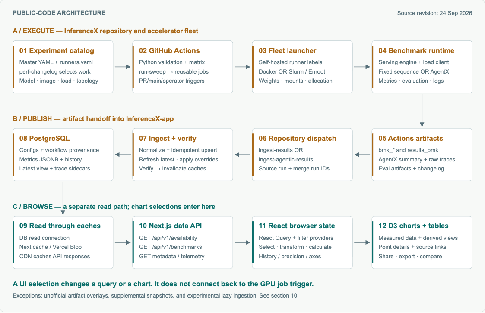

# InferenceX architecture and UI flow

A source-linked study of [SemiAnalysis InferenceX](https://github.com/SemiAnalysisAI/InferenceX) and its [live dashboard](https://inferencex.semianalysis.com/).

Research snapshot: **24 September 2026**.

## Start here

- [Read the detailed architecture guide](inferencex-architecture-guide.md).
- Download [the illustrated HTML guide](inferencex-architecture-guide.html) and open it in a browser. It is self-contained and includes navigation, diagrams, a dashboard screenshot, and source links.

## Main finding

Public chart selections read and visualize existing results. New benchmarks run through separate GPU workflows, produce artifacts, and are ingested into the dashboard database.

## Diagrams

- [Architecture, editable SVG](inferencex-architecture.svg)
- [UI request sequence](inferencex-ui-flow.svg)
- [Aggregated and disaggregated serving](inferencex-serving.svg)

## Live UI captures

- [Agentic dashboard](inferencex-live-dashboard.png)
- [Fixed-sequence dashboard](inferencex-fixed-sequence.png)

## Sources and scope

The guide links to 48 source files at these revisions:

- InferenceX: `5abd17e2ef546bd557608b370a8ff6123a170cbf`
- InferenceX-app: `b710865c22e631d1cf0420f029afbd950ee73bb8`

The study combines public code inspection and live browser observations. No GPU benchmarks were dispatched. This is an independent analysis, not an official SemiAnalysis repository. Screenshots show the original InferenceX interface; source projects retain their respective licenses and ownership.
