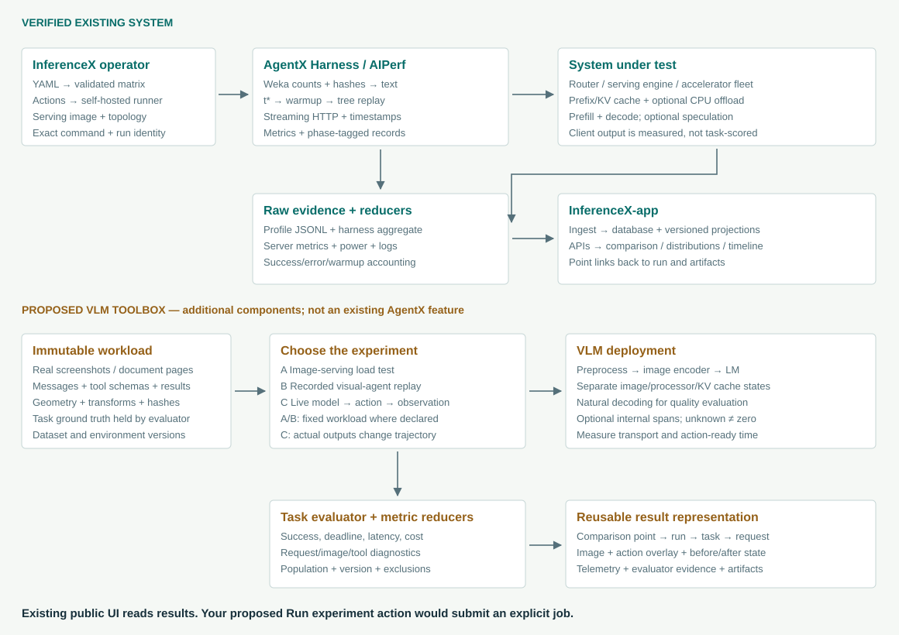

# AgentX mechanics and a VLM benchmark toolbox

A code-level study of InferenceX, its AgentX/AIPerf harness, and the result application, focused on image agents using screenshots, documents, and tools.

**Revision 3 · 24 September 2026.** A detailed study of workload reconstruction, agent creation and orchestration, request traffic, scheduling, metrics, evaluation, and a proposed VLM adaptation. Chapter 5 follows agent/session creation, worker execution, branches, interval barriers, joins, and failures through the actual source.

- [Read the guide on GitHub](inferencex-architecture-guide.md).
- [Download the standalone illustrated HTML](inferencex-architecture-guide.html) and open it in a browser.
- [Source map and pinned revisions](inferencex-source-map.json).
- [Proposed VLM data and execution blueprint](vlm-benchmark-blueprint.json).
- [Worked metric fixture, checked against the real InferenceX reducers](agentx-metric-walkthrough.json).
- [Illustrative traffic timeline and checks of the source interval algorithm](agent-traffic-walkthrough.json).

## The key distinction

Canonical AgentX reconstructs the traffic shape of coding-agent traces. Generic AIPerf can send real images. Live visual-agent evaluation additionally needs an environment/action loop and task evaluator. These are separate capabilities.

## Detailed diagrams

- [Replay state machine](agentx-replay-mechanics.svg)
- [Live VLM serving and action loop](vlm-agent-serving-flow.svg)
- [Agent orchestration and timed request traffic](agentx-agent-orchestration.svg)

The earlier architecture/serving/UI-flow diagrams and public-dashboard captures remain as supporting overview material.

## Evidence and scope

Public source inspection and live UI observation; exact commits are recorded in the source map. Illustrative metric arithmetic was verified by running the real Python reduction functions. No GPU benchmark or live agent accuracy evaluation was executed. The VLM blueprint is a proposed design, and deployment commands require validation on the chosen model, backend, and hardware.

This is an independent study, not an official SemiAnalysis repository. Referenced projects and screenshots retain their respective ownership and licenses.
