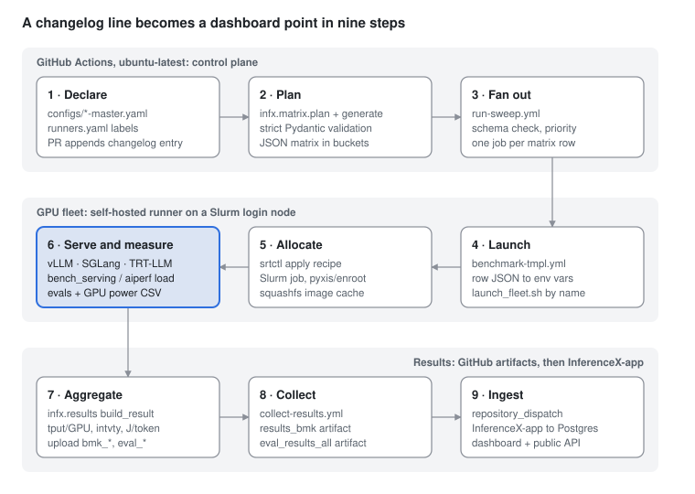

# InferenceX — Architecture Deep-Dive & Study Plan

Sep 27, 2026 · @Hello\_Mental

## What InferenceX is

InferenceX is a CI system, not an inference engine: it turns a YAML declaration of "model × GPU × engine × parallelism × concurrency" into GPU jobs on self-hosted runners, measures throughput/latency/power/accuracy, and ships JSON artifacts to a separate dashboard repo ([InferenceX-app](https://github.com/SemiAnalysisAI/InferenceX-app)). It owns none of the serving code — it drives vLLM, SGLang, TensorRT-LLM, Dynamo, ATOM and TileRT containers through NVIDIA's [srt-slurm](https://github.com/NVIDIA/srt-slurm).

Analysed at commit `45aa3a2` (26 Sep 2026). Scale at that commit: 143 NVIDIA + 49 AMD config keys, 212 search-space entries bound to srt-slurm recipes, 23 GitHub workflows, \~31k lines of Python in the `infx` package, \~3.6k lines in `benchmarks/benchmark_lib.sh`.

The flow in one breath: a PR appends an entry to `perf-changelog.yaml` → `infx.matrix.plan` diffs it, expands the selected master-config keys into a validated JSON matrix → `run-sweep.yml` fans that out to reusable job templates → each job runs `runners/launch_<fleet>.sh`, which builds an srt-slurm recipe and calls `srtctl apply` on a Slurm cluster → the engine starts in a pyxis/enroot container and a client (in-repo `infx.bench_serving` for fixed ISL/OSL, forked `aiperf` for AgentX trace replay) hits it → `infx.results` turns raw JSON + GPU power CSV into `agg_*.json` → collectors upload run-level artifacts → a `repository_dispatch` tells InferenceX-app to ingest into Postgres and refresh the dashboard.

Three benchmark modes exist, and they use different clients and artifacts:

| Mode | What it measures | Client | Headline metric |
| --- | --- | --- | --- |
| Fixed sequence (`fixed-seq-len`, 1k1k / 8k1k) | Synthetic random prompts at fixed ISL/OSL across a concurrency sweep | `infx.bench_serving` (vLLM `benchmark_serving.py` fork) | tokens/s/GPU vs interactivity (tok/s/user) Pareto curve |
| AgentX (`agentic-coding`) | Replay of real Claude Code session traces, multi-turn, long context, 1 h duration | `aiperf` fork (`utils/aiperf`) | per-GPU throughput, cache hit rate, TTFT/ITL under realistic load |
| Evals | Accuracy guardrail at selected points | lm-eval (GSM8K, GPQA), SWE-bench Lite, BFCL, Kimi/MiniMax vendor verifiers | score vs `infx/evals/thresholds.yaml` |

## Repo map

Everything sits in seven layers; each top-level path belongs to exactly one. The repo ships its own maintainer docs — `docs/architecture.md` is the best single file to read and this plan follows its stage numbering.

| Path | Layer | Role |
| --- | --- | --- |
| `configs/nvidia-master.yaml`, `configs/amd-master.yaml` | 1 Intent | Catalog of benchmark "families": image, model, precision, framework, runner label, scenarios, search space. Key name = `<model-prefix>-<prec>-<gpu>-<framework>` |
| `configs/runners.yaml` | 1 Intent | Scheduling label → concrete runner names; per-cluster hardware facts (GPUs/node, CPU DRAM) |
| `configs/CONFIGS.md` | 1 Intent | Human-readable schema contract for the two files above |
| `configs/ci-priority.yaml` | 3 Orchestration | Queue priority scores (framework, model, label weights) |
| `perf-changelog.yaml` | 1 Trigger | Append-only log (\~1,040 entries). Adding an entry is what triggers a sweep |
| `infx/matrix/` | 2 Planning | `validation.py` (Pydantic schemas), `generate.py` (expansion), `plan.py` (changelog diff → buckets) |
| `.github/workflows/` | 3 Orchestration | `run-sweep.yml` (main pipeline), `benchmark-tmpl.yml` / `benchmark-multinode-tmpl.yml` (per-job templates), collectors, Klaud, profiling, ops |
| `infx/workflows/`, `infx/github.py` | 3 Orchestration | Priority scoring, schema preflight, sweep reuse, merge helper, CODEOWNER sign-off, ingest recovery |
| `runners/launch_*.sh`, `runners/slurm_utils.sh`, `runners/srt-slurm/*.yaml` | 4 Fleet | One launcher per physical fleet; cluster profiles for srt-slurm; image import to squashfs |
| `infx/srt_slurm/` | 4 Fleet | Binds a matrix point to a recipe, renders cluster config, injects synthetic spec-decode acceptance |
| `benchmarks/single_node/srt-slurm-recipes/`, `benchmarks/multi_node/srt-slurm-recipes/` | 5 Runtime | srt-slurm recipe YAMLs: `<model>/<engine>/<gpu>-<prec>/<1k1k\|8k1k\|agentx>/<agg\|disagg-…>.yaml` |
| `benchmarks/benchmark_lib.sh` | 5 Runtime | Shared bash: GPU monitor, readiness, benchmark client, all evals, AgentX replay |
| `benchmarks/*/srt_fixed_sequence.sh`, `srt_eval.sh`, `benchmarks/srt_agentic.sh` | 5 Runtime | The `benchmark.command` and `post_eval` hooks srt-slurm runs after the server is up |
| `benchmarks/multi_node/amd_utils/`, `tilert_utils/`, `llm-d/` | 5 Runtime | Bespoke multi-node paths (AMD SGLang/ATOM disagg over sbatch+docker; TileRT; llm-d, currently dormant) |
| `infx/bench_serving/` | 5 Runtime | Fixed-seq load generator (vLLM fork) + `server_watch` + DeepSeek-V4 chat encoder |
| `infx/evals/` | 5 Runtime | Eval task YAMLs, vendor-verifier adapters, score thresholds, runtime patches |
| `infx/golden_al_distribution/` | 5 Runtime | Golden acceptance-length curves so spec-decode results are comparable |
| `infx/datasets/` | 5 Runtime (offline) | Builds AgentX trace datasets from the Claude Code proxy DB and uploads them to HF |
| `infx/results/` | 6 Results | Raw → aggregate JSON (fixed-seq, agentic, evals), power integration, collectors, DB comparison |
| `utils/srt-slurm` (submodule) | External | NVIDIA srt-slurm, pinned `8dace5f` — launches engines on Slurm |
| `utils/aiperf` (submodule) | External | SemiAnalysis fork of NVIDIA aiperf, pinned `754356e` — AgentX replay client |
| `utils/runner_setup/` | Infra | Registers GitHub self-hosted runners on the Slurm login node (tmux) |
| `infx/klaud/`, `.github/klaud-*.md` | Automation | "Klaud Cold" — Claude agent that bumps engine images and opens PRs every 6 h |
| `experimental/` | Research | Not in the main pipeline: CollectiveX (EP all-to-all), OperatorX (op microbenchmarks), DSA/MLA, KV swap, decode SLO |
| `.agents/skills/`, `.claude/commands/`, `AGENTS.md` | Automation | Agent instructions shipped with the repo |
| `infx/tests/` | Quality | pytest suite mirroring the package; run by `ci.yml` |

Two things are not here: the dashboard, API and Postgres schema live in InferenceX-app (TypeScript), and the engines themselves come in as container images.

Line-by-line walkthroughs of the runtime, results and automation rows, with file:line pointers: [Runtime deep-dives](02_runtime_deep_dives.md)

## Component deep-dive

Each component below lists what it takes in, what it emits, and the one or two design decisions worth stealing.

### 1. Master configs and changelog (intent + trigger)

- A config key is a family, e.g. `dsr1-fp4-b200-dynamo-trt`. Fields: `image`, `model`, `model-prefix`, `precision` (fp4 | fp8), `framework`, `runner` (label; agentic must use `cluster:<name>`), `multinode`, `disagg`, `router{name,version}`, `kv-p2p-transfer` (nixl, mooncake, mori…).
- `scenarios.fixed-seq-len[]` = `{isl, osl, search-space[]}`; each search-space entry has `tp/pp/ep/dp-attn/dcp-size/pcp-size`, `spec-decoding` (mtp | draft\_model | none), and either `conc-list` or `conc-start`/`conc-end` (doubling steps). Single-node entries carry `srt-recipe:`; multi-node entries carry `prefill{}`/`decode{}` worker blocks whose `additional-settings` include `CONFIG_FILE=recipes/...yaml`.
- `scenarios.agentic-coding[]` = `{trace-source, dram-utilization, search-space[{tp, kv-offloading: dram|none, kv-offload-backend, conc}]}`.
- `perf-changelog.yaml` entries are `{config-keys (globs), description[], pr-link, evals-only?, all-evals?, append-only?, scenario-type?}`. Deleting a line fails CI; it is an audit trail and a trigger, never a copy of config content.
- Steal this: separating the catalog (what can run) from the trigger (what runs now) makes every sweep reviewable and replayable.

### 2. Matrix planner (`infx/matrix`)

- `validation.py`: strict Pydantic v2 models with `extra="forbid"` for input (master YAML) and output (matrix rows). Cross-field rules: one concurrency form, `tp % dcp == 0`, disagg needs prefill+decode and a `kv-p2p-transfer`, agentic needs a `cluster:` runner.
- `generate.py`: `full-sweep` and `test-config` subcommands. Expands concurrency, derives `max-model-len = isl + osl + 256`, `exp-name`, `node-count` (reads the recipe for multi-node), `total-cpu-dram-gb`, and marks eval rows (8k1k single-node: highest + median concurrency; multi-node: highest ≥ 16 per topology; Kimi/MiniMax agentic: vendor eval).
- `plan.py`: `git diff base head -- perf-changelog.yaml`, parses only added lines, expands globs, calls `generate_config_matrix`, adds `recipe-fingerprint` (sha256 of the row minus conc), and emits buckets: `single_node{1k1k,8k1k,agentic}`, `multi_node{...}`, `evals`, `agentic_evals`, `multinode_evals`, `multinode_agentic_evals`, `changelog_metadata`. `append-only` entries run the base revision's own generator and emit only new points.
- Only dependencies: `pydantic`, `pyyaml`. This is the most portable piece in the repo.

### 3. Orchestration (`.github/workflows`)

- `run-sweep.yml` triggers on `perf-changelog.yaml` changes. Jobs: `check-changelog` → `reuse-sweep-gate` → `setup` (plan → `infx.workflows.benchmark_schema --plan` → `infx.workflows.ci_priority`) → optional `canary-select`/`canary-sweep` → one fan-out job per bucket via `strategy.matrix.config: fromJson(...)` → `collect-results`, `collect-evals`, `calc-success-rate`, `compare-results` (PR, against Postgres) → `trigger-ingest` (main only).
- `benchmark-tmpl.yml` receives one row as a JSON `config` input and projects it into env vars (`MODEL`, `MODEL_PREFIX`, `IMAGE`, `FRAMEWORK`, `PRECISION`, `TP`, `EP_SIZE`, `PP_SIZE`, `DCP_SIZE`, `PCP_SIZE`, `CONC`, `ISL`, `OSL`, `MAX_MODEL_LEN`, `SPEC_DECODING`, `SRT_RECIPE`, `RESULT_FILENAME`…). It then runs `bash ./runners/launch_${RUNNER_NAME%%_*}.sh`: the runner name prefix is the routing key to the fleet launcher.
- `benchmark-multinode-tmpl.yml` adds `PREFILL_*`/`DECODE_*` variables, `CONC_LIST`, `node-count`, and exports `additional-settings` only if they match `^[A-Za-z_][A-Za-z0-9_]*=` (no shell injection from YAML).
- `runs-on` labels encode priority and node count (`nodes:N`, `ci-job-<priority>-<token>`) for an external queue scheduler not in this repo.
- PR labels pick scope: `sweep-enabled` (min concurrency only), `full-sweep-fail-fast` (canary first), plus modifiers `all-evals`, `evals-only`, `agentx-fast`. `/use <run_id>` lets a merge reuse a PR's GPU results instead of re-running.

### 4. Fleet launchers (`runners/`)

- 16 `launch_*.sh`, one per fleet (CoreWeave, Nebius, nScale, DGX Cloud, TensorWave/AMD, NVIDIA GB200/GB300 NVL72…). All active ones are Slurm + enroot/pyxis; there is no Kubernetes path.
- Single-node path (`launch_srt_single_node` in `slurm_utils.sh`): clone the `utils/srt-slurm` submodule into a temp dir, apply local patches, copy recipes in, `uv pip install -e .` (installs `srtctl`), `python -m infx.srt_slurm.single_node prepare $SRT_RECIPE` (validates the recipe matches the matrix point and emits `--set` overrides), render `srtslurm.yaml` from `runners/srt-slurm/<fleet>.yaml`, then `srtctl apply --json`. It tails the Slurm log, checks `sacct` for `COMPLETED 0:0`, and copies `logs/$RESULT_FILENAME.json` back.
- Multi-node path: same, with `CONFIG_FILE` from `additional-settings` and a hardcoded table mapping model prefix to a staged weights path (Lustre / NVMe).
- Images are imported once to shared squashfs with `enroot import` under `flock`, validated with `unsquashfs`, then moved atomically.

### 5. Runtime: recipes, servers and clients (`benchmarks/`)

- A recipe is a `schema: 2` srt-slurm YAML: `model{path: hf:..., container, precision}`, `engine`, `frontend{type: dynamo|sglang|vllm|sglang-router}`, `roles{agg|prefill|decode: {nodes, workers, gpus, env, args}}`, `benchmark{type: custom, command, env}`. Variants use `base` + `override_*` / `zip_override_*` selected with `file.yaml:selector`.
- srt-slurm launches the engine CLI with `roles.*.args`, puts nginx in front of multiple frontends, and runs `benchmark.command` (`srt_fixed_sequence.sh` or `srt_agentic.sh`) once the endpoint is healthy, then `post_eval` (`srt_eval.sh`).
- `benchmark_lib.sh` is the shared toolbox. Key functions: `start_gpu_monitor` (`nvidia-smi ... -l 1` or `amd-smi metric ... --csv`), `wait_for_server_ready`, `run_server_client` (wraps the client in `server_watch` so it aborts if the engine dies), `run_benchmark_serving`, `run_eval` → `run_lm_eval` / `run_swebench_eval` / `run_kimi_vendor_eval` / `run_bfcl_eval`, `install_agentic_deps`, `build_replay_cmd`, `run_agentic_replay_and_write_outputs`.
- Fixed-seq client call: `python3 -m infx.bench_serving.benchmark_serving --dataset-name random --random-input-len ISL --random-output-len OSL --random-range-ratio 0.8 --num-prompts CONC*10 --max-concurrency CONC --request-rate inf --ignore-eos --num-warmups 2*CONC --percentile-metrics ttft,tpot,itl,e2el --save-result`.
- AgentX client call: `aiperf profile --scenario inferencex-agentx-mvp --endpoint /v1/chat/completions --streaming --concurrency C --benchmark-duration 3600 --public-dataset semianalysis_cc_traces_weka_062126 --server-metrics <worker /metrics URLs> ...`.
- Speculative decoding fairness: `infx.srt_slurm.synthetic_acceptance` injects a golden acceptance length per model (`SGLANG_SIMULATE_ACC_LEN`, vLLM `rejection_sample_method=synthetic`, TRT `TLLM_SPEC_DECODE_FORCE_NUM_ACCEPTED_TOKENS`, ATOM `--spec-decode-acceptance-length`), so draft-head quality does not skew agentic results.

### 6. Benchmark client (`infx/bench_serving`)

- Fork of vLLM's `benchmarks/benchmark_serving.py` + `backend_request_func.py`, cut down to the `random` dataset. Backends: OpenAI completions/chat (vllm, sglang, openai), TGI, TRT-LLM `generate_stream`.
- Random prompts are built from token IDs and re-tokenised up to 10× to hit the exact ISL; lengths are uniform in `[len×0.8, len]`.
- Metrics: TTFT, TPOT = (latency − TTFT)/(out − 1), ITL from chunk gaps, E2EL; mean/median/std/p90/p99/p99.9; request, output and total-token throughput; goodput. The run fails if more than 5% of requests fail (`benchmark_outcome.py`).
- `server_watch.py` snapshots engine worker PIDs (`sglang::scheduler`, `EngineCore`, `VllmWorker`, `trtllm-worker`) from `/proc` and kills the client if one dies.
- Known limit (`infx/KNOWN_LIMITATION.md`): single process, so it becomes client-bound for small models at very high QPS.

### 7. Results and power (`infx/results`)

- `fixed_sequence.build_result(raw, env)` is pure (no I/O). It adds identity fields and `tput_per_gpu = total_tok/s ÷ (tp×pp×pcp)`; for disagg, output tput is divided by decode GPUs and input tput by prefill GPUs. Every `*_ms` becomes seconds, and every TPOT becomes interactivity `intvty = 1000 / tpot_ms` (tok/s/user).
- `agentic.build_result(...)` turns aiperf records + Prometheus scrapes into request metrics, cache hit rates (GPU/CPU/external), KV offload bandwidth and per-GPU throughput. Backends for vLLM, SGLang, TRT-LLM, Dynamo and ATOM metric names are detected automatically.
- `power/single_node.py` integrates each GPU's power CSV (trapezoid, 3 s max gap) over the exact benchmark window to give joules per input/output/total token. `power/multinode.py` validates a DCGM-exporter package from srt-slurm.
- `compare_results.py` compares a PR sweep to the production Postgres baseline and prints colored deltas in the job summary.

### 8. Evals (`infx/evals`)

- lm-eval-harness (pinned commit) with `local-chat-completions` against the running server: `gsm8k.yaml` (5-shot) and `gpqa_diamond.yaml`.
- SWE-bench Lite: generation with `mini-swe-agent` in Modal sandboxes, scoring with `swebench==4.1.0` on Modal (GPU nodes have no Docker).
- Vendor verifiers: Kimi (pinned, SHA-checked archive, 408 cases), MiniMax M3 (102 cases), BFCL V4.
- `thresholds.yaml` gates results (e.g. GSM8K 0.90 default; per model 0.91–0.94). `patches/` holds anchor-checked monkey-patches for lm-eval and SWE-bench tooling.

### 9. AgentX datasets and golden AL (`infx/datasets`, `infx/golden_al_distribution`)

- Traces come from SemiAnalysis's own Claude Code proxy (Postgres). `sample_proxy_traces.py` samples sessions, `proxy_to_weka.py` converts them to the "weka" trace format (hash IDs for prefix-cache reuse, think times, subagent fan-out), and `build_weka_hf_dataset.py` publishes to HF (`semianalysisai/cc-traces-weka-062126`, plus a 256k-capped variant).
- Golden AL curves are measured on SPEED-Bench (coding, temp 1.0, 4096 output) on B300 with vLLM via `speedbench-al.yml`, stored as `{model: {thinking_on|off: {num_spec_tokens: AL}}}`.

### 10. Automation (Klaud, Claude workflows)

- `klaud-plan.yml` (every 6 h): finds families whose image is behind upstream, using the public dashboard API, then checks cluster capacity (< 80% busy) and claims up to 5 candidates.
- `klaud-candidate.yml`: one Claude Code session per candidate. It bumps the image, opens a draft PR, runs a smoke `e2e-tests.yml`, appends a changelog entry, labels `full-sweep-fail-fast`, repairs failures up to 5 times, then posts `/use <run>`. It never merges.
- `claude.yml` and `codeowner-signoff-verify.yml` provide `@claude` coding, `@pr-claude` review and a checklist sign-off verifier.

### 11. Experimental (outside the pipeline)

- `CollectiveX`: MoE expert-parallel dispatch/combine latency across DeepEP V2, MoRI, UCCL-EP, NCCL EP and FlashInfer EP, using a DeepSeek-V4 shape.
- `operatorx`: single-op timing (GEMM, attention, MoE, collectives) over torch, DeepGEMM, FlashInfer, AITER, JAX and NKI on NVIDIA, AMD, TPU and Trainium. It has its own `uv.lock` and changelog.
- `dsv32` (DSA vs dense MLA decode via `flash_mla_with_kvcache`), `kvcache_transfer_DtoH_HtoD` (`vllm._custom_ops.swap_blocks` bandwidth), `token_position_decode_slo`, `single_node_decodeonly` (vLLM `DecodeBenchConnector`).

## How components connect

No single file owns the pipeline; it works because every handoff is a JSON contract that both sides agree on. The GPU step (6, highlighted) is the only place a model actually runs — everything above it is planning, everything below it is bookkeeping.

Read it as a snake: control plane left to right, fleet right to left, results left to right. Klaud Cold closes the loop by reading the dashboard API and opening new changelog PRs.

The handoffs you must reproduce if you lift any piece:

| # | Handoff | Format | Producer | Consumer |
| --- | --- | --- | --- | --- |
| 1→2 | Selected work | Added YAML lines in `perf-changelog.yaml` (git diff base..head) | PR author / Klaud | `infx.matrix.plan` |
| 2→3 | Matrix | JSON `ChangelogMatrixEntry` with buckets; each row validated by `SingleNodeMatrixEntry` / `MultiNodeMatrixEntry` | `plan.py` | `run-sweep.yml` job output `search-space-config` |
| 3→4 | One job | Row as JSON `config` input + `runner` label; projected to env vars | `run-sweep.yml` | `benchmark-tmpl.yml` |
| 4→5 | Fleet routing | Runner name prefix (`h200-cw_01` → `launch_h200-cw.sh`) | GitHub runner assignment | `runners/launch_*.sh` |
| 5→6 | Deployment | srt-slurm recipe YAML + `--set` overrides + `srtslurm.yaml` cluster profile | launcher + `infx.srt_slurm` | `srtctl apply` |
| 6→7 | Raw result | `$RESULT_FILENAME.json` (bench\_serving), `aiperf_artifacts/*`, `gpu_metrics.csv`, `results*.json` | client scripts | `infx.results.*` |
| 7→8 | Per-job artifact | `bmk_<RF>`, `bmk_agentic_<RF>` + `agentic_<RF>`, `eval_<RF>_<fw>_<suite>_<attempt>`, `server_logs_*`, `power_audit_*` | job template | collectors, app ETL |
| 8→9 | Run artifact + trigger | `results_bmk/agg_bmk.json`, `eval_results_all/agg_eval_all.json`, `changelog-metadata`, `run-stats`; `repository_dispatch` `ingest-results` with `{source-run-id, merge-run-id}` | `run-sweep.yml` | InferenceX-app `ingest-ci-run.ts` |

Artifact names are the cross-repo API: rename `results_bmk` and the sweep still goes green while the dashboard silently loses rows.

## External dependencies

The Python core is almost dependency-free (`pydantic`, `pyyaml`). The weight is outside it: srt-slurm and Slurm launch everything, engines arrive as container images, and evals pull their own tool stacks at runtime. The table groups every external thing by the component that calls it.

| Category | Dependency | Called from | Why |
| --- | --- | --- | --- |
| Engine launcher | [NVIDIA srt-slurm](https://github.com/NVIDIA/srt-slurm) (submodule, v2.2.1-era pin `8dace5f`; `srtctl`) | `runners/slurm_utils.sh`, `infx/srt_slurm/synthetic_acceptance.py` | Turns a recipe into Slurm jobs, starts engine workers, frontends, nginx, etcd/NATS for Dynamo, DCGM exporter |
| Load client | SemiAnalysis fork of NVIDIA aiperf (submodule `754356e`) | `benchmark_lib.sh` `install_agentic_deps`, AMD `trace_replay.sh` | AgentX trace replay, Prometheus server-metrics scraping |
| Scheduler / containers | Slurm (`salloc`, `srun`, `sbatch`, `sacct`, `scontrol`, `scancel`), pyxis + enroot, squashfs-tools | all active launchers | Allocation and container runtime on every fleet |
| Scheduler / containers | Docker | `amd_utils/job.slurm`, `llm-d`, 2 dormant launchers | AMD multi-node disagg only |
| Engine images | `lmsysorg/sglang` (97), `vllm/vllm-openai` (33), `lmsysorg/sglang-rocm` (16), `nvcr.io/nvidia/tensorrt-llm/release` (16), `nvcr.io/nvidia/ai-dynamo/tensorrtllm-runtime` (10), `rocm/atom` + `atom-dev` (12), `vllm/vllm-openai-rocm` (6), `ghcr.io/tile-ai/tilert*` (2) | master YAML `image:` (192 keys) | The system under test |
| Infra images | `nginx:1.27.4`, `nvcr.io/nvidia/k8s/dcgm-exporter:4.6.0-4.8.3`, `rocm/mori-dev`, llm-d EPP/sidecar, `envoyproxy/envoy` | launchers, recipes, `benchmarks/llm-d/Dockerfile` | Load balancing, power telemetry, KV store, gateway routing |
| KV transfer / routing (inside engines) | NIXL, Mooncake, MoRI, UCX; Dynamo KV router, `sglang_router`, `vllm-router`, llm-d EPP | recipe `args`, `amd_utils/server_sglang.sh` | Disaggregated prefill/decode and cache-aware routing |
| GPU telemetry | `nvidia-smi`, `amd-smi` | `start_gpu_monitor` | 1 s power, clock, util CSV for J/token |
| Python (core) | `pydantic`, `pyyaml` | `infx.matrix`, `infx.klaud`, `infx.workflows` | Schemas and config loading |
| Python (client) | `aiohttp`, `numpy`, `transformers`, `tqdm`, `huggingface_hub`; optional `vllm` tokenizer utilities | `infx.bench_serving` | HTTP streaming, tokenisation for exact ISL |
| Python (results) | `psycopg2-binary`, `tabulate`, `matplotlib`, `pandas` | `compare_results.py`, plotting | PR vs production comparison, plots |
| Python (workflows) | `PyGithub`, `GitPython`, `codeowners`; `gh` CLI | `merge_with_reuse`, `signoff_scope`, `infx/github.py` | Merge automation and CODEOWNER checks |
| Evals | lm-evaluation-harness (pinned commit), `swebench==4.1.0`, `mini-swe-agent==2.4.5`, `swe-rex[modal]==1.4.0`, `bfcl-eval`, Kimi/MiniMax vendor verifiers | `run_eval` in `benchmark_lib.sh` | Accuracy guardrails |
| Remote services | Modal (SWE-bench sandboxes), Hugging Face Hub (weights, `semianalysisai/cc-traces-weka-*`, `openai/gsm8k`, `Idavidrein/gpqa`, `princeton-nlp/SWE-bench_Lite`) | evals, `resolve_trace_source` | Sandboxed scoring, datasets |
| Remote services | InferenceX-app (Postgres, Vercel), dashboard API `/api/v1/*`, Claude Code proxy DB | `trigger-ingest`, `infx.klaud.api`, `infx.datasets.sample_proxy_traces` | Persistence, Klaud planning, trace sourcing |
| CI actions | `actions/checkout`, `upload-artifact`, `download-artifact`, `github-script`, `astral-sh/setup-uv`, `anthropics/claude-code-action` (all SHA-pinned); `uv`, `ruff`, `zizmor` | `.github/workflows/*` | Orchestration, lint, workflow security audit |
| AI agent | Claude Code CLI `@anthropic-ai/claude-code@2.1.282`, `ANTHROPIC_API_KEY` | `klaud-*.yml`, `claude.yml`, `run-sweep.yml` priority classifier | Autonomous image bumps, review, priority tagging |

Secrets you would need to replicate the full pipeline: `INFERENCEX_OFFICIAL_RO_HF_TOKEN`, `MODAL_TOKEN_ID/SECRET`, `FRONTEND_PAT` (cross-repo dispatch), `DB_RO_URL`, plus `AGENT_PAT` / `ANTHROPIC_API_KEY` / `DASH_API_KEY` for the agent layer. The submodules are empty in a plain clone — run `git submodule update --init` before reading aiperf or srt-slurm source.

## Study plan

Follow one real config end to end, then go wide: six phases, and each ends with an exercise that proves you understand it. Phases 1–3 and 5 need only a laptop; phase 4 needs a Slurm cluster or can be done by reading. The running example is `dsr1-fp4-mi355x-sglang` (DeepSeek-R1 MXFP4, SGLang, MI355X, TP4, 8k/1k).

Setup: `git clone --recurse-submodules https://github.com/SemiAnalysisAI/InferenceX` and a recent `uv`, because `exclude-newer = "PT12H"` in `pyproject.toml` is rejected by uv 0.8 (the build backend pins `uv_build` ≥ 0.12, so use uv 0.12 or later).

### Phase 1 — Mental model (half a day)

Read `README.md`, `docs/index.md`, then all of `docs/architecture.md`. Skim `configs/CONFIGS.md` and `AGENTS.md`.

- [ ] Draw the 9-step flow from memory and name the file that owns each step
- [ ] Explain why the matrix is never checked in, and why `perf-changelog.yaml` is append-only

### Phase 2 — Intent and planning, no GPU (1 day)

Read `configs/amd-master.yaml` (the `dsr1-fp4-mi355x-sglang` block), `infx/matrix/validation.py`, `generate.py`, `plan.py`, `infx/workflows/benchmark_schema.py`, `configs/ci-priority.yaml`.

- [ ] Run `uv run --no-project --python 3.12 --with pydantic --with pyyaml python -m infx.matrix.generate test-config --config-files configs/amd-master.yaml --runner-config configs/runners.yaml --config-keys dsr1-fp4-mi355x-sglang`, then map every output field back to YAML or to a derivation (for example `max-model-len` 9472 = 8192 + 1024 + 256)
- [ ] Add `--evals-only`, then `--smoke`, and explain which rows change and why
- [ ] Break the YAML on purpose (set both `conc-list` and `conc-start`) and read the Pydantic error
- [ ] Run `pytest infx/tests/matrix -q`

### Phase 3 — Orchestration (1 day)

Read `.github/workflows/README.md`, `run-sweep.yml`, `benchmark-tmpl.yml`, `benchmark-multinode-tmpl.yml`, `collect-results.yml`, `docs/ci-procedures.md`. Then open a recent merged PR and its Actions run on GitHub.

- [ ] List every env var `benchmark-tmpl.yml` derives from the `config` JSON, and mark which the launcher and recipe actually consume
- [ ] Trace how a PR with the `full-sweep-fail-fast` label picks its canary
- [ ] Download `results_bmk` from a public run and open `agg_bmk.json`

### Phase 4 — Fleet and runtime (2–3 days, the core)

Read `runners/launch_mi355x-amds.sh`, `runners/slurm_utils.sh` (`setup_srt_slurm`, `launch_srt_single_node`, `apply_srt_recipe`), `runners/srt-slurm/mi355x-amds.yaml`, `infx/srt_slurm/single_node.py`, the recipe `benchmarks/single_node/srt-slurm-recipes/dsr1/sglang/mi355x-fp4/8k1k.yaml`, `benchmarks/single_node/srt_fixed_sequence.sh`, and the functions in `benchmark_lib.sh` listed in section 3.5. Then read srt-slurm itself: its recipe schema, how `roles.*.args` become an engine CLI, and how `benchmark.command` is invoked.

- [ ] Write out the exact `sglang` server command and `benchmark_serving` command this matrix point produces
- [ ] Compare against a disagg recipe under `benchmarks/multi_node/srt-slurm-recipes/dsr1/sglang/` and note what changes: roles, `disaggregation-transfer-backend`, frontend, node count
- [ ] Read `infx/srt_slurm/synthetic_acceptance.py` and `infx/golden_al_distribution/README.md`, and explain in one paragraph why forced acceptance length makes MTP results comparable
- [ ] Optional, if you have one GPU node: start SGLang or vLLM by hand and run `python -m infx.bench_serving.benchmark_serving` against it with the same flags

### Phase 5 — Results, power, evals (1 day)

Read `infx/results/fixed_sequence.py`, `topology.py`, `power/single_node.py`, `agentic/__init__.py`, `agentic/server_metrics.py` and the backends, `infx/evals/EVALS.md`, `thresholds.yaml`, `validate_scores.py`.

- [ ] Feed a hand-written raw `benchmark_serving` JSON plus env dict to `build_result` in a REPL, and check `tput_per_gpu` and `median_intvty` by hand
- [ ] Run `pytest infx/tests/results -q`
- [ ] Work out, with pen and paper, joules per output token from a 3-sample power CSV

### Phase 6 — AgentX and the edges (1–2 days, optional)

Read `docs/eval-agentx-procedures.md`, `build_replay_cmd` in `benchmark_lib.sh`, `benchmarks/srt_agentic.sh`, `infx/datasets/proxy_to_weka.py`, the aiperf fork's trace loader, and `docs/klaud.md`. Skim `experimental/CollectiveX` and `experimental/operatorx` for kernel-level ideas.

- [ ] Load one row of `semianalysisai/cc-traces-weka-062126` from HF and explain how `hash_ids` model prefix-cache reuse
- [ ] Explain why AgentX needs Prometheus server metrics while fixed-seq does not

Done when you can take any dashboard point and name the config key, recipe, launcher, server command, client command and artifact that produced it (the 11-step check at the end of `docs/architecture.md`).

## Extraction guide

The cleanly separable pieces are the ones with pure-function builders and few dependencies; the fleet layer is the least portable because it is bound to specific clusters. Ranked from easiest to hardest to lift:

| Piece | Files to copy | Dependencies | Coupling to cut | Effort |
| --- | --- | --- | --- | --- |
| Fixed-seq load client | `infx/bench_serving/*` | aiohttp, numpy, transformers, tqdm (vllm optional) | None; it is a standalone CLI against any OpenAI-compatible endpoint | Hours |
| Engine-death guard | `infx/bench_serving/server_watch.py` | stdlib | Worker process-name regex list | Hours |
| Result builder + interactivity/per-GPU math | `infx/results/fixed_sequence.py`, `topology.py`, `metadata.py`, `result_filename.py` | stdlib | `build_result` reads env keys (`RUNNER_TYPE`, `TP`…): pass your own mapping | Hours |
| Power → J/token | `infx/results/power/common.py`, `single_node.py`, `__init__.py` + `start_gpu_monitor` from `benchmark_lib.sh` | stdlib, `nvidia-smi` / `amd-smi` | Needs benchmark start/end unix timestamps in the raw JSON | 1 day |
| Config → matrix engine | `infx/matrix/validation.py`, `generate.py`, `infx/config.py` | pydantic, pyyaml | Drop agentic/multi-node models you do not need; replace `runners.yaml` lookups | 1–2 days |
| Changelog-driven trigger | `infx/matrix/plan.py`, `infx/workflows/validate_perf_changelog.py`, `run-sweep.yml` setup job | git, GitHub Actions | Bucket names must match your fan-out jobs | 1–2 days |
| Eval guardrail | `infx/evals/gsm8k.yaml`, `thresholds.yaml`, `validate_scores.py`, `run_lm_eval` in `benchmark_lib.sh` | lm-eval-harness | Output-path conventions in `stage_eval_artifacts` | 1 day |
| AgentX replay | `utils/aiperf` fork, `build_replay_cmd`, `infx/results/agentic/*`, HF trace dataset | aiperf, HF datasets, Prometheus `/metrics` on the engine | Backend metric-name adapters per engine; 1 h runs | 3–5 days |
| Engine launch on Slurm | `runners/slurm_utils.sh`, `runners/srt-slurm/*.yaml`, `infx/srt_slurm/*`, recipes | NVIDIA srt-slurm, Slurm, pyxis/enroot | Cluster profiles, model paths, partitions | 1 week+ |

### Minimal port

The smallest useful extraction is a single-node sweep harness, roughly 1,500 lines lifted plus about 200 of glue:

1. Copy `infx/matrix/validation.py` and `generate.py`, and strip them to `SingleNodeMasterConfigEntry` plus the `fixed-seq-len` scenario. You keep YAML → validated rows.
2. Replace launchers with one script per engine that runs `docker run` (or `srun --container-image`) for the server, polls `/health`, and runs `start_gpu_monitor`.
3. Run `infx.bench_serving.benchmark_serving` with the exact flag set from section 3.5 so your numbers are methodologically comparable to InferenceX.
4. Call `fixed_sequence.build_result(raw, env)`, then `power.single_node` on the CSV, and write `agg_*.json`.
5. Plot `tput_per_gpu` against `median_intvty` per config, which gives the same Pareto view as the dashboard.
6. Add the GitHub Actions fan-out and changelog trigger only after steps 1–5 produce correct results locally.

### Pitfalls

- YAML acceptance is not execution. A field can validate and still be ignored if no launcher or recipe reads it, so trace each field you add through to the command line.
- The random dataset needs the model's tokenizer and re-tokenises to hit exact ISL. `_fix_tokenizer_for_sglang` exists because token-count drift inflated TTFT, so keep it if you target SGLang.
- Comparing spec-decode runs without a fixed acceptance length measures draft-head quality, not serving performance. Reuse `golden_al_distribution` or drop MTP from comparisons.
- License is Apache-2.0: keep the notices. The README requires that results from any fork be labelled "Unofficial" if you publish them.

## Sources

- [SemiAnalysisAI/InferenceX](https://github.com/SemiAnalysisAI/InferenceX), commit `45aa3a2`: README, `docs/architecture.md`, `docs/ci-procedures.md`, `docs/klaud.md`, `configs/`, `infx/`, `runners/`, `benchmarks/`, `.github/workflows/`
- [SemiAnalysisAI/InferenceX-app](https://github.com/SemiAnalysisAI/InferenceX-app) (consumer side; referenced, not read here)
- [NVIDIA/srt-slurm](https://github.com/NVIDIA/srt-slurm) (submodule; behaviour inferred from call sites)
