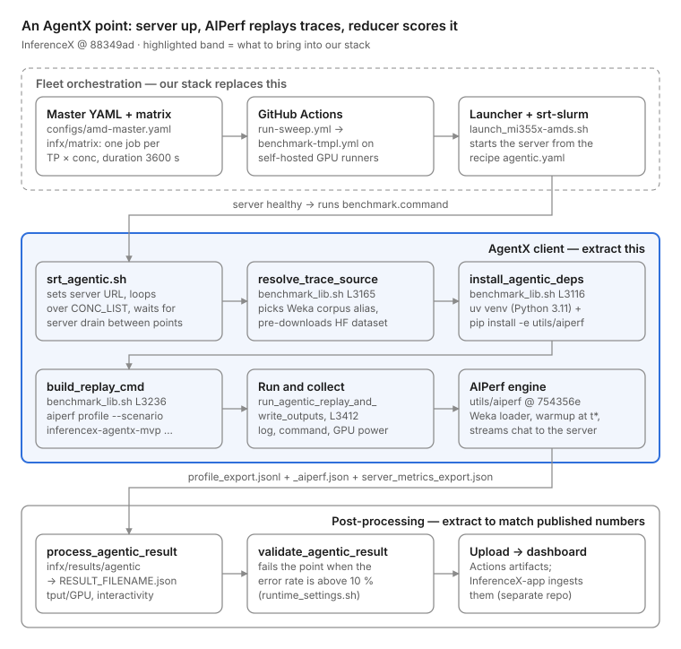

# InferenceX AgentX Extraction Guide

27 Sep 2026 · Rajeev Ranjan (drafted with Claude)

## Goal and scope

The ask from the onboarding session: pull the smallest working core of InferenceX's agentic benchmark (AgentX) out of the InferenceX repo, run it from our own internal stack setup, and check that it reproduces InferenceX's published numbers.

Why: our release gates only sweep fixed ISL/OSL/concurrency and score the geomean of our/NVIDIA ratios. That misses the multi-turn, KV-cache-heavy agentic workload that InferenceX (SemiAnalysis) now publishes and that shapes what gets attention.

This doc answers four questions:

1. Where the agentic benchmark lives in InferenceX, file by file.
2. What the minimal piece is (AIPerf + public dataset + the exact parameters) and what can be left behind.
3. How to run that piece standalone against a served model.
4. Whether `vllm bench serve` can act as a good-enough proxy for AIPerf, so our existing tooling can be reused.

## InferenceX repository map

Of roughly 20 top-level areas, only three matter for AgentX: `benchmarks/` (bash glue), `infx/results/agentic/` (post-processing), and the `utils/aiperf` submodule (the actual load generator). Everything else is fleet scheduling, CI, fixed-sequence benchmarks, evals or publishing.

All links are pinned to InferenceX commit `88349ad` (27 Sep 2026) and the AIPerf submodule commit `754356e` (SemiAnalysisAI/aiperf fork).

| Path | What it does | Need it? |
| --- | --- | --- |
| [benchmarks/srt\_agentic.sh](https://github.com/SemiAnalysisAI/InferenceX/blob/88349ad38e6db5e60cd92081f4bdefc1932611af/benchmarks/srt_agentic.sh) | Client-only AgentX entry point: resolves the server URL, loops over `CONC_LIST`, builds and runs the replay per concurrency | Yes (logic only) |
| [benchmarks/benchmark\_lib.sh](https://github.com/SemiAnalysisAI/InferenceX/blob/88349ad38e6db5e60cd92081f4bdefc1932611af/benchmarks/benchmark_lib.sh) | 3,566-line shared library; lines 3078–3566 are the AgentX part (install AIPerf, pick dataset, build command, run, post-process) | Yes (\~300 lines) |
| [benchmarks/runtime\_settings.sh](https://github.com/SemiAnalysisAI/InferenceX/blob/88349ad38e6db5e60cd92081f4bdefc1932611af/benchmarks/runtime_settings.sh) | Default values for every `AIPERF_*` knob (thresholds, warmup, idle caps) | Yes (values) |
| [utils/aiperf](https://github.com/SemiAnalysisAI/aiperf/tree/754356e9a39acc6cc6afb242d123bb57c3fb6f75) (submodule) | SemiAnalysis fork of NVIDIA AIPerf with the `inferencex-agentx-mvp` scenario, agentic-replay scheduler and Weka trace loaders | Yes (pin, don't copy) |
| [infx/results/agentic/](https://github.com/SemiAnalysisAI/InferenceX/tree/88349ad38e6db5e60cd92081f4bdefc1932611af/infx/results/agentic) | Turns AIPerf artifacts into the InferenceX aggregate JSON (throughput/GPU, interactivity, cache hit rates) and validates error rate | Yes, to match published numbers |
| [infx/results/generate\_aiperf\_plots.py](https://github.com/SemiAnalysisAI/InferenceX/blob/88349ad38e6db5e60cd92081f4bdefc1932611af/infx/results/generate_aiperf_plots.py) | Optional `metrics_plots.png` from per-second server metrics | Optional |
| [benchmarks/single\_node/srt-slurm-recipes/](https://github.com/SemiAnalysisAI/InferenceX/tree/88349ad38e6db5e60cd92081f4bdefc1932611af/benchmarks/single_node/srt-slurm-recipes) | Per model/GPU/engine `agentic.yaml`: exact server args, image, TP and per-concurrency overrides | Reference (server flags) |
| [configs/amd-master.yaml](https://github.com/SemiAnalysisAI/InferenceX/blob/88349ad38e6db5e60cd92081f4bdefc1932611af/configs/amd-master.yaml) / nvidia-master.yaml | Which model × GPU × TP × concurrency points get run (the search space) | Reference (which points to reproduce) |
| [infx/matrix/](https://github.com/SemiAnalysisAI/InferenceX/tree/88349ad38e6db5e60cd92081f4bdefc1932611af/infx/matrix) | Expands master YAML into a CI job matrix; sets agentic duration to 3600 s | No (one constant) |
| [.github/workflows/](https://github.com/SemiAnalysisAI/InferenceX/tree/88349ad38e6db5e60cd92081f4bdefc1932611af/.github/workflows) | `run-sweep.yml` → `benchmark-tmpl.yml`: schedules jobs on self-hosted runners, uploads artifacts | No |
| [runners/](https://github.com/SemiAnalysisAI/InferenceX/tree/88349ad38e6db5e60cd92081f4bdefc1932611af/runners) | Per-cluster launchers (`launch_mi355x-amds.sh` etc.) that submit srt-slurm jobs | No |
| utils/srt-slurm (submodule) | NVIDIA srt-slurm: starts the inference server from a recipe, then calls the benchmark command | No (our stack starts the server) |
| infx/evals, infx/klaud, infx/workflows, experimental/ | Accuracy evals, automation bot, publishing, experiments | No |
| infx/bench\_serving/ | Fixed-sequence client (vLLM `benchmark_serving` fork) used by the old release-gate style runs | No for AgentX; relevant for the vLLM-bench proxy question |

The public dashboard (InferenceX-app) is a separate repository; this one only produces the JSON it ingests.

## Code flow graph

One published AgentX point is one server configuration at one concurrency, replayed for 60 minutes. CI and srt-slurm only get the server running; everything after the server is healthy is a short bash chain that ends in one `aiperf profile` call and a Python reducer.



Read top to bottom. The dashed band is what our internal stack already does in its own way (start a server, pick a config). The highlighted band plus the reducer are what needs to move into our repository.

## AgentX internals and exact code locations

AgentX is a single command: `aiperf profile --scenario inferencex-agentx-mvp` pointed at a public HuggingFace trace corpus. The InferenceX bash code only picks the corpus, fixes about 20 flags, and post-processes the output. All the replay logic (warmup, sessions, subagents, cache-busting) lives in the AIPerf fork.

**What the workload is.** 393 recorded Claude Code sessions from the Weka corpus `semianalysisai/cc-traces-weka-062126`: 56.8k main turns, 1,697 subagent groups and 98.8k total requests. Prompts are synthetic filler, but each prompt has the exact recorded token count and the same cache-block sharing, so prefix-cache behaviour matches production. `max_tokens` equals the recorded output length and `ignore_eos=true` is forced.

**What concurrency means.** `--concurrency N` keeps N live session trees (a root plus its subagents), not N requests. There is no request-rate knob. Each lane starts at a random point t\* in its trace, sends the turn before t\* as KV-cache warmup, then replays from t\* with the recorded think-time gaps. A finished lane recycles to a new trace from turn 0.

| Step | What happens | Code location |
| --- | --- | --- |
| Entry point | Sets `AIPERF_SERVER_URL`, splits `CONC_LIST`, calls the steps below once per concurrency, and waits until the server is idle (3 polls of `/metrics`) between points | [srt\_agentic.sh L61–184](https://github.com/SemiAnalysisAI/InferenceX/blob/88349ad38e6db5e60cd92081f4bdefc1932611af/benchmarks/srt_agentic.sh#L61-L184) |
| Guard: native context | Unsets `MAX_MODEL_LEN` for agentic runs and requires `KV_OFFLOADING` to be set | [benchmark\_lib.sh L382–395](https://github.com/SemiAnalysisAI/InferenceX/blob/88349ad38e6db5e60cd92081f4bdefc1932611af/benchmarks/benchmark_lib.sh#L382-L395) |
| AIPerf paths | `AIPERF_DIR=utils/aiperf`, venv, `AIPERF_CLI`, `AIPERF_PYTHON` | [benchmark\_lib.sh L3078–3085](https://github.com/SemiAnalysisAI/InferenceX/blob/88349ad38e6db5e60cd92081f4bdefc1932611af/benchmarks/benchmark_lib.sh#L3078-L3085) |
| Install client | uv venv on Python 3.11, then `pip install -e utils/aiperf` plus pandas, transformers, datasets and hf CLI | [install\_agentic\_deps L3116](https://github.com/SemiAnalysisAI/InferenceX/blob/88349ad38e6db5e60cd92081f4bdefc1932611af/benchmarks/benchmark_lib.sh#L3116-L3159) |
| Pick corpus | 1M-context families (dsv4, glm5.x, minimaxm3, kimik3) get `semianalysis_cc_traces_weka_062126`; all others get the `_256k` variant. `WEKA_LOADER_OVERRIDE` overrides it. Then `hf download` into the cache | [resolve\_trace\_source L3165–3234](https://github.com/SemiAnalysisAI/InferenceX/blob/88349ad38e6db5e60cd92081f4bdefc1932611af/benchmarks/benchmark_lib.sh#L3165-L3234) |
| Build command | Assembles `REPLAY_CMD` (every flag listed in the run section below) | [build\_replay\_cmd L3236–3366](https://github.com/SemiAnalysisAI/InferenceX/blob/88349ad38e6db5e60cd92081f4bdefc1932611af/benchmarks/benchmark_lib.sh#L3236-L3366) |
| Run | Writes `benchmark_command.txt`, runs the command with a tee to `benchmark.log`, and optionally records GPU power | [run\_agentic\_replay\_and\_write\_outputs L3412–3566](https://github.com/SemiAnalysisAI/InferenceX/blob/88349ad38e6db5e60cd92081f4bdefc1932611af/benchmarks/benchmark_lib.sh#L3412-L3566) |
| Scenario lock | Locks agentic-replay timing, `ignore_eos`, streaming, `cache-bust first_turn_prefix`, a 10 s system idle cap, a 900 s minimum duration and the pinned Weka loader | [aiperf …/scenario/inferencex\_agentx\_mvp.py](https://github.com/SemiAnalysisAI/aiperf/blob/754356e9a39acc6cc6afb242d123bb57c3fb6f75/src/aiperf/common/scenario/inferencex_agentx_mvp.py) |
| Trace loader | Reads the HF dataset rows into `WekaTrace` objects and rebuilds token-exact prompts | [aiperf …/loader/semianalysis\_cc\_traces\_weka.py](https://github.com/SemiAnalysisAI/aiperf/blob/754356e9a39acc6cc6afb242d123bb57c3fb6f75/src/aiperf/dataset/loader/semianalysis_cc_traces_weka.py) and the registry in [plugins.yaml L2423](https://github.com/SemiAnalysisAI/aiperf/blob/754356e9a39acc6cc6afb242d123bb57c3fb6f75/src/aiperf/plugin/plugins.yaml#L2423) |
| Replay scheduler | Lanes, t\* warmup (`_execute_warmup` L625), profiling (`_execute_profiling` L1317), recycle (L1606), system idle cap (L511) | [aiperf …/timing/strategies/agentic\_replay.py](https://github.com/SemiAnalysisAI/aiperf/blob/754356e9a39acc6cc6afb242d123bb57c3fb6f75/src/aiperf/timing/strategies/agentic_replay.py) |
| Aggregate | Builds `RESULT_FILENAME.json`: `request_metrics` (QPS, TTFT, ITL, interactivity, throughput and throughput per GPU, theoretical cache hit rate) and `server_metrics` (GPU/CPU cache hit rate, KV usage) | [process\_agentic\_result.py](https://github.com/SemiAnalysisAI/InferenceX/blob/88349ad38e6db5e60cd92081f4bdefc1932611af/infx/results/agentic/process_agentic_result.py) → [build\_result](https://github.com/SemiAnalysisAI/InferenceX/blob/88349ad38e6db5e60cd92081f4bdefc1932611af/infx/results/agentic/__init__.py#L141) → [request\_metrics.py](https://github.com/SemiAnalysisAI/InferenceX/blob/88349ad38e6db5e60cd92081f4bdefc1932611af/infx/results/agentic/request_metrics.py) |
| Validate | Fails the point when the error rate is above `AIPERF_FAILED_REQUEST_THRESHOLD` (0.10) | [validate\_agentic\_result.py L48](https://github.com/SemiAnalysisAI/InferenceX/blob/88349ad38e6db5e60cd92081f4bdefc1932611af/infx/results/agentic/validate_agentic_result.py#L48) |
| Extras | Distribution plots, `metrics_plots.png`, power adapter | [analyze\_benchmark\_distributions.py](https://github.com/SemiAnalysisAI/InferenceX/blob/88349ad38e6db5e60cd92081f4bdefc1932611af/infx/results/agentic/analyze_benchmark_distributions.py), [generate\_aiperf\_plots.py](https://github.com/SemiAnalysisAI/InferenceX/blob/88349ad38e6db5e60cd92081f4bdefc1932611af/infx/results/generate_aiperf_plots.py), [power\_adapter.py](https://github.com/SemiAnalysisAI/InferenceX/blob/88349ad38e6db5e60cd92081f4bdefc1932611af/infx/results/agentic/power_adapter.py) |

Background reading in the fork: the [AgentX MVP tutorial](https://github.com/SemiAnalysisAI/aiperf/blob/754356e9a39acc6cc6afb242d123bb57c3fb6f75/docs/tutorials/agentx-mvp.md) (how to run it) and the [AgentX FAQ](https://github.com/SemiAnalysisAI/aiperf/blob/754356e9a39acc6cc6afb242d123bb57c3fb6f75/docs/benchmark-modes/semianalysis-agentx-faq.md) (load shape, t\*, cache-busting, subagents, validity).

## Minimal extraction

The minimum is three pieces: the pinned AIPerf fork, one \~60-line script that reproduces `build_replay_cmd`, and the `infx/results/agentic` reducer. Server launch, CI, the matrix, srt-slurm, evals and power accounting can all stay behind, because our internal stack already starts the server.

| Piece | Action | Why |
| --- | --- | --- |
| `SemiAnalysisAI/aiperf` @ `754356e` | Pin as a dependency (`pip install git+https://github.com/SemiAnalysisAI/aiperf@754356e…`) or as a submodule. Don't vendor it | Contains the scenario, loader and scheduler. Upstream NVIDIA AIPerf may lag the fork |
| `build_replay_cmd` flags | Rewrite as one script in our repo, with the values from `runtime_settings.sh` | This is the contract that makes our numbers comparable to theirs |
| `resolve_trace_source` | Keep only the model → corpus rule (1M-context → `_062126`, else `_062126_256k`) | Using the wrong corpus variant changes the workload |
| `infx/results/agentic/` (\~3.5k lines, standard library only; also needs infx/results/metadata.py and topology.py; backends/ parses sglang, vllm, atom, trtllm and dynamo metrics) | Copy the whole package, or install InferenceX's `infx` package and call `python -m infx.results.agentic.process_agentic_result` | Published dashboard numbers come from this reducer, not from AIPerf's own summary table |
| `validate_agentic_result.py` | Copy (it's in the same package) | Same 10% failure gate as InferenceX |
| `srt_agentic.sh` drain loop | Only needed if we run several concurrencies against one server. Otherwise restart the server per point, as the InferenceX single-node flow does | Keeps points independent |
| Recipe `agentic.yaml` | Read the server flags from it; don't copy the file | To reproduce an AMD point we must launch the same image and args in our internal stack |
| Power monitor, `power_adapter.py` | Skip at first | Only needed for tokens-per-joule charts |
| srt-slurm, runners, workflows, matrix, klaud, evals | Skip | Fleet plumbing that our internal stack replaces |

Env vars the reducer reads (set them in our wrapper): `RESULT_FILENAME`, `RESULT_DIR`, `AGENTIC_OUTPUT_DIR`, `MODEL`, `MODEL_PREFIX`, `FRAMEWORK`, `PRECISION`, `CONC`, `TP`, `EP_SIZE`, `KV_OFFLOADING` (required; use `none`), `IS_MULTINODE=false`, `SPEC_DECODING`, `RUNNER_TYPE`, `IMAGE`. `num_gpus` comes from `TP × PP × DCP × PCP`, and throughput per GPU is divided by it.

## How to run it standalone

One InferenceX point takes four steps: start the server with the recipe's args, install the pinned AIPerf, run the exact `build_replay_cmd` command for 3600 s, then run the reducer. The example below reproduces the AMD point Qwen3.5-397B MXFP4 on MI355X, SGLang, TP2, concurrency 8 (from [configs/amd-master.yaml L411–425](https://github.com/SemiAnalysisAI/InferenceX/blob/88349ad38e6db5e60cd92081f4bdefc1932611af/configs/amd-master.yaml#L411-L425) and [its agentic.yaml](https://github.com/SemiAnalysisAI/InferenceX/blob/88349ad38e6db5e60cd92081f4bdefc1932611af/benchmarks/single_node/srt-slurm-recipes/qwen3.5/sglang/mi355x-fp4-mtp/agentic.yaml)).

**1. Server** (image `lmsysorg/sglang-rocm:v0.5.19-rocm720-mi35x-20260915`; flags translated from the recipe's `base` + `override_tp2_c8`. Check the flag names against that SGLang build):

```bash
export SGLANG_USE_AITER=1 SGLANG_USE_AITER_UNIFIED_ATTN=1 AITER_FLYDSL_FORCE=1 \
       SGLANG_MAMBA_SSM_DTYPE=bfloat16 ROCM_QUICK_REDUCE_QUANTIZATION=INT4 SGLANG_TIMEOUT_KEEP_ALIVE=1800
MODEL=amd/Qwen3.5-397B-A17B-MXFP4-AttnFP8-V2
python3 -m sglang.launch_server --model-path $MODEL --served-model-name $MODEL --trust-remote-code \
  --port 8000 --tp 2 --attention-backend aiter --mem-fraction-static 0.8 --page-size 16 \
  --kv-cache-dtype fp8_e4m3 --max-prefill-tokens 16384 --chunked-prefill-size 16384 \
  --scheduler-recv-interval 60 --stream-interval 50 --reasoning-parser qwen3 --tool-call-parser qwen3_coder \
  --speculative-algorithm EAGLE --speculative-num-steps 3 --speculative-eagle-topk 1 --speculative-num-draft-tokens 4 \
  --max-running-requests 16 --cuda-graph-max-bs-decode 16 --watchdog-timeout 1200 \
  --enable-metrics --enable-cache-report
```

Note that `max-running-requests` is 2 × CONC in every recipe override, and the server runs at the model's native context (no `--context-length` cap).

**2. Client install** (what `install_agentic_deps` does):

```bash
uv venv --python 3.11 .aiperf && source .aiperf/bin/activate
uv pip install "git+https://github.com/SemiAnalysisAI/aiperf@754356e9a39acc6cc6afb242d123bb57c3fb6f75" \
  "huggingface_hub[cli]>=0.25.0" "transformers>=4.46" "datasets>=4.7.0"
hf download --repo-type dataset semianalysisai/cc-traces-weka-062126-256k   # Qwen3.5 uses the _256k corpus
```

**3. Replay** (exactly the flags `build_replay_cmd` emits with the defaults from `runtime_settings.sh`):

```bash
export AIPERF_DATASET_WEKA_LIVE_ASSISTANT_RESPONSES=0 AIPERF_DATASET_CONFIGURATION_TIMEOUT=1800 \
       AIPERF_SERVICE_PROFILE_CONFIGURE_TIMEOUT=1800 AIPERF_UI_REALTIME_METRICS_ENABLED=true
CONC=8; OUT=results/qwen35_mi355x_tp2_c${CONC}
aiperf profile --scenario inferencex-agentx-mvp \
  --url http://localhost:8000 --endpoint /v1/chat/completions --endpoint-type chat --streaming \
  --model $MODEL --tokenizer $MODEL --tokenizer-trust-remote-code \
  --concurrency $CONC --benchmark-duration 3600 --stats-interval 30 --random-seed 42 \
  --failed-request-threshold 0.10 \
  --trajectory-start-min-ratio 0.25 --trajectory-start-max-ratio 0.75 \
  --warmup-requests-per-lane 10 --warmup-grace-period 1800 \
  --trace-idle-gap-cap-seconds 300 \
  --use-server-token-count --no-gpu-telemetry \
  --num-dataset-entries 393 --slice-duration 1.0 \
  --apply-chat-template \
  --output-artifact-dir $OUT/aiperf_artifacts \
  --public-dataset semianalysis_cc_traces_weka_062126_256k 2>&1 | tee $OUT/benchmark.log
```

`--apply-chat-template` is only there because this recipe sets `AIPERF_APPLY_CHAT_TEMPLATE=true`. Add `--max-context-length N` only if the server's limit is below native context. Server metrics are scraped from `<url>/metrics` by default.

**4. Reduce and validate** (from an InferenceX checkout, or from our copy of `infx/results`):

```bash
export RESULT_DIR=$OUT AGENTIC_OUTPUT_DIR=$OUT RESULT_FILENAME=qwen35_mi355x_tp2_c8 \
       MODEL=$MODEL MODEL_PREFIX=qwen3.5 FRAMEWORK=sglang PRECISION=fp4 CONC=$CONC TP=2 EP_SIZE=1 \
       SPEC_DECODING=mtp KV_OFFLOADING=none IS_MULTINODE=false RUNNER_TYPE=mi355x
python -m infx.results.agentic.process_agentic_result
python -m infx.results.agentic.validate_agentic_result $OUT/aiperf_artifacts --failed-request-threshold 0.10
```

**Smoke test first.** InferenceX's `agentx-fast` mode uses `--benchmark-duration 1200 --warmup-requests-per-lane 1`. Anything under 900 s needs `--unsafe-override` and is stamped `submission_valid: false`. Expect a cold first run to spend several minutes on dataset reconstruction before warmup; a fixed seed makes later runs reuse the cache.

**Differences from the AIPerf tutorial defaults that matter.** InferenceX uses a t\* window of 0.25–0.75 (the scenario default is 0.0–1.0), seed 42, 10 warmup requests per lane, a 300 s per-trace idle cap and a 3600 s duration. Copy the tutorial command instead and our numbers will not line up with the dashboard.

## Metrics, output format, and comparing with published numbers

Compare our `RESULT_FILENAME.json` with InferenceX's `bmk_agentic_<RESULT_FILENAME>` artifact for the same model, GPU, engine, TP and concurrency, field by field. Don't compare against AIPerf's console table: the reducer uses a different population (warmup and error rows are dropped) and its own formulas.

**AIPerf writes** (under `aiperf_artifacts/`): `profile_export.jsonl` (one record per request), `profile_export_aiperf.json` (aggregates plus `metadata.submission_valid`), and `server_metrics_export.json`/`.csv` (per-second Prometheus slices).

**The reducer's fields to compare:**

| Field in the aggregate JSON | Definition in the code |
| --- | --- |
| `request_metrics.throughput.per_gpu.total_tput_tps` (and `output_`/`input_`) | (Σ input + Σ output tokens of successful profiling requests) ÷ (last end − first start), divided by `num_gpus` |
| `request_metrics.latency.intvty.p50` / `p90` | 1 ÷ P50/P90 of per-request ITL, so p90 is the slow tail. It is not the P90 of 1/ITL |
| `request_metrics.latency.e2e_norm_intvty.*` | 1 ÷ percentile of (request latency ÷ output tokens); includes the wait for the first token |
| `request_metrics.latency.ttft.*`, `e2el.*` | Seconds, from AIPerf per-record `time_to_first_token`, `request_latency` |
| `request_metrics.qps.*` | Completed requests per window |
| `request_metrics.cache.theoretical_cache_hit_rate` | Upper bound on prefix reuse from the trace structure (AIPerf `theoretical_prefix_cache_hit`) |
| `server_metrics.cache.gpu_cache_hit_rate`, `kv_cache.gpu_usage_pct` | Engine-reported values, parsed by `backends/sglang.py` or `backends/vllm.py` |
| `num_requests_total` / `num_requests_successful`, `request_accounting` | Sanity check: warmup dropped, error dropped |

Code: [request\_metrics.py L65 (interactivity)](https://github.com/SemiAnalysisAI/InferenceX/blob/88349ad38e6db5e60cd92081f4bdefc1932611af/infx/results/agentic/request_metrics.py#L65), [L214 (throughput)](https://github.com/SemiAnalysisAI/InferenceX/blob/88349ad38e6db5e60cd92081f4bdefc1932611af/infx/results/agentic/request_metrics.py#L214), [per-GPU division in \_\_init\_\_.py](https://github.com/SemiAnalysisAI/InferenceX/blob/88349ad38e6db5e60cd92081f4bdefc1932611af/infx/results/agentic/__init__.py#L141).

**Where the published numbers live.** Each dashboard point (e.g. [inferencex.semianalysis.com/inference/agentic/442369](https://inferencex.semianalysis.com/inference/agentic/442369)) links to its GitHub Actions run. That run uploads `bmk_agentic_<name>` (the aggregate JSON) and `agentic_<name>` (raw AIPerf artifacts), per [benchmark-tmpl.yml L386–397](https://github.com/SemiAnalysisAI/InferenceX/blob/88349ad38e6db5e60cd92081f4bdefc1932611af/.github/workflows/benchmark-tmpl.yml#L386-L397). Download those and diff them against ours.

**Suggested pass criteria (a proposal to agree with the team):** same corpus, seed and flags; `submission_valid: true`; error rate under 10%; and throughput per GPU and p50 interactivity within about ±5% of the published point on the same image. Run each point twice to see our own run-to-run noise before judging the gap.

## vllm bench serve as a proxy for AgentX

Plain `vllm bench serve` cannot reproduce AgentX: it sends independent requests, so it has no session trees, think time or trace-shaped prefix sharing. A proxy is only credible if it ranks server configs the same way AgentX does, and that has to be measured, not assumed.

**What AgentX exercises that a fixed ISL/OSL sweep does not:**

- Growing multi-turn prompts with exact block-level prefix reuse (cache hit rate is the main lever).
- Subagent fan-out and joins, which produce bursty, tree-shaped concurrency.
- Recorded idle gaps between turns (capped at 300 s per trace and 10 s system-wide), so KV blocks age and get evicted or offloaded.
- `ignore_eos` with recorded output lengths, over a very wide input-length distribution (up to \~256k or 1M).

| Proxy candidate | Keeps | Loses |
| --- | --- | --- |
| `vllm bench serve` random/sharegpt at matched ISL/OSL | Prefill/decode mix on average | Prefix reuse, sessions, timing: the cache hit rate will be wrong |
| `vllm bench serve --dataset-name custom` fed the request sizes from an AgentX `profile_export.jsonl` | The exact ISL/OSL distribution | Shared prefixes (prompts are independent), ordering, think time |
| vLLM [benchmarks/multi\_turn](https://github.com/vllm-project/vllm/tree/main/benchmarks/multi_turn) with conversations shaped to the corpus (turns, ISL growth, delays) | Multi-turn prefix reuse, inter-turn delay | Subagent trees, t\* warmup, cache-bust per replay; needs a converter from Weka traces |
| AIPerf AgentX itself (smoke-mode 1200 s, fewer points) | Everything | Slower (dataset build plus a 20–60 min run per point) |

**How to decide (proposal):** pick 6–8 server configs that differ in things AgentX is sensitive to, e.g. TP2 vs TP4, concurrency 4/8/16, HiCache on/off, and page size. Run each under AgentX and under the proxy. The proxy passes if it picks the same best config and the rank correlation of throughput per GPU at matched interactivity is ≥ 0.9. If only the multi-turn proxy passes, invest in a Weka → multi\_turn converter. If none pass, our internal stack should call AIPerf directly.

## Open questions and next steps

- [ ] Get added to the [internal dev team] ([colleague]) so I can read [internal perf repo] and its existing `examples/` AIPerf AgentX example; check how far it already goes before writing anything new.
- [ ] Decide whether our internal stack pins the SemiAnalysis AIPerf fork (`754356e`) or upstream NVIDIA AIPerf. Only the fork is guaranteed to match InferenceX.
- [ ] Pick 2–3 published AMD points to reproduce first (e.g. Qwen3.5 MXFP4 MI355X SGLang TP2 c8 and TP4 c16), and download their `bmk_agentic_*` artifacts.
- [ ] Run one smoke point (1200 s, `--warmup-requests-per-lane 1`) end to end: server → AIPerf → reducer → validator.
- [ ] Run the full 3600 s point twice, then diff against the published JSON using the fields in the metrics section.
- [ ] Write the wrapper script in our repo (flags from `build_replay_cmd`, corpus rule, reducer env vars).
- [ ] Run the proxy experiment (6–8 configs, AgentX vs `vllm bench serve` / multi\_turn) and report the rank correlation.

* Open: does InferenceX's own run for an AMD point set `AIPERF_SERVER_METRICS_URLS` to the worker (srt-slurm path) rather than the frontend? This matters for the server cache fields; check `benchmark_command.txt` in a published artifact.
* Open: the 0.25–0.75 t\* window InferenceX passes differs from the scenario default of 0.0–1.0. Confirm with the team that matching InferenceX, not the AIPerf tutorial, is the target.

**Sources:** [InferenceX @ 88349ad](https://github.com/SemiAnalysisAI/InferenceX/tree/88349ad38e6db5e60cd92081f4bdefc1932611af), [SemiAnalysis AIPerf fork @ 754356e](https://github.com/SemiAnalysisAI/aiperf/tree/754356e9a39acc6cc6afb242d123bb57c3fb6f75), [InferenceX\_Architecture notes](https://github.com/rajeev921/InferenceX_Architecture), and the onboarding session recordings (InferenceX1.m4a, inferenceX.m4a).
