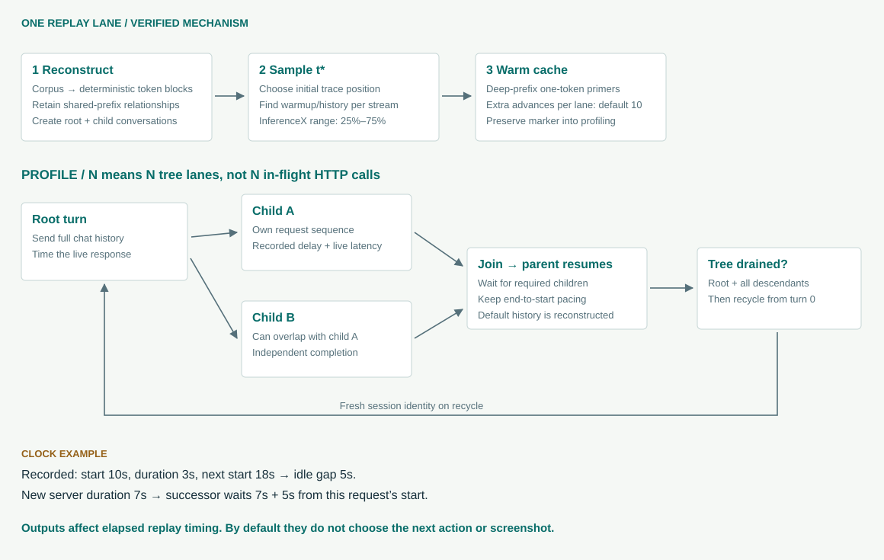
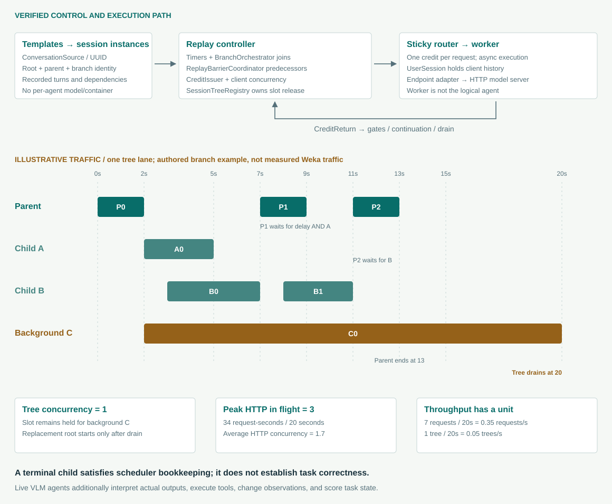
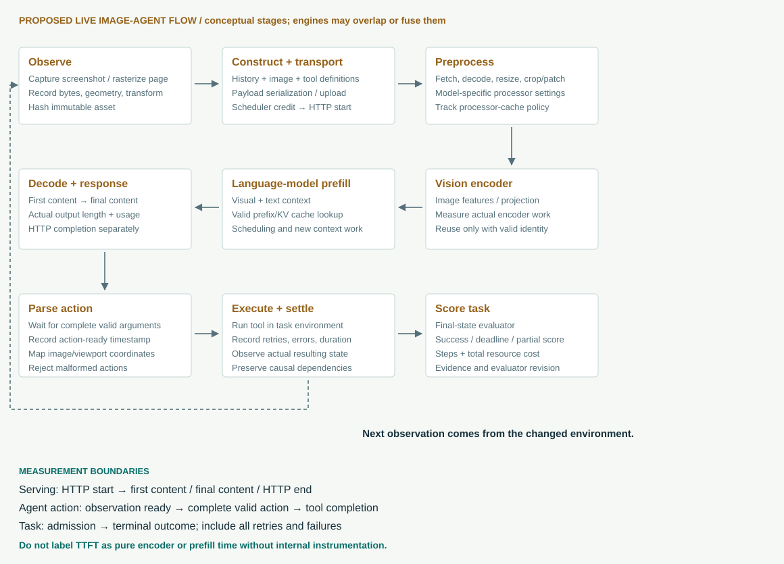

# InferenceX, AgentX, and an image-agent benchmark you can build

A code-level study of workload reconstruction, replay scheduling, measurement, serving, evaluation, and reusable result visualization.

**Revision 3 · 24 September 2026.** Focus: image-based agents that read screenshots and documents and invoke tools. This replaces the earlier architecture overview. **Verified implementation**, **interpretation**, and **proposed design** are distinguished throughout. No GPU benchmark or live agent evaluation was run for this study; numerical teaching examples are explicitly illustrative.

## 1. The answer for your use case

You can reuse a substantial part of this toolbox, but the useful boundary is wider than the dashboard and narrower than the entire InferenceX deployment. Reuse the streaming measurement client, artifact contracts, metric-reduction patterns, experiment provenance, and diagnostic visualizations. Add a real image workload, image-aware measurement, and a task evaluator. For live visual agents, also add the environment/action loop that changes the next observation according to the model's actual output.

**Canonical AgentX is a serving-system benchmark driven by reconstructed coding-agent traces. It does not, by itself, tell you whether a visual agent understood a screenshot or completed a task.** Its default replay preserves recorded workload structure while synthesizing the content. Model outputs are timed, but the next recorded conversation does not depend on whether those outputs made sense. The separate evaluation machinery in InferenceX can grade tasks; it is a different execution path. [Trace reconstruction][H02] · [Replay configuration][B01] · [Evaluation procedures][B12]

Three experiments answer different questions:

| Experiment | What is held fixed | What actually changes | Question it answers |
|---|---|---|---|
| Image-serving load test | Images, prompts, request schedule, optional output budget | Engine execution and generated answers | Can this serving configuration handle this image workload at an acceptable latency and error rate? |
| Recorded visual-agent replay | Real screenshots/document pages, recorded messages, tool observations, and dependency graph | Serving latency; optionally the measured generated response | How does the infrastructure behave under a repeatable visual-agent traffic pattern? |
| Live visual-agent evaluation | Initial task, environment snapshot, action policy, limits, evaluator | Model answers, actions, subsequent screenshots, number of turns, retries, success | Does the complete agent solve the task, how long does it take, and at what resource cost? |

You need all three eventually, but should build them in that order. A faster model can be worse at choosing tools. A more accurate model can require fewer turns and finish a task sooner despite slower token generation. A server with impressive decode throughput can be poor for a screenshot agent that generates short JSON actions after expensive image encoding.

**The main result to optimize for your application should be successful tasks per unit of time or cost, subject to a latency target and quality floor.** Tokens per second, cache hit rates, and GPU utilization explain that outcome; they do not replace it. This is a design recommendation, not an existing AgentX score.

### What was inspected

The study follows InferenceX commit `5abd17e2ef546bd557608b370a8ff6123a170cbf`, InferenceX-app commit `b710865c22e631d1cf0420f029afbd950ee73bb8`, and the exact harness gitlink `754356e9a39acc6cc6afb242d123bb57c3fb6f75`. The website now links a separately named [AgentX Harness repository](https://github.com/SemiAnalysisAI/agentx-harness), inspected at `56a0cf70f4c0359454ee4bd15a17770b541a3e3e`. Six critical scenario, loader, scheduler, and chat-endpoint files were byte-identical between that checkout and the InferenceX-pinned harness. This does not assert that their entire trees are identical.

The local gitlink remains under `utils/aiperf`, and the package/command is still named `aiperf`. Do not assume that an arbitrary `pip install aiperf` release is the exact harness used by a published InferenceX point. Pin the source revision and resolved dependencies. [Submodule declaration][B15] · [Harness package metadata][H17]

**Reading route:** sections 2–9 explain the existing benchmark, with agent creation, orchestration, and traffic in chapter 5; 10–12 explain what changes for vision; 13–17 define the toolbox and result representation to build; 18–20 give command templates, experiment controls, and implementation milestones.

## 2. Architecture: four responsibilities, three codebases


The benchmark repository, harness, model server, and result application have distinct jobs:

**InferenceX is the experiment operator.** Master YAML files describe model, container image, hardware pool, precision, parallelism, offload options, and concurrency search spaces. Python validates and expands those declarations. GitHub Actions schedules concrete jobs on self-hosted GPU runners. Pool-specific launchers allocate machines, start the containerized serving stack, invoke the benchmark client, and retain evidence. [Configuration example][B03] · [Matrix generator][B13] · [Reusable job][B14]

**AgentX Harness/AIPerf is the traffic and measurement engine.** It loads a dataset, creates conversations, schedules requests and dependencies, sends streaming HTTP calls, consumes responses, collects telemetry, and exports records. The AgentX scenario constrains this general engine to a particular benchmark protocol. AIPerf also has multimodal loaders and a chat serializer that are useful outside that protocol. [Scenario][H04] · [Multimodal loader][H11] · [Chat endpoint][H12]

**The inference engine is the system under test.** SGLang, vLLM, TensorRT-LLM, or another compatible engine performs model execution. It owns request scheduling, model weights, tensor/expert/pipeline parallelism, prefix caching, KV allocation, and possibly offload. A router and separate prefill/decode pools can sit behind the API. Neither the browser nor AIPerf implements the model's vision encoder or decoder kernels.

**InferenceX-app is the result publication and inspection system.** Ingestion associates artifacts with a run and configuration, normalizes metrics, persists raw/derived trace data, and exposes read APIs. React renders selection controls and D3 charts over those saved records. The detailed point pages connect the summary dot to latency distributions, cache/queue time series, and request timelines. [Trace ETL][A02] · [Detail UI][A07]

### Is it delivered through Docker?

Docker is one execution mechanism, not the whole product architecture. InferenceX recipes use pinned serving images, and some pools run through Slurm/Enroot rather than a normal local `docker run`. The client installs the checked-out AIPerf package into an isolated runtime environment. The public web application is a separate application and database. You can run a local benchmark against an already running endpoint without copying the fleet scheduler or the public dashboard deployment. [Client bootstrap][B01] · [Architecture guide in the source repository][B16]

For your first VLM experiment, the useful minimum is **one supported model server + one benchmark client + a versioned image dataset + raw artifacts + a reducer/viewer**. Add a task sandbox and evaluator for live agents. GitHub Actions, a queue, and a multi-user dashboard become useful when the experiments are repeatable and numerous.

## 3. What a recorded AgentX workload really contains

### 3.1 Capture records describe work, not recoverable original content

The repository's proxy converter consumes timestamped session records, deduplicates them, identifies main and subagent activity, and emits Weka-format traces. A normal trace request contains a timestamp `t`, input length `in`, output length `out`, cache `hash_ids`, model name, and optional timing/content-type annotations. Nested subagent entries carry their own request lists. The strict Pydantic schema forbids extra fields and restricts `hash_id_scope` to `local`. [Capture converter][B05] · [Weka schema][H01]

These are sufficient to reproduce aspects of **load shape**: growing context, repeated prefixes, output lengths, delays, fan-out, and joins. They are insufficient to reconstruct the original screenshot, exact tool specification, a database result, or the semantic answer that should follow a prompt.

The converter sets a 64-token capture block size. Its `effective_input_length()` prioritizes `hash_token_count`, then `len(hash_ids) × block_size`, and only falls back to input plus cache-read plus cache-write token accounting. Consequently, the replay input length is a deliberate cache-covered accounting choice, not necessarily a byte-for-byte representation of every original request field. This is an important qualification to claims that the workload is “real.” [Input accounting][B05]

### 3.2 How counts and hashes become prompts

The loader reconstructs deterministic filler token blocks from recorded identities. Shared leading hash IDs produce shared reconstructed prefix material within the trace's namespace. It then composes conversation turns and accumulates their deltas into the full chat messages sent to the server. The intended repeated-prefix relationship is preserved even though the text is synthetic. [Loader][H02] · [Prompt composition][H03] · [Worker conversation state][H09]

Consider this **illustrative structural example**, simplified to make the arithmetic visible:

```text
Capture block size = 64 tokens
Turn 0: hashes [10, 11, 12, 13], input 256, output 32
Turn 1: hashes [10, 11, 12, 13, 14], input 320, output 48

Reconstructed turn 1 reuses the leading 256-token block sequence.
Its extra block represents 64 tokens of newly introduced context.
The server receives the accumulated conversation, not just hash 14.
```

The capture block size is not a guarantee that every engine stores KV in the same physical page layout. The server tokenizes the serialized chat request using its own tokenizer/template and may choose another cache page size. Wrapping, injected markers, and decode/re-encode differences can affect exact lengths and cache boundaries. The intended structural correspondence must therefore be checked against actual wire payloads, server token counts, and observed reuse.

The same nominal token count also does not guarantee identical computation across models. Attention architecture, mixture-of-experts routing, quantization, and actual input content can change runtime behavior. The trace is a controlled system workload, not a proof of semantic or architectural equivalence.

### 3.3 Default assistant history is reconstructed

For the default Weka context mode, later requests use reconstructed recorded assistant material. The currently tested server generates a response, which is measured, but its words are not ordinarily used to determine the next prompt. InferenceX explicitly defaults `AIPERF_DATASET_WEKA_LIVE_ASSISTANT_RESPONSES` to `0`. Turning it on changes the experiment and its context behavior. It does not supply a browser, execute actions, or create a task evaluator. [Runtime defaults][B02] · [Replay builder][B01] · [Loader context mode][H02]

This design is useful for comparing infrastructure under a common trajectory. If a model produces an incorrect code edit, the fixed replay can continue with the same recorded next turn. That is precisely why a good throughput result cannot be interpreted as a good agent-success result.

### 3.4 Tool markers and subagents are not actual tool execution

Recorded tool-use annotations inform the workload reconstruction. By default, tool-result-like content can be represented as user text. An opt-in tool-shaped mode emits synthetic tool-call/result structures; it cannot recreate schemas absent from the capture. This exercises message formatting, not the correctness of calling a real application. [Tool shaping][H10]

Recorded model names are also remapped to the configured served model(s). With a single target model, parent and child traffic can all hit that model even if the capture used a stronger parent and a smaller helper. The preserved topology and preserved model-routing policy are different questions. [Model mapping][H02]

For your workload, retain **real image bytes, actual messages, tool definitions, tool outputs, parent-child identities, and environment state IDs**. Token counts alone cannot reproduce vision encoding or visual task difficulty.

## 4. The replay state machine, step by step



### 4.1 Configure and reconstruct before measurement

The selected loader downloads or locates the trace corpus, filters eligibility, synthesizes content using the chosen tokenizer, builds conversations and dependency metadata, and prepares data for workers. This can be CPU-intensive. It is not model-serving latency. Pin the corpus revision, tokenizer, seed, synthesis settings, and harness commit when reproducing a result. [Trace loader][H02] · [Public corpus loader][H18]

InferenceX's default corpus selection is model-family dependent: the resolver chooses full-context or 256k variants and supports explicit overrides. These are not interchangeable workload populations. A `_256k` corpus removes over-limit requests during corpus construction; a runtime `--max-context-length` filter can reject entire traces whose peak prompt-plus-output exceeds the cap. Compare the retained population, not just the flag's numerical value. [Resolver][B01] · [Eligibility filter][H02]

### 4.2 Concurrency counts live session trees

With `--concurrency N`, AgentX maintains N replay lanes for session trees. A tree contains a root and its descendants. A spawned child runs inside that tree's slot rather than consuming a new root slot. If several children run in parallel, the number of in-flight HTTP requests can exceed N. N is neither requests/second, exact simultaneous decoder batch size, nor active human users measured in production. [Session-tree registry][H08] · [Timing strategy][H06]

This matters for serving limits. A server configured for 32 active requests can queue child bursts even when the benchmark says concurrency 32. The inspected Qwen SGLang recipe explicitly sets `MAX_RUNNING_REQUESTS=2 × CONC`, illustrating that the two controls are separate. [Qwen recipe][B04]

### 4.3 Sample a position t* and reconstruct a warm state

Each initial lane samples a start instant, t*, within the recorded trace. The harness identifies each stream's history before t* and the next turns eligible afterward. A primer sends a deep-prefix request for streams already in progress so the server sees the context required at the measurement boundary. The primers request only one output token. Their purpose is cache population, not representative decode measurement. [Trajectory construction][H07] · [Warmup implementation][H06]

The generic AgentX scenario defaults to a 0%–100% start range. **The InferenceX wrapper explicitly sets 25%–75%.** It also requests ten additional warmup advances per lane by default. The benchmark therefore cannot be reproduced merely by copying a generic scenario quickstart. The wrapper's settings and recipe overrides are part of the protocol. [Scenario defaults][H04] · [Wrapper flags][B01] · [Runtime defaults][B02]

Warmup requests are spread according to the replay's phase-start behavior. Additional warmup advances can move the live state beyond the original snapshot before profiling resumes. Warmup is a separate phase in the raw records. Root warmup failure can abort the run before profiling; child handling has different rules. Inspect failure records instead of assuming every planned lane entered measurement successfully. [Timing strategy][H06]

### 4.4 Keep cache identity across warmup and profiling

The scenario injects a first-user-turn marker unique to a replayed session tree. The marker remains stable across that tree's warmup and profiling and changes when a lane recycles to a fresh session. This prevents copies of the same recorded user on different lanes from accidentally sharing the entire conversation's cache while preserving reuse within one tree. [Cache-bust ledger][H07] · [Marker lifecycle][H06]

This does not imply that every prefix byte is unique. Shared system material before the marker can still be shared, depending on serialization. For a production VLM study, decide whether shared instructions, shared documents, and repeated screenshots really should be reusable before adopting the same isolation rule.

### 4.5 Timing is completion-dependent

Suppose a captured request started at second 10, took 3 seconds, and the next began at second 18. Its inter-turn gap is `18 − (10 + 3) = 5 seconds`. If the tested server takes 7 seconds for that request, the successor is eligible after those 7 seconds plus the recorded 5-second gap. Reusing an 8-second start-to-start interval after completion would count the original 3 seconds twice. The loader reconstructs end-to-start delays. [Delay calculation][H02]

This produces a **closed-loop, dependency-aware** workload. A slower server slows progress through a lane; a faster server completes more turns and may recycle into more traces during a fixed-duration experiment. Same seed and duration do not guarantee identical completed request sets. Report the actually completed input/output distributions and identities along with performance.

The scenario has a 10-second whole-system idle cap. InferenceX additionally sets a 300-second per-tree idle cap. These guards advance eligible waiting timers when a whole system or tree is idle; they do not make a running request finish earlier or bypass a join. They compress some observed idle time, so “one hour of profiling” is not necessarily “one hour of the original user's wall-clock session.” [Replay controls][B01] · [Idle guards][H06]

### 4.6 Spawn, join, and recycle

The loader reconstructs child conversations and their dependencies. Children can overlap. A parent turn that depends on several children waits for their terminal outcomes; background children need not gate that parent turn. The tree's lane remains occupied until the root and all descendants have drained. Only then does the registry release it and let the sampler start another trace from turn zero. Recycled sessions do not repeat the startup t* snapshot procedure. [Child/dependency reconstruction][H02] · [Tree release][H08]

General AIPerf supports forked context as well as fresh spawned conversations. The inspected Weka path represents its subagents as spawns. Also distinguish the client's worker affinity, which helps maintain conversation state, from server/router affinity, which determines where the reusable model KV lives. They operate at different layers. [Replay strategy][H06] · [Worker state][H09]

### 4.7 Stop, drain, and export

The profile duration bounds admission; in-flight work and export can add time afterward. Warmup, preparation, drain, and measurement are separate intervals. Raw timestamps determine which denominator a metric uses. Short runs made with `--unsafe-override` are useful integration smoke tests but carry `submission_valid=false` under the scenario. Canonical scenario duration must be at least 900 seconds; the scenario defaults to 1,800 seconds, while the InferenceX matrix's normal agentic duration defaults to 3,600 seconds. [Scenario][H04] · [Matrix defaults][B19]

## 5. How agents are created, orchestrated, and turned into traffic

This chapter follows the actual runtime objects and events. The word **agent** is overloaded: a real application agent makes decisions and acts; an AgentX replay agent is a scheduled conversation stream reconstructed from a capture. A benchmark worker is a process that sends requests, and a model replica is a server deployment. These four things need not have a one-to-one relationship.

### 5.1 What “creating an agent” means in this harness

AgentX does not create a new intelligent program, provision a new model, or start a Docker container for every recorded subagent. The loader creates **conversation templates**. At execution time the conversation source creates **session instances** from those templates. The workers materialize session history and send its turns to an already running inference service. Several sessions and children can use one worker and the same served model. [Conversation creation][H28] · [Worker execution][H27]

The levels are:

| Object | Created from | Lifetime and purpose |
|---|---|---|
| Captured trace | Original recorded application traffic | Source evidence of observed request shapes, timestamps, and subagent markers |
| Conversation template | Loader reconstruction | Reusable sequence of turns, model labels, timing, branches, and prerequisites |
| Replay session | `ConversationSource.next()` or `start_branch_child()` | One execution instance, identified by a new `x_correlation_id` |
| Session tree | A root and all descendants | Owns one configured replay-concurrency slot until all work terminates |
| Credit | One eligible turn | Permission and metadata for one inference request; not a billing credit |
| Worker `UserSession` | Conversation template plus current runtime identity | Client-side history and turn position kept across requests |
| HTTP request | Endpoint serialization of that turn/history | The actual model-serving work whose latency and output are measured |

`conversation_id` names the reusable dataset template. `x_correlation_id` names this particular execution. A child gets its own correlation ID, the immediate parent's correlation ID, the tree's root correlation ID, and `agent_depth = parent_depth + 1`. Replaying the same source trace twice creates distinct execution identities. Grouping only by source ID would merge separate executions and corrupt concurrency and latency analysis. [Session creation][H28] · [Credit fields][H30]

For a live VLM agent, creation has an additional meaning: initialize an agent policy, instructions, model route, tool registry, working memory, task/environment identity, budgets, and termination rules. That policy will interpret actual model outputs. These proposed application objects are not supplied by creating an AgentX `SampledSession`.

### 5.2 How the loader reconstructs parent/child relationships

The Weka loader emits a root conversation and child conversations for captured subagent entries. It can split a captured agent into several context chains using hash-prefix relationships; one captured subagent marker can therefore yield several replay conversations. A replay conversation count is not automatically the original application's count of independently reasoning agents. [Weka loader][H02]

For an explicit captured subagent, the loader finds the preceding retained parent turn in the recorded entry order. That turn gets a branch ID. It then finds the first later parent turn whose recorded start reaches or exceeds the child's recorded end, using a small equality tolerance. That later turn gets a `SPAWN_JOIN` prerequisite. Children with the same spawning turn and joining turn can share a branch group.

For example, if children A, B, and C end at recorded times 6, 12.5, and 24, while later parent turns start at 6 and 20, A gates the first later parent turn, B gates the second, and C is background work. The parent need not wait for B before continuing the turn gated only by A. If no retained parent turn precedes an explicit subagent, the loader drops that orphan rather than inventing a spawn point. Detected flat chains use their own fallback rules; do not generalize the explicit-subagent rule to every reconstructed stream.

This is **reconstructed dependency structure**. It is not proof that the original program issued an explicit `await child_A` at that exact point, or that the benchmark recovered the application's source-level plan. For your own VLM captures, record explicit spawn, await, cancellation, and tool-result-consumption events so fewer dependencies must be inferred.

### 5.3 Three orchestration layers operate independently

**Experiment orchestration** chooses model/configuration combinations, obtains hardware, starts serving, launches the client, and publishes artifacts. InferenceX workflows and recipes own this layer.

**Replay orchestration** chooses session templates, advances phases, tracks dependency gates, issues requests, and recycles drained lanes. `AgenticReplayStrategy`, `BranchOrchestrator`, `ReplayBarrierCoordinator`, the credit components, and `SessionTreeRegistry` own this layer.

**Model-server scheduling** admits requests to execution, batches prefill/decode work, allocates KV cache, and routes distributed computation. The inference engine owns this layer. A server can batch unrelated replay agents together; the replay parent/child structure does not itself create GPU isolation.

The optional live **application-agent orchestrator** would decide which tools or agents to call based on actual answers and observations. That is a fourth responsibility to add for task evaluation. Neither a GitHub Actions job nor a GPU batch scheduler replaces it.



### 5.4 Follow one request through the execution pipeline

1. **Select or resume a session.** The sampler supplies a root template, or a branch selects a known child template. A new instance carries its replay identity and tree ownership. Startup may resume the t* snapshot instead of turn zero.
2. **Establish eligibility.** The replay strategy and timer scheduler establish when a turn is due. A parent join checks required children, and recorded cross-stream barriers check predecessor completion. Being present in the dataset does not mean a request can be sent immediately.
3. **Admit the turn.** `CreditIssuer` checks stop conditions and obtains the applicable client concurrency slots. A new root takes a session slot; children inherit their tree's slot. An optional prefill limiter applies per request. Final admission is checked again before issuing.
4. **Create and route the credit.** The credit identifies the phase, conversation, execution, turn, depth, root/parent, issue time, endpoint selection, cache marker, and any generation override. The sticky router chooses a worker and keeps a conversation's turns together.
5. **Build the request.** On a session miss, the worker retrieves the conversation and creates `UserSession`. It advances to the requested turn, applies the configured context/history behavior, and lets the endpoint adapter serialize the request. Cache-bust markers and warmup output limits affect this construction.
6. **Perform streaming inference.** `InferenceClient` and the transport send HTTP to the server and consume the response stream. The worker creates request timing and result evidence. A first-token control notification is emitted when a downstream control feature requires it; this is separate from retaining stream timing for metrics.
7. **Return scheduling control.** The worker returns `CreditReturn` on completion, error, or cancellation. The callback handler updates accounting and releases applicable request-level limits. It routes child terminal outcomes to the branch orchestrator and offers parent completions for branch creation/join handling.
8. **Continue, wait, or retire.** The next turn is scheduled if eligible; a gated parent waits; a completed tree releases its slot and may recycle. Request records separately enter the records/metrics pipeline for export.

The worker uses asynchronous tasks for credit execution and a typed messaging path to the router; the inspected router uses ZeroMQ communication. A logical agent is not a dedicated operating-system thread. More workers can improve client throughput, but more workers alone do not create more replay trees. [Issuer][H24] · [Router][H26] · [Worker][H27] · [Callbacks][H25] · [Timer scheduler][H31]

### 5.5 SPAWN and FORK are different context operations

**SPAWN** starts a child with its own conversation context. The Weka path uses this mode. It still records the parent and root identities, and may use the parent's worker while its routing entry exists. Shared ancestry does not mean automatic copying of every parent message.

**FORK** starts from the parent's accumulated client history. The generic DAG machinery supports it. Worker affinity and reference counts keep the parent's state available for child seeding. The current session-manager implementation separates creation from `seed_from_parent`; this matters when following older comments that describe cloning entirely inside `create_and_store`.

Forking client history does not clone a GPU process or guarantee a KV-cache hit. The server must receive a compatible prefix and have valid reusable cache state on the selected backend. A client-side worker cache stores conversation objects; a serving-side KV cache stores model activations. They are different caches. [Session manager][H09] · [Branch modes and routing][H23] · [Sticky entries][H26]

The replay tree's cache marker also persists through its descendants. This preserves an intended prefix-sharing domain inside one tree while separating repeated source traces across trees. It does not recreate every production router's placement policy.

### 5.6 Exactly when does a child start?

The common path intercepts completion of a parent turn, reads that turn's declared branch IDs, creates child session instances, registers their dependency gates, and dispatches their first turns. **Registration precedes dispatch** so a child that finishes quickly cannot satisfy an incompletely registered join or prematurely drain a tree. Pending delayed children count as outstanding work before their first HTTP request begins. [Branch dispatch][H23]

SPAWN children may have a recorded offset between branch creation and their first request. The scheduler preserves that offset. FORK children need the parent's completed response/history and start through the completion path.

There is also an important overlap path: `BranchOrchestrator.on_credit_issued()` can schedule SPAWN branches when the captured branch began before the declaring root request ended. At the inspected revision it checks a depth-zero parent, replay scope, valid parent timestamps/duration, and SPAWN mode. It schedules relative to the recorded parent start and marks that branch as already dispatched so the eventual return does not spawn it twice. This feature should not be described as arbitrary nested FORK overlap.

During ordinary cache priming, branch interception is disabled; accelerated warmup enables additional replay advancement. Thus “child starts after parent completion” is an incomplete description across all phases and trace shapes.

### 5.7 Joins have both a dependency condition and a time condition

The branch orchestrator tracks expected and completed child identities for each prerequisite. Completed identities are a set, protecting against duplicate completion notifications. A prerequisite that has not yet been registered does not count as satisfied merely because its current count is zero.

A parent can keep executing intermediate turns while its children run. It suspends only when its **next** turn is gated by unfinished prerequisites. One child can contribute to more than one gate; a gate can require several branches. This is a directed dependency graph layered over the parent/child ownership tree.

For a blocked timed join, the parent resumes after **both** all required terminal child outcomes and its replay deadline are ready. Conceptually:

```text
parent eligible time = max(recorded-delay deadline, required-child completion times)
actual HTTP start    = eligible time + further admission/routing/transport waiting
```

The equation describes this join boundary, not every timer in the system. Startup snapshots, idle-time compression, interval barriers, server queueing, and stop conditions can introduce other constraints. A background child creates no parent join, but still holds the whole tree's slot until it terminates. [Join state and release][H23] · [Tree accounting][H08]

### 5.8 Recorded interval barriers preserve more than explicit joins

The Weka loader also installs cross-stream `replay_predecessors`. Within each replay scope, it examines recorded request intervals. For another stream, the latest request known to have completed by the target's recorded start can become a predecessor; redundant predecessors are pruned. Overlapping intervals do not generate that completion edge. Exact end/start boundaries are ordered, while equal starts remain unordered. Missing or invalid durations follow a deterministic zero-duration fallback. [Dependency installation][H02] · [Interval inference][H32]

Consider a long request A0 spanning seconds 0–10 and another stream with B0 at 2–3 and B1 at 4–5. Both B requests overlap A0. B1 should follow B0 without being forced to wait for A0. A later B2 beginning at 10 can depend on A0. Collapsing every connected overlap into one simultaneous burst would misrepresent this traffic.

`ReplayBarrierCoordinator` maintains the completed frontier and pending dispatches **per runtime root**, so replaying the same source twice does not share completion state. The phase runner wires these barriers for `AGENTIC_REPLAY`; activation/handoff logic separates ordinary cache priming from subsequent replay. Scope boundaries also matter: explicit captured subagent contexts can have separate interval scopes from the top-level reconstructed streams. The loader does not infer every possible pairwise ordering across unrelated agents. [Phase wiring][H34]

These inferred edges preserve recorded ordering; they do not prove semantic causality. A later request might have happened after another request without consuming its result. Your proposed visual trace format should preserve an `edge_origin` such as `explicit_tool_dependency`, `explicit_agent_join`, or `inferred_recorded_interval` so readers can distinguish the evidence.

The included `agent-traffic-walkthrough.json` checks the interval example using the exact source definitions of `infer_cross_stream_predecessors` and its data classes, extracted without changing them. This is an algorithm check, not a full replay run.

### 5.9 A complete timed example: one tree, seven requests

The following **illustrative authored branch scenario** isolates the scheduling concepts. It assumes no extra interval barriers, startup warmup, idle compression, retries, or client/server queue delays. It is not a measured Weka trace. All times are seconds after this example's start; intervals are half-open.

| Stream / request | Start–end | Why it can start |
|---|---|---|
| Parent P0 | 0–2 | Root admitted; one tree slot acquired |
| Child A0 | 2–5 | Fresh child from P0; gates P1 |
| Child B0 | 3–7 | Child first-request offset of one second; gates P2 after its final turn |
| Child B1 | 8–11 | B0 finishes, then one second of recorded idle |
| Background C0 | 2–20 | Fresh background child; no parent join |
| Parent P1 | 7–9 | Five-second delay after P0 ends; A has already finished at 5 |
| Parent P2 | 11–13 | One-second delay after P1 would permit 10, but B finishes at 11 |

At time 4, A0, B0, and C0 are simultaneous HTTP requests even though configured tree concurrency is **one**. At time 8.5, P1, B1, and C0 overlap. The parent finishes at 13, but C0 keeps the tree alive until 20. Starting a replacement root at 13 would violate the one-tree limit.

The seven request durations sum to 34 request-seconds. Across this 20-second interval, average in-flight HTTP requests are `34 / 20 = 1.7`; peak in-flight requests are 3; completed request throughput is `7 / 20 = 0.35 requests/s`; tree completion throughput is `1 / 20 = 0.05 trees/s`. These are four different quantities. The example's mean request duration is `34 / 7 ≈ 4.857 seconds`; multiplying that by request throughput recovers 1.7. This finite-window accounting identity works here because every request is wholly contained in the window. Production windows need explicit treatment of requests crossing their boundaries.

If the model takes longer on B1, P2 may start later. If it takes longer on background C0, the next tree starts later even though the parent's answer time may stay unchanged. If P1 becomes very fast, P2 can still be dominated by B's completion. That is why an average token rate alone does not explain agent-traffic capacity.

### 5.10 Failures, cancellation, and termination are part of orchestration

The harness distinguishes a child dispatch that was issued, deferred, or rejected. Deferral retains dependency tracking for later issuance or phase handoff. Terminal refusal must drain the tracking state; otherwise a parent could wait forever for a request that will never be sent. A child truncated by a stop condition is counted separately from a normally completed child. [Dispatch results][H33] · [Branch cleanup][H23]

The default DAG error policy has `AIPERF_DAG_FAIL_FAST=false`: a child error is recorded and treated as terminal for join bookkeeping so replay can proceed. Enabling fail-fast uses a different abort path for the affected parent and tracked siblings. Neither policy makes the failed child's answer correct. A released join means the scheduler has accounted for terminal work, not that a business task succeeded. [Error-policy defaults][H21] · [Child error handlers][H23]

When the root's final turn returns, newly declared children must be registered before `on_root_terminal()` can consider releasing the tree. The registry releases exactly once after the root is terminal and its outstanding descendants are zero. Phase cleanup cancels pending work, stops new dispatch, and releases remaining resources without launching replacement roots. Context-overflow terminals also need special handling because a conversation can end before its authored final turn. [Callbacks][H25] · [Registry][H08]

For a live visual agent, specify application-level outcomes separately: a failed OCR helper may trigger a retry, fallback model, partial result, or failed task. Retain the actual policy decision and charge all retries to latency and cost. Do not silently translate “child errored, join drained” into “task passed.”

### 5.11 What determines agent traffic and how to describe it

Agent traffic is an evolving mix of **arrivals, payloads, dependencies, and feedback**. Important dimensions include:

| Dimension | Record or derive | Why it changes serving performance |
|---|---|---|
| Tree arrivals and admission | Scheduled/start times, external queue wait, live-tree occupancy | Closed-loop replenishment reacts to completion; external arrivals can keep accumulating |
| Fan-out and depth | Children per spawn, active children, tree depth, join width | Bursts can exceed the configured root-concurrency count |
| Turns and context growth | Requests per stream/tree; input/output lengths by turn; resets/compaction | Later turns can create more prefill, cache, and memory pressure |
| Timing and dependencies | Inter-turn gap, delayed spawn, parent blocked time, background tail | Exposes the critical path and periods where capacity is occupied without model work |
| Prefix reuse | Shared instruction/history blocks; eviction; worker and backend route | Influences how much context is recomputed and where cache can be reused |
| Model mix | Recorded source model, resolved served model, endpoint and role | Remapping every helper to one model changes the workload's execution cost |
| Visual load | Image count, bytes, resolution, pages/patches, processing settings | Text token counts alone do not describe encoder or preprocessing load |
| Tools and environment | Tool type, duration, error, state change, observation size | Tools create waits and the next request's content; live behavior creates feedback |
| Failure and termination | Error, timeout, retry, cancellation, truncation, terminal reason | Success-only views can hide dropped demand and wasted work |

Report concurrency at each layer: admitted trees, active conversation streams, in-flight client HTTP calls, requests waiting inside the server, and requests/tokens the engine actually batches. Optional client prefill concurrency is another control: its slot lasts until first-token notification or terminal fallback, so it is a client-side proxy for outstanding pre-first-token work, not a count of simultaneous GPU prefill kernels. [Concurrency manager][H29] · [Issuer and callbacks][H24]

A fixed number of replay lanes is a **closed-loop** experiment: slower service reduces how quickly those lanes produce subsequent demand. It measures that population under backpressure. An **open-loop** arrival test supplies a declared external arrival schedule, allowing queues to grow when service falls behind. Neither should be mislabeled as the other. For your application, include both a fixed population of active agents and a separate externally arriving task-load test, reporting requested versus achieved arrival rates and client-generator delay.

Never claim a repeated synthetic corpus is the complete production distribution. Specify which roles, branch sizes, tool gaps, history lengths, images, and errors were retained or changed. Compare full distributions and cohorts, not only an average request size.

### 5.12 What a real VLM agent orchestrator must add

For your screenshot/document use case, a live orchestrator should create an `AgentInstance` with a task identity, optional parent identity, role, policy version, model route, context store, tool registry, environment handle, deadlines, and request/action budgets. These are proposed application contracts, not classes already implemented by AgentX.

A concrete live loop is:

```text
admit task and reset environment
create parent agent and initial observation
while task is nonterminal and budgets permit:
    build real messages, image references, and allowed tool definitions
    call the configured VLM; keep streaming/timing/usage evidence
    parse and validate a complete action or agent-delegation request
    if delegation:
        create child instance(s) with declared fresh/inherited context
        schedule children with bounded parallelism and explicit join rules
    elif tool action:
        execute tool against the task environment; record outcome
        capture resulting screenshot/document/tool response
    else:
        record proposed final answer or terminal error
    update history from actual outputs and actual environment observations
    checkpoint causal event identities and evaluate stopping conditions
score final task state using independent ground truth
publish task outcome alongside every contributing request and tool event
```

For a document-to-form task, a parent might delegate page extraction to a document-reader child, use a browser-controller child to populate fields, and wait for a verifier before declaring success. Sharing one browser introduces interference: either serialize mutating actions through an environment owner or give children isolated environments and explicitly merge results. Parallel independent page reading is often simpler to compare than two agents clicking the same mutable screen concurrently. This is a design choice to test, not an assumed optimal architecture.

The delegation policy can be static (a fixed workflow) or model-driven (the model chooses when and whom to delegate). Record which one is used. A model-driven policy changes fan-out, number of turns, retries, and screenshot history across models, so live comparisons need task-level normalization. You cannot keep the whole trajectory identical and simultaneously claim to evaluate all consequences of the model's choices.

For the result UI, show a **causal tree with a time axis**. A parent row contains its requests, child spawn/join links, tool spans, screenshots, and terminal score. Separate “ready but queued,” “model request,” “waiting on child,” and “waiting on tool.” Allow a user to select a long task, identify its critical path, open the exact image and action, and inspect the model/server configuration responsible. Show background work after the parent finishes and include its cost according to the declared accounting policy. This is the bridge from InferenceX-style request diagnostics to meaningful image-agent performance analysis.

### 5.13 Code-reading checklist for this mechanism

Start with `WekaTraceLoader` and `_install_replay_dependencies`; follow `ConversationSource.start_branch_child`; inspect `BranchOrchestrator.on_credit_issued`, `intercept`, and `_spawn_children_and_register_gates`; then follow `CreditIssuer`, `StickyCreditRouter`, `Worker._process_credit`, and `UserSession.advance_turn`. Return through `CreditCallbackHandler.on_credit_return`, the child/join handlers, `ReplayBarrierCoordinator.complete`, and `SessionTreeRegistry._maybe_release`. The source map links every file at the inspected revision. This route exposes the actual state changes behind the word “agent,” rather than assuming that a high-level class diagram explains execution.


## 6. What is measured, with exact arithmetic

### 6.1 A request has several different timestamps

Do not equate “HTTP ended,” “last model content arrived,” and “the agent can act.” In the inspected harness, `request_latency` ends at the **last content response**, excluding usage-only chunks. The timeline's request end can include the remaining HTTP completion. Full-response metrics exist separately. The client also records when a credit was issued, before the worker began the HTTP request. [Request latency][H13] · [ITL calculation][H14] · [Timeline schema][A03]

For one request, use this notation:

```text
t_credit   client scheduler issues permission/work
t_send     HTTP request starts
t_first    first metric-qualifying content token arrives
t_content  final content arrives
t_http     HTTP response completes
O          measured output tokens

TTFT                 = t_first − t_send
content request time = t_content − t_send
mean ITL per request = (content request time − TTFT) / (O − 1), O ≥ 2
full response time   = t_http − t_send
client queue delay  = t_send − t_credit
```

The precise first-token classification depends on endpoint parsing, including reasoning/tool content. Record which metric tag you use. One SSE chunk can contain multiple tokens; chunk spacing is not automatically token spacing. In particular, the Qwen recipe sets `--stream-interval 50`. Its per-request average ITL can still be computed from token counts and elapsed time, but it does not describe every individual token's delivery interval. [Endpoint parser][H12] · [Recipe][B04]

For a visual agent, add `t_action_ready`: the first time a complete, valid action or tool invocation can safely be parsed. A fast first token such as `{` does not mean the action is ready to execute.

### 6.2 Interactivity and E2E normalized interactivity differ

InferenceX derives the slow-tail interactivity statistic by inverting a latency percentile:

```text
P90 interactivity = 1 / P90(per-request ITL in seconds)
P90 E2E normalized interactivity = 1 / P90(request_time_seconds / output_tokens)
```

These are not `P90(1/ITL)` or `P90(output_tokens/request_time)`. They describe the slow side of the distribution. The E2E normalized metric includes the prefill/first-token wait and therefore penalizes a system that delays first tokens but decodes quickly afterward. [Python reduction][B09] · [Application derived metric][A05]

**Illustrative calculation:** four successful profiling requests each generate 100 tokens. Their content request times are 2, 3, 5, and 10 seconds, and their TTFTs are 1, 1, 2, and 4 seconds. The per-request seconds/output-token ratios are `0.02, 0.03, 0.05, 0.10`. The Python reducer uses linear interpolation at `(n−1) × p`, so P90 is `0.085 s/token`; its inverse is **11.7647 tokens/s**. Taking P90 of the reciprocal rates instead would produce a fast-tail statistic and answer a different question.

Their ITLs are `1/99, 2/99, 3/99, 6/99` seconds. Interpolated P90 ITL is `5.1/99` seconds, yielding **19.4118 tokens/s** interactivity. Both values describe the same requests; the gap is caused by the first-token wait. The included `agentx-metric-walkthrough.json` was checked by executing the actual InferenceX reducer on this fixture. These are teaching numbers, not GPU results.

### 6.3 Throughput needs a population and a time window

The inspected Python reducer first excludes warmup and error-bearing records. It then computes token throughput over:

```text
W = max(successful profiling request_end_ns)
    − min(successful profiling request_start_ns)
output throughput = sum(output tokens of retained requests) / W_seconds
```

If the four illustrative requests all start at second 0 and end at seconds 2, 3, 5, and 10, output throughput is `400/10 = 40 tokens/s`. Their mean content latency is 5 seconds. Summing their latencies gives 20 seconds because they overlap; 20 is not the wall-clock duration. Dividing 400 by that sum would produce another statistic. [Throughput reducer][B09]

The duration computed from surviving requests can differ from the configured measurement duration. Error-only intervals and work that did not produce retained records require separate accounting. AIPerf's own aggregate tables and the InferenceX Python output can also use different populations: some raw harness percentile metric classes admit failed requests, whereas the InferenceX loader drops error rows. Do not silently treat every field named “P90 latency” as interchangeable. [Artifact filtering][B10] · [Harness metric flags][H13]

Input-token throughput counts reported prompt tokens, which can include reused tokens. It is not a direct measurement of newly computed prefill tokens. Keep server cache counters and actual uncached work distinct from total logical prompt volume.

### 6.4 Queue-aware, effective, and active metrics

AIPerf defines an effective-latency family that includes the interval from credit issue to completion, exposing client-side queueing hidden by send-to-response timing. Effective time-series metrics integrate a quantity over the full window; active metrics restrict that integration to intervals where the relevant request phase is active. [Metric methodology][H16]

These diagnostics are useful, but a client-side “prefill” interval is not a CUDA kernel profiler measurement: it can contain network transport, admission queues, image decoding, encoder work, and scheduling. Likewise, an interval with at least one request outstanding is not GPU utilization. Use engine/profiler telemetry to establish an internal bottleneck.

A queue-aware timestamp cannot invent demand absent from a closed-loop experiment. If all agents are blocked waiting for a slow server, they issue fewer future requests. For capacity planning under an independent incoming task arrival rate, also run an open-loop task-arrival experiment with an explicit arrival schedule and deadlines.

### 6.5 Missing data is a state, not zero

One-token outputs have no ordinary `(O−1)` ITL. Missing usage counts can invalidate token-rate metrics. Absent image-encoder telemetry does not imply zero encoder latency. Store a sample count and reason for every missing family. The live detail page inspected for result `442369` showed 5,029 ISL/OSL samples and 5,028 interactivity points, a visible example of different metric populations. This observation alone does not prove why one sample was excluded. [Observed point](https://inferencex.semianalysis.com/inference/agentic/442369)

## 7. Speculative decoding and benchmark validity

### 7.1 Some throughput runs deliberately standardize acceptance

Speculative decoding proposes several draft tokens and verifies them with the target model. Speed depends partly on how many are accepted. InferenceX maintains golden mean acceptance lengths, measured on the coding category of SPEED-Bench, for particular model/mode/draft-length combinations. Comparable throughput recipes can force a standardized acceptance behavior. Quality evaluation must use real verification. [Golden acceptance protocol][B06]

For example, the inspected Qwen3.5 FP8 B200 SGLang recipe sets simulated acceptance length to `3.39` when `EVAL_ONLY` is false. It requests NEXTN speculation with a specific draft configuration. With `EVAL_ONLY=true`, the simulation variables are not enabled by that branch, and the script calls `run_eval` instead of replay. This particular script uses mutually exclusive eval/replay branches; the generic library also supports other combined execution patterns. [Actual recipe][B04]

The interpretation is a normalized system comparison under a declared acceptance assumption. It is not measured VLM draft quality on screenshots. Natural visual prompts can have a different acceptance distribution. For your VLM toolbox, retain both **real acceptance** runs and, only if useful, a separately labeled **controlled acceptance** systems experiment. A forced-acceptance run must never enter a quality leaderboard as evidence of answer correctness.

The target verification token convention also matters: golden AL includes the guaranteed target token. Engine knobs that count only accepted draft tokens need a conversion. Copy the correct engine adapter, not just the same numeric constant. [Engine-specific conventions][B06]

### 7.2 Validity has multiple gates

The AgentX scenario locks streaming, timing mode, cache-busting policy, `ignore_eos=true`, loader eligibility, no arbitrary input truncation, and minimum duration. It includes a 95% required latency-signal duration-coverage setting; this is not simply “95% of requests succeeded.” Runtime metadata can further mark cancellation, context overflow, and coverage problems. The default scenario context-overflow threshold is 1%. [Scenario][H04] · [Configuration validator][H05] · [Runtime record validation][H19] · [Threshold defaults][H21]

InferenceX adds a **separate** generic request-error gate. Its inspected common runtime settings set both live and post-run error thresholds to 10%; a recipe can override them. The post-run validator checks `errors/completed` against the declared threshold and rejects zero completed requests. Ten percent is an implementation setting, not a suggested production acceptance target. [Runtime defaults][B02] · [Validator][B07]

`submission_valid=true` is therefore not synonymous with “zero errors,” “identical workload,” “good model quality,” or “appropriate VLM benchmark.” Some materially important settings, including t* range and corpus size, are not completely certified by that flag. Publish the resolved manifest and population alongside it.

The scenario's custom-loader restrictions also mean you cannot replace the coding corpus with arbitrary image traces and continue claiming an official comparable AgentX submission. A generic AIPerf multimodal experiment or a separately named VLM replay scenario is the correct identity. [Loader allowlist validation][H05]

## 8. One concrete InferenceX job from YAML to artifacts

The inspected key `qwen3.5-fp8-b200-sglang-agentic-mtp` specifies a dated SGLang container image, `Qwen/Qwen3.5-397B-A17B-FP8`, runner pool `cluster:b200-nscale`, and `agentic-coding` search spaces. It varies TP4/TP8, concurrency, and no-offload versus DRAM HiCache. An explicit concurrency list expands into several comparable deployment points. [Master configuration][B03]

Follow one point through the layers:

1. **Plan:** a workflow or selected change identifies the configuration. Python expands the search space, validates allowed combinations, resolves runner resources, and generates job parameters. This creates jobs; it does not yet run a model.
2. **Allocate:** the reusable workflow runs on the appropriate self-hosted pool. Its launcher provisions the recipe's runtime and forwards the resolved environment. Cluster allocation, container startup, and model download are outside steady-state request metrics.
3. **Serve:** the recipe loads model weights, sets parallelism, memory limits, cache/offload policy, speculation, parsers, and metrics, then waits for readiness. Readiness must test the intended endpoint and model alias.
4. **Prepare replay:** `resolve_trace_source()` selects the corpus; `install_agentic_deps()` installs the checked-out harness in an isolated Python 3.11 environment; `build_replay_cmd()` supplies seed 42, conversation concurrency, duration, warmup, timing, streaming, server token counting, and artifact destination.
5. **Measure:** AIPerf sends the replay and scrapes configured Prometheus endpoints. InferenceX can additionally capture GPU power with the formal measurement window. The wrapper records the exact client command and logs.
6. **Reduce and validate:** raw per-request JSONL, harness aggregates, server metrics, and environment metadata feed the Python result builder. It writes a nested AgentX aggregate and runs error/required-telemetry checks. Diagnostic evidence can be written even when the job eventually fails.
7. **Publish:** artifact collection and an ingestion handoff make eligible results available to InferenceX-app. Ingestion identifies configurations, normalizes formats, upserts saved observations, prepares trace projections, and refreshes caches.

[Job workflow][B14] · [Matrix][B13] · [Recipe][B04] · [Replay and validation wrapper][B01] · [Result builder][B08] · [App ingestion][A01]

A failed run's artifact existence does not establish a valid measurement. Conversely, a missing dashboard point does not prove that the GPU experiment never ran; collection, normalization, or publication may have failed later. Retain separate states for execution, measurement validity, evaluation completeness, and publication.

### Accuracy evaluation is an additional lane

The evaluation path can use lm-evaluation-harness tasks, SWE-bench machinery, and model-specific vendor suites. Task selection, context length, concurrency, scoring, and score thresholds are independently configured. `EVAL_ONLY` must be set before server startup when it affects context and simulation settings. The concrete Qwen recipe selects lm-eval; other agentic recipes can use another framework. A GSM8K score or a vendor tool-schema smoke check does not certify visual perception or a GUI task. [Eval dispatch and artifact procedure][B12]

For VLM integration, add a vision-aware evaluator with its own dataset and score contract. Merely putting images into a throughput input file will not make `run_eval` compute document or computer-use correctness.

## 9. From a raw request to a dashboard point

### 9.1 The artifact-to-chart data lineage

`profile_export.jsonl` is the request-level evidence. `profile_export_aiperf.json` contains harness aggregates and metadata. Server metrics exports carry engine observations and time slices. The Python AgentX reducer combines these with deployment metadata into `request_metrics` and `server_metrics` containers. Keep raw evidence because later reducers may change or need additional fields. [Artifact reader][B10] · [Aggregate builder][B11]

In the app, `flattenAgenticAggRow()` maps nested v3 containers to the established flat metric keys. It renames `p50` to `median_*`. It does **not** map every nested field: source comments explicitly identify unconsumed server details. A field existing in a raw artifact is therefore not a guarantee that a generic chart can display it. [v3 compatibility mapping][A04]

The trace ingestion coordinator computes aggregate distributions, server chart series, and a compact request timeline. Timeline records preserve conversation IDs, replay-lane identity, source trace/turn references, depth, phase, dispatch/start/ack/end times, token counts, and cancellation. Replaying one source trace multiple times requires distinct replay IDs; grouping only by source conversation ID would merge separate live sessions. [Derived ETL][A02] · [Timeline extraction][A03]

E2E normalized interactivity follows a particularly instructive path: raw request latencies and output lengths → per-request ratios → stored ratio percentile bundle → reciprocal at read time → typed React query → chart. The API's preferred path reads precomputed statistics; old or missing bundles can fall back to parsing saved profile blobs and write back upgraded projections. That is reprocessing existing evidence, not a new inference run. [Database read path][A05] · [React hook][A06]

### 9.2 What a UI click does today

On the public dashboard, a model/scenario selection changes browser state and read queries over existing benchmark rows. A point selection opens a result-ID page. A concurrency navigator chooses another saved point. Phase tabs and metric controls select projections, populations, or visualizations. They do not queue a new GPU experiment. [Main chart data hook][A10] · [Detail view URL state][A08]

The live point page inspected for `442369` was a Qwen3.5 / B200 / FP8 / SGLang result. It exposed **Per-point**, **Request timeline**, **Aggregates across configs**, and **Logs** views, a warmup/profiling selector, sibling concurrency points, and an Actions run link. Per-point panels included ISL/OSL distributions, interactivity, TTFT/E2E, KV utilization, queue depth, cache hit rate, input/decode throughput, prompt-token source breakdown, and unique input tokens in flight. These are the strongest representation features to adapt. [Live point](https://inferencex.semianalysis.com/inference/agentic/442369) · [Detail components][A07]

The cache percentages on that page are engine-defined metrics. Some backends expose combined versus separate tiers, and the UI accounts for this. Do not blindly add two percentages unless they share a denominator and describe disjoint hits. [Point metadata display][A09]

### 9.3 What is worth extracting

The reusable product idea is **a navigable evidence chain**: a comparison point opens the exact run; the run opens its distributions and timeline; a request opens its inputs, outputs, context, and resource state. Keep that chain while changing the measurement contract for visual tasks. Copying only a scatterplot would reproduce the look without the explanatory power.

## 10. VLM support: what exists and what you must add

### 10.1 Existing support is in the general harness

The pinned harness includes `single_turn` and `multi_turn` loaders with image fields. The general chat endpoint serializes images into OpenAI-style `image_url` content parts and supports authored image UUIDs. A vision tutorial demonstrates actual image inputs and generated images. These are real building blocks you can use immediately with an appropriate VLM server. [Multi-turn loader][H11] · [Chat endpoint][H12] · [Vision tutorial][H15]

By contrast, the Weka schema used by canonical AgentX has integer cache block identities, token counts, and content-type annotations. It has no image-byte, image-URI, pixel geometry, page-number, or vision-processor fields. Writing `input_types: ["image"]` would be an annotation, not a mechanism that sends a picture. Its loader reconstructs text/token structure. This is a concrete schema and implementation limitation, not a claim that the entire AIPerf project lacks multimodal support. [Weka models][H01] · [Weka loader][H02]

| Capability | Inspected implementation | Consequence for your VLM toolbox |
|---|---|---|
| Streaming endpoint load and latency | Present in AIPerf | Reuse, retain endpoint/parser version and metric units |
| Real image messages | Present in general loaders and chat serializer | Start with this for a VLM-serving smoke test |
| Multi-turn image conversations | Present in generic `multi_turn` loader | Useful for simple chains; inspect history mode and cumulative images |
| AgentX coding-tree replay | Present with warmup, dependencies, recycle | Reuse scheduling concepts; adapt dataset/conversation conversion |
| Canonical AgentX image corpus/protocol | Not established by the inspected coding path | Define your own named workload and compatibility rules |
| Screenshot-driven action execution | Not supplied by that replay path | Add agent controller and environment adapter |
| Image encoder phase attribution | Not established by client token metrics | Add server spans or profiling; preserve unknown when unavailable |
| Visual/document task-success evaluator | Not supplied by the canonical replay | Add task-specific ground truth and state-based scoring |
| VLM result drilldown | Existing generic diagnostic components are useful | Add images, actions, task outcomes, image/cache fields, and denominators |

One specific compatibility limit matters: the pinned `multi_turn` loader rejects `--uuid-and-strip`. Its error directs that specialized image reuse mode to `single_turn` with session-grouped rows. Do not combine every multimodal feature flag just because each is supported somewhere. Verify the loader/endpoint combination you actually select. [Loader check][H11]

### 10.2 A vision-capable model label does not certify a vision workload

A model may support images while a benchmark run sends only reconstructed text. A model may also be served with particular modality restrictions or processor options. The evidence for a VLM run is the actual request payload, model/processor configuration, and image-aware telemetry, not the model family name displayed on the chart.

For every experiment, make the first audit simple: save a redacted wire request and verify that its content contains a real image reference or data URL, the server accepted it, and changing the image can change a relevant answer. The latter is a semantic smoke test, not a full quality benchmark.

## 11. The VLM serving path you need to measure



A common image-input VLM path is:

```text
screenshot / page rasterization
  → encode or upload image bytes
  → gateway and request admission
  → image fetch / decode / orientation / resize / crops or patches
  → vision encoder and projection into language-model input
  → language-model prefill, including reused context where valid
  → autoregressive decode and streaming
  → complete action parsing
  → tool/environment execution
  → new screenshot or document state
```

This is a conceptual decomposition. Actual VLM architectures and serving engines can fuse, overlap, relocate, or cache stages. Some use cross-attention rather than treating every visual feature as an ordinary decoder token. Discover the selected model's path before assigning token counts or memory formulas.

### 11.1 Image resolution is workload, not decoration

Two requests with “one image” can have very different cost: a compressed 800×600 screenshot, a high-DPI document page, and several dynamically tiled crops do not present the same encoder workload. Record original dimensions, effective dimensions after processing, encoded byte size, media format, number of pages/images, crop policy, and processor configuration. For document agents, also record rasterization DPI and whether preprocessing selected or cropped pages.

For a simple patching scheme, a rough patch count is `ceil(H/p) × ceil(W/p)`, with patch size p. Real models can add resizing, merging, global crops, dynamic tiling, separators, and architecture-specific tokenization. Therefore this formula is an intuition aid, not the measured visual-token count. Obtain actual processor/engine accounting if available and state its definition.

Base64 also changes transport cost: the encoded payload is approximately `4 × ceil(bytes/3)` bytes before JSON overhead. URL inputs shift image fetch work to another part of the path; an already cached URL is not equivalent to a cold remote fetch. In a controlled serving test, freeze asset bytes and retrieval policy. In an end-to-end agent test, include capture, encoding, and retrieval when users pay that latency.

### 11.2 There are several caches to distinguish

| Cache | Reused object | Example confounder |
|---|---|---|
| Client/transport asset cache | Encoded bytes or fetched media | A tiny repeated image corpus removes most I/O cost |
| Multimodal processor cache | Processed image inputs and related processor outputs | A repeated screenshot avoids CPU preprocessing |
| Vision-feature/encoder reuse, if supported | Encoder results or intermediate representations | Repeated image identity avoids expensive GPU work |
| Language-model prefix/KV cache | Attention state for a valid token/visual prefix | Stable history avoids re-prefilling prior context |
| KV offload tier | Evicted KV blocks in CPU memory or another tier | Low GPU-resident hit rate may be rescued by slower host hits |

These are logical categories, not a promise that one engine exposes five independent caches. In vLLM, the documented multimodal processor cache and prefix cache have different purposes; image hashes participate in prefix identity. Engine/version-specific details determine whether encoder reuse is integrated with another cache. [vLLM multimodal inputs](https://docs.vllm.ai/en/stable/features/multimodal_inputs/) · [vLLM prefix caching](https://docs.vllm.ai/en/stable/design/prefix_caching/)

For image identity, retain a content checksum and the processing fingerprint. A stable URI is not enough if its bytes can change. Reusing a UUID for different image content invalidates the experiment and can cause stale reuse; use explicit content identity and the exact engine contract.

Test at least four relevant conditions: unique images, repeated same image with changed text, slightly changed screenshots, and repeated conversation history. Label cold starts separately from steady-state warmed workloads. Do not flush every cache if the application actually benefits from reuse, and do not prewarm every asset if production is mostly unique screenshots.

### 11.3 Memory and serving topology

Memory pressure comes from weights, decoder KV or other recurrent state, vision tensors/activations, processor caches, workspaces, and batching. For a conventional decoder attention stack, KV bytes per token are approximately `2 × layers × KV_heads × head_dim × bytes_per_element`, before partitioning and implementation overhead. Hybrid, recurrent, compressed, or cross-attention architectures change this model. Reused prefixes also mean summing all active logical context lengths overcounts unique resident KV.

An image-heavy workload can bottleneck the CPU decoder, vision encoder, or preprocessing stage before the decoder is saturated. A long-document conversation can instead become dominated by growing language-model context and KV capacity. This is why queue depth, encoder timing, image geometry, and context length should be visible together.

Start with an aggregated VLM deployment. Separate prefill/decode pools require correct KV transfer and model support. Separating image encoding additionally requires a supported feature-transfer contract, processor consistency, routing, and accounting for transfer latency and memory. A text-only prefill/decode recipe does not establish that this multimodal split works. Treat encoder disaggregation as a later experiment rather than an assumption in the initial architecture.

### 11.4 Why short visual actions expose TTFT

Take two **hypothetical** configurations for a 20-token action. A has TTFT 0.8 seconds and decode rate 100 tokens/s; B has TTFT 0.2 seconds and decode rate 50 tokens/s. Using 19 post-first-token intervals, A needs about `0.8 + 19/100 = 0.99 s`; B needs about `0.2 + 19/50 = 0.58 s`. The slower decoder produces an actionable result sooner. Schema validation or buffered tool-call arguments can add further delay.

A task with ten such decisions and several tools amplifies that difference. Measure action-ready and task-completion latency directly; do not predict task time by multiplying an average TTFT by an average turn count when branches, retries, and parallel tools vary.

## 12. Design the three experiments separately

### 12.1 Experiment A: image-serving characterization

Use a fixed corpus of real screenshots and rendered document pages. Test one image, multiple images, and long histories as separate strata. Keep image processing fixed within a comparison. Use the general AIPerf image path and an already validated VLM endpoint. Begin at concurrency 1; increase load until you see latency, errors, or queue growth violate your chosen service target.

Two submodes are useful. **Controlled output length** isolates serving behavior under a declared decode budget; only enable forced length when the engine supports it, and label it as such. **Natural output** lets the model terminate normally and retains answer quality plus actual length. Neither mode alone is a fair universal model ranking: forced length changes behavior, while natural length changes the amount of work performed.

Collect client send/first-content/final-content/HTTP-end timestamps, server usage, image geometry, failures, queue metrics, CPU load, GPU memory, and available encoder/prefill/decode spans. Keep model loading and graph compilation outside steady-state metrics, but report a separate cold-start experiment if startup matters to the service.

### 12.2 Experiment B: recorded visual-agent replay

Record genuine application sessions with real image observations and full message/tool structure. Convert them to a dependency graph with turn IDs and explicit timing. Replay the same requests against alternate serving configurations. When the next request must remain fixed, supply the recorded assistant/tool observations instead of letting generated responses rewrite the experiment.

This lets you answer: “Given this exact visual-agent workload, what are the latency distribution, queue behavior, encoder load, and cache reuse?” It does not answer whether the model would have selected the recorded action. Store generated responses for optional **offline turn scoring**, but label that score carefully: following recorded correct history can rescue a model that would already have gone off-track in a live run.

Replay must also choose a scheduling contract. A closed-loop dependency replay preserves causal waits and changes achieved request rate with server speed. An open-loop request replay preserves an arrival schedule and reveals backlog under overload, but can violate agent causality if a successor is sent before its prerequisite completes. For user-facing capacity studies, open-loop **task arrival** with closed-loop execution inside each task is often the useful combination.

A generic `multi_turn` input file is sufficient for a simple linear image conversation. It is not proof that you have preserved AgentX's full branch/join/warmup semantics. For tree replay, build an adapter to the harness's Conversation/Turn/dependency structures, validate it with small deterministic graphs, and give it an explicit scenario identity.

### 12.3 Experiment C: a live image-agent loop

Here the actual answer decides the next action and observation. The controller must implement:

```text
restore task environment and initialize history
while task has not terminated and limits are not exceeded:
    capture screenshot / select document pages
    build real messages plus tool schemas
    stream a VLM response; measure action-ready time
    parse and validate action against the allowed action schema
    execute the action; measure tool and environment-settle time
    observe the resulting state and append the actual result
score terminal state with the task evaluator
record outcome, costs, failures, and full causal trace
```

The scheduler can run several independent tasks concurrently. Tool actions and screenshot capture consume resources too; isolation and deterministic environment resets keep one task from affecting another. A slow sandbox should appear as tool/environment time instead of being misattributed to the model server.

Live evaluation requires real decoding and ordinary termination. Do not force AgentX's recorded output lengths, synthetic acceptance, or invented tool responses into this path. A model's malformed action, retry, premature stop, and timeout are part of the result.

For desktop/screenshot tasks, [OSWorld](https://github.com/xlang-ai/OSWorld) supplies a concrete environment-and-task evaluation reference. For visual web tasks, [VisualWebArena](https://github.com/web-arena-x/visualwebarena) is a relevant reference. Their environment versions and evaluator definitions must be pinned; neither becomes equivalent to your production application merely by using screenshots. For document parsing, [OmniDocBench](https://github.com/opendatalab/OmniDocBench) provides document-oriented evaluation, but parser quality alone is not an agent workflow score. Use these as task/evaluator adapters where they match your use case.

## 13. A worked visual-agent task and its trace

**Proposed teaching task:** read an invoice image, extract the invoice number and total, compare them with a seeded order record, then populate a sandbox form. Success requires the final saved fields to match ground truth, the intended order to be selected, and no duplicate submission. This combines perception, document reasoning, tool use, and environment state verification.

Keep two datasets: an immutable input/evaluator specification and observed run events. Ground truth belongs to the evaluator and must not be exposed in the model prompt.

### Capture contract

| Event | Required evidence | Why it matters |
|---|---|---|
| Task start | task ID, dataset version, environment snapshot, agent policy, seed | Makes resets and comparisons reproducible |
| Observation | image hash, page/viewport, dimensions, byte size, transform fingerprint, capture time | Establishes exactly what the model saw |
| Model request | request/turn/task IDs, parent/dependency IDs, full message reference, model and endpoint identity | Reconstructs context and branching |
| Stream | send, first content, action-ready, last content, HTTP end; token usage source | Separates responsiveness from throughput |
| Tool action | tool name, validated arguments, actual start/end, outcome, retry parent | Exposes time and failures outside inference |
| State transition | before/after observation or state IDs, settle policy | Establishes whether the action changed the environment |
| Task end | terminal reason, score and evaluator version, steps, deadline status | Supports success-rate and goodput denominators |

### Example observed request record

This is **your proposed normalized schema**, not an existing InferenceX or AIPerf input format. The companion `vlm-benchmark-blueprint.json` defines its field families and design choices. Timestamps below are illustrative monotonic offsets from run start.

```json
{
  "schema_version": "vlm-agent-observation/v1",
  "run_id": "illustrative-run",
  "task_id": "invoice-017",
  "task_attempt_id": "invoice-017-attempt-1",
  "request_id": "req-003",
  "turn_index": 2,
  "parent_request_id": "req-002",
  "depends_on": ["tool-lookup-001"],
  "phase": "profiling",
  "mode": "live_agent",
  "images": [{
    "asset_ref": "assets/invoice-017-page-1.png",
    "sha256": "<computed from actual immutable bytes>",
    "width_px": 1600,
    "height_px": 2200,
    "page": 1,
    "processor_fingerprint": "<model processor revision and options>"
  }],
  "time_ms": {
    "scheduled": 6200,
    "http_start": 6210,
    "first_content": 6460,
    "action_ready": 6820,
    "last_content": 6830,
    "http_end": 6840
  },
  "usage": {
    "prompt_total": 2450,
    "completion": 40,
    "text_tokens": null,
    "visual_tokens": null,
    "source": "server_usage"
  },
  "status": "completed",
  "action_schema_valid": true,
  "message_artifact": "messages/req-003.json",
  "response_artifact": "responses/req-003.json"
}
```

`prompt_total` is deliberately not copied into `text_tokens` or `visual_tokens`. Engines do not necessarily expose a comparable decomposition. Missing values remain null with a documented accounting source. Stable run/task/attempt/request identifiers also prevent retries from silently increasing the apparent task sample size.

A full action follows in a separate tool event; it should not be folded into HTTP request latency. If document extraction and order lookup run in parallel, represent their dependencies and compute the task's actual elapsed time or critical path. Summing all overlapping spans would overstate wall time.

## 14. Result metrics designed for real image agents

### 14.1 Primary outcomes and denominators

**Task success rate** is `successful eligible task attempts / all eligible started task attempts`, under a frozen retry/attempt policy. Timeouts and model-caused failures remain in the denominator. Independently documented infrastructure-invalid runs can be separated, with their counts visible. Repeated attempts need a declared pass@k or first-attempt policy; do not select the best outcome afterward.

**Task latency** runs from admitted task start to terminal outcome. Show successful-task latency separately from all-task outcomes and timeout mass. A system should not appear fast because hard tasks timed out and disappeared from the latency distribution. Deadline success can be more actionable than a single average.

**SLO goodput** is the number of successful tasks that meet a declared deadline divided by the declared observation window. Use an arrival/admission cutoff and drain rule so completed and unfinished tasks are accounted for consistently. For comparison, also report admitted tasks, completed tasks, still-running tasks, and task mix.

**Cost per successful task** divides the cost of the entire comparable run, including unsuccessful attempts and retries, by successful tasks. Specify whether cost includes allocated GPU time, API charges, CPU/sandbox resources, and storage. If a replica remains allocated during tool waits, its allocation cost does not disappear simply because no decoder request is in flight.

For example, in an **illustrative** 10-minute observation with 100 admitted tasks, 90 completed, 80 successful, and 70 successful within a 30-second deadline, deadline goodput is `70/600 = 0.1167 tasks/s`. If the run cost is $12, cost per success is `$12/80 = $0.15`, not `$12/90`. Pending tasks need a declared drain or censored-outcome treatment before this becomes a final scored batch. These quantities answer a different question from output tokens/s.

### 14.2 Secondary diagnostics

| Metric family | Store and display | Interpretation |
|---|---|---|
| Request latency | TTFT, final-content time, HTTP-end time, action-ready time, client scheduling delay | Responsiveness at explicit boundaries |
| Workload | image count/resolution/bytes, document pages, text and visual accounting, context, output length | Makes comparisons conditional on actual work |
| Agent behavior | steps/task, retries, invalid actions, repeated observations, tool errors | Explains success and wall time |
| Server | queues, running requests, GPU/CPU memory, cache tiers, available encoder/prefill/decode spans | Helps locate serving bottlenecks |
| Quality | extraction score, grounding score, final-state success, partial credit | Shows whether the generated work was useful |
| Reproducibility | model/processor/engine/harness revisions, config hash, dataset/evaluator version | Makes a result auditable |

For screenshot grounding, retain the coordinate convention: original versus resized image, crop offset, pixel versus normalized coordinates, display scale, and target bounds. A valid JSON `click(x,y)` can still fail because coordinates were interpreted in the wrong space. For document extraction, retain field normalization rules and partial-credit policy; a substring match can reward a wrong entity or amount.

### 14.3 Compare within comparable cohorts

Never put all “VLM” runs on one undifferentiated frontier. Partition by task/dataset version, image preprocessing, task mode, quality threshold, precision, cache condition, and resource-accounting scope. For cross-model comparisons, native tokenizer output tokens are not a universal unit of useful work; task success/time or fixed semantic output requirements are more defensible primary measures.

A systems comparison can hold one model and image corpus fixed while changing an engine flag. A product comparison can hold tasks fixed and allow each model's valid trajectory to differ. These are both useful but have different causal interpretations.

Use repeated runs and per-task paired comparisons where possible. Bootstrap at task/session level rather than treating many correlated turns from one task as independent samples. Report uncertainty, sample sizes, and retained populations. A confidence interval over requests does not automatically quantify uncertainty over tasks or environments.

## 15. Extract the representation layer at explicit seams

### 15.1 What to reuse, wrap, or replace

| Existing source area | Reuse decision | Work required |
|---|---|---|
| AIPerf image loader and chat endpoint | Reuse through a pinned dependency | Build and verify your exact image/message input contract |
| AgentX trajectory/tree timing | Adapt for faithful visual replay | Replace text-only reconstruction; preserve dependencies, IDs, phases, and timing |
| InferenceX request reducers | Reuse definitions selectively | Keep original metric names/populations; add task/action/image measurements |
| Backend server-metric adapters | Wrap or extend | Map the VLM engine's metrics with units, labels, and cache-tier definitions |
| v3 flattening compatibility layer | Study; design your own versioned adapter | Register new metrics end-to-end, avoid losing unmapped nested fields |
| Request timeline ETL | Adapt | Add observation/action IDs and encoder/tool spans; preserve failures and attempts |
| Detail charts and linked cursor behavior | Extract as UI components behind typed data contracts | Remove application-specific routing/constants and add VLM drilldown |
| Pareto/frontier math | Reuse after auditing axis direction and cohorts | Add quality/SLO eligibility and model/task grouping |
| GitHub GPU fleet workflows | Defer initially | Replace with a local runner; add orchestration once the measurement contract stabilizes |
| Existing model/eval recipes | Reference rather than wholesale reuse | VLM processor, tool parser, dataset, scorer, and termination settings differ |

[Request reducers][B09] · [Backend adapters][B17] · [Flattening][A04] · [Timeline ETL][A03] · [Point components][A07] · [Pareto series code][A11]

The app is not a drop-in chart library. Components depend on typed hooks, metric registries, framework/hardware constants, URL state, and shared styles. Extract data contracts and pure transformations first, then make the chart components accept those contracts as props. Preserve upstream licenses/notices when reusing code; naming the repository under your account does not remove third-party code ownership.

### 15.2 Suggested package boundaries

```text
vlm-workloads/       immutable assets, task specs, capture and replay adapters
vlm-runner/          run manifests, local execution, server readiness, lifecycle
vlm-agent/           live policy loop, tool/environment adapters, termination
vlm-evaluators/      per-turn and final-state scoring, frozen evaluator versions
vlm-observations/    normalized events, timing/usage adapters, artifact writer
vlm-metrics/         pure reducers, populations, aggregation versions
vlm-results-api/     run catalog, cohort selection, projections, artifact access
vlm-results-ui/      comparisons, point details, task timeline, image/action views
```

Keep the metric package independent of React, the database, and GPU libraries. Its input should be saved normalized records and a resolved manifest; its output should be deterministic summaries with definitions, units, sample counts, and exclusions. This gives you an offline correctness check and lets you recompute historical results when a metric definition changes.

### 15.3 Store evidence once; derive views reproducibly

Use a run manifest and content-addressed artifact store for raw messages, image references, outputs, traces, telemetry, and evaluator evidence. A relational catalog can index `runs`, `deployment_configs`, `tasks`, `task_attempts`, `requests`, `tool_events`, `assets`, `evaluations`, and `metric_projections`. Large raw payloads need not be duplicated into every catalog row.

Make `(run_id, task_attempt_id, request_id)` or a stable globally unique request ID the deduplication key. Store `artifact_sha256`, `schema_version`, and `aggregation_version` in projection provenance. Re-ingesting the same artifact must be idempotent. A corrected reducer should create or identify a new projection version without pretending that a fresh GPU run occurred.

Keep images private or sanitized as the real task requires; screenshots can carry application data. This is an architectural artifact-access requirement for your toolbox, not a requirement to publish production traces to the public InferenceX site.

## 16. The UI to build for your purpose

### 16.1 Comparison view

Use the main plot to compare **successful tasks/s versus P90 task latency**, with filters for task family, image workload, quality floor, serving configuration, and cache condition. Provide secondary axes/views for cost per success and serving-only tokens/s. Each point is one resolved experiment, with a visible validity state and denominator.

A frontier should include only eligible runs in the selected cohort. Point A dominates B when it is no worse on the selected objectives and strictly better on at least one; the direction changes for latency/cost versus throughput/quality. A lower-resolution run with lower quality must not silently dominate a more accurate run because it is faster.

### 16.2 Point-detail view

Adapt the existing AgentX layout: run/config summary at top, distributions and telemetry beneath, sibling configuration navigation, and a deep link to artifacts. Add these VLM-specific panels:

- Task success and deadline success, with attempted/completed/failed/timed-out counts.
- Task latency distribution split by outcome, plus action-ready and TTFT distributions.
- Image dimensions, image counts, page counts, and image-byte/visual-work distributions.
- Encoder/preprocessing spans when measured, otherwise explicit absence.
- Cache reuse separated by relevant stage and engine semantics.
- Steps, tool time, retries, and repeated observations per task.
- Cost and resource accounting with the exact scope shown.

### 16.3 Causal task timeline

Show a row per task and nested agent/tool branch. Use request bars for client wait, time to first content, and remaining response; use separate tool/environment bars. Clicking a request should open the exact image/page, prompt/context reference, generated response, parsed action, coordinate overlay, before/after state, and evaluator evidence. Never infer an internal GPU phase from client timestamps without telemetry.

Use shared time cursors so an action stall can be correlated with queue depth, image processing, GPU memory, and cache behavior. Preserve warmup/profiling boundaries and cancelled requests. Separate source trace identity from replay instance and task attempt identity.

### 16.4 Export contract

Export the resolved manifest, selected cohort, exclusions, metric definitions, sample counts, and raw artifact references with every comparison. A screenshot of a Pareto curve cannot establish reproducibility by itself. Users should be able to trace a metric back to a request population and recompute it offline.

## 17. UI-to-run flow for your toolbox

This is a **proposed extension**, not a description of the current public InferenceX UI.

```text
User selects workload + mode + deployment + load + cache policy
  → UI displays the resolved experiment manifest
  → POST /runs with an idempotency key
  → API validates compatibility and stores immutable run specification
  → queue dispatches a local/container/cluster runner
  → runner allocates deployment and validates real image handling
  → preparation and labeled warmup
  → serving load, visual replay, or live agent loop
  → drain; collect artifacts even on failure
  → evaluator + metric reducers + completeness/validity gates
  → immutable artifacts and versioned projections
  → UI receives progress and reads final result APIs
```

Use durable states such as `queued`, `preparing`, `warming`, `running`, `draining`, `evaluating`, `publishing`, and terminal outcomes. Execution failure and invalid measurement are distinct: a process can exit successfully but omit required samples; a failed process can still yield useful diagnostic artifacts.

Browsing existing results should use GET queries and local chart transformations. A clearly named **Run experiment** action creates work and consumes resources. Changing a chart filter should not implicitly rerun a model. Cancellation should stop admission, apply the declared in-flight policy, and preserve partial evidence with a cancelled status.

GitHub Actions can be one backend: the API dispatches a workflow with a manifest hash/run ID, the runner reads that immutable manifest, and completion triggers artifact ingestion. You still need run identity, idempotency, status reconciliation, retry ownership, and resource limits. The GitHub dispatch itself is not the benchmark methodology.

## 18. Practical starting point: a VLM endpoint and AIPerf

The following are **command templates for your Linux GPU environment**, not commands run or performance-validated in this study. They exercise Experiment A. Hardware availability, the final VLM choice, its engine compatibility, and the application dataset remain your project decisions.

### 18.1 Pin the harness you are studying

```bash
git clone https://github.com/SemiAnalysisAI/agentx-harness.git
cd agentx-harness
git checkout 754356e9a39acc6cc6afb242d123bb57c3fb6f75
python3.11 -m venv .venv
. .venv/bin/activate
python -m pip install -e .
python -m pip freeze > resolved-python-dependencies.txt
```

This matches the source revision inspected under InferenceX's gitlink. A resolved dependency lock or container digest is still needed for reproducibility because source pinning alone does not pin every transitive package. The source advertises Python `>=3.11,<3.14`. [Package contract][H17]

### 18.2 Start the chosen server separately

Choose a model/engine pair with verified image support. The harness tutorial uses `Qwen/Qwen2-VL-2B-Instruct` as a small integration example; that is a starting smoke-test model, not a recommendation for your final task. Pin the serving image by digest and model revision before performance comparisons. [Vision tutorial][H15]

```bash
# Define these in the experiment environment first:
# VLM_SERVER_IMAGE = validated vLLM image reference, preferably @sha256:...
# VLM_MODEL = supported image-input model repository or local path
# VLM_MODEL_REVISION = immutable model revision

docker run --rm --gpus all --ipc=host -p 8000:8000 \
  "${VLM_SERVER_IMAGE:?set a validated image}" \
  --model "${VLM_MODEL:?set a supported model}" \
  --revision "${VLM_MODEL_REVISION:?pin the model revision}" \
  --served-model-name image-agent \
  --limit-mm-per-prompt '{"image":4}'
```

The image limit is a declared test bound, not a universal optimal setting. Validate context length, GPU memory, image resolution limits, template, and processor options for your selected model. A successful `/health` response is insufficient: send a real image request and inspect its response. vLLM documents OpenAI-style chat messages with `text` and `image_url` parts. [Multimodal API](https://docs.vllm.ai/en/stable/features/multimodal_inputs/)

```json
{
  "model": "image-agent",
  "messages": [{
    "role": "user",
    "content": [
      {"type": "text", "text": "Read the invoice number and total."},
      {"type": "image_url", "image_url": {"url": "<immutable image URL or data URL>"}}
    ]
  }],
  "max_tokens": 128,
  "stream": true,
  "stream_options": {"include_usage": true}
}
```

Do not assume that an empty or text-only response demonstrates visual correctness. Use a known-answer image and verify the extracted content. Then inspect measured usage and confirm how the server accounts for image inputs.

### 18.3 Two real-image serving inputs

Create a JSONL file on the **client** with actual readable assets. Replace the paths below with immutable files whose checksums are saved in your manifest:

```json
{"texts":["Read the invoice number and total."],"images":["/data/vlm/invoice-017-page-1.png"],"output_length":128}
{"texts":["Identify the button that opens order details."],"images":["/data/vlm/order-list.png"],"output_length":64}
```

```bash
aiperf profile \
  --url http://localhost:8000 \
  --endpoint-type chat \
  --model image-agent \
  --tokenizer "${VLM_TOKENIZER:?use the pinned tokenizer path or ID}" \
  --input-file /data/vlm/smoke.jsonl \
  --custom-dataset-type single_turn \
  --streaming \
  --use-server-token-count \
  --concurrency 1 \
  --request-count 2 \
  --output-artifact-dir ./artifacts/vlm-smoke
```

The `output_length` values set request budgets through the loader; ordinary generation can stop earlier. This command does not force EOS suppression and does not enable the locked AgentX scenario. It is an image-serving integration check, not a scored visual-agent benchmark. [Vision input format][H15] · [Single-turn loader][H20]

A small linear multi-turn input can instead use:

```json
{"session_id":"invoice-017","turns":[{"text":"Read the invoice number.","image":"/data/vlm/invoice-017-page-1.png","output_length":64},{"text":"Now read the total on the same page.","image":"/data/vlm/invoice-017-page-1.png","delay":300,"output_length":64}]}
```

Select `--custom-dataset-type multi_turn` for that format; its delay is in milliseconds. Before scaling it, inspect the accumulated wire messages, whether history includes live responses, and whether repeating the image creates extra historical image parts. A controlled payload count is essential when `limit-mm-per-prompt` applies to the full accumulated prompt. For fixed recorded-history replay, implement and verify that policy explicitly rather than assuming the simple loader is semantically identical to Weka replay. [Multi-turn implementation][H11]

### 18.4 Promote the smoke test to a benchmark

After real image handling works, use a substantial stratified dataset and a declared duration/task count, run repetitions, collect the full manifest, and add engine telemetry. Decide whether images are unique or reused and whether the server is cold or warm. Check the load generator's CPU, network, and scheduling lag before attributing saturation to the model server.

Inspect `profile_export.jsonl`, `profile_export_aiperf.json`, errors, actual output lengths, and server metrics before building a chart. Only after the measurement contract is sound should you integrate automatic uploads and a comparison UI.

## 19. Experiment plan and acceptance criteria

### Phase 1: prove measurement correctness

Use a local stub streaming endpoint to verify timestamp boundaries, usage parsing, errors, missing usage, chunked outputs, one-token outputs, and cancellation. This validates the client/reducer integration without paying for GPUs. Then send two known-answer images to the real endpoint and verify that the image content reaches the model.

Acceptance: stored payload references identify the actual images; all timestamp units and boundaries are documented; two known request records produce independently checked metric values; errors remain visible; a one-token response has no fabricated ITL.

### Phase 2: characterize image serving

Vary one dimension at a time: concurrency, image count, effective resolution/crop policy, context depth, cache condition, or engine configuration. Begin with one model and one backend. Hold the rest of the manifest fixed and repeat runs. Add representative screenshot and document cohorts rather than only random noise.

Acceptance: no unexplained request loss; declared SLO and error limits are checked; sample counts and output-length distributions accompany every point; client-side queueing and CPU/network load are recorded; representative answers pass the integration quality check.

### Phase 3: validate visual replay semantics

Build a tiny deterministic graph with a root, two parallel children, one background child, and a join. Include a repeated image, a changed image, a failed child, and two replay instances of the same source trace. Verify actual emitted requests and event ordering rather than only checking generated configuration files.

Acceptance: joins wait for required children; the background branch holds tree occupancy until its terminal state; replay IDs do not alias; cache identity changes only where intended; warmup exclusion is correct; cancelled/failed requests are not silently erased.

### Phase 4: add live task scoring

Integrate the invoice/form task or a matched benchmark environment. Freeze task initialization, permitted actions, action parser, step/deadline/token budgets, retry policy, and evaluator version. Run repeated tasks with the model's actual outputs and natural termination. Collect task outcomes and action/environment spans alongside serving metrics.

Acceptance: the scorer rejects wrong fields and duplicate/wrong-order actions; a timeout lowers success; a tool failure is distinguishable from an image-reading error; coordinate transforms are checked; cold reset produces the same initial state; the dashboard can open evaluator evidence for every scored task.

### Phase 5: extract and harden the results UI

Make a static artifact importer and offline result browser first. Connect a catalog/API once the normalized data contract is stable. Port selected AgentX components and transformers behind typed interfaces. Add quality gates to comparison cohorts and retain source-to-result links.

Acceptance: one metric can be traced to its raw population; reimporting a run does not duplicate it; an aggregation-version change recomputes projections without overwriting the raw run; missing encoder metrics render as unavailable; unknown backend cache metrics are not mislabeled; a chart filter never launches inference.

### Phase 6: add scheduled or UI-triggered execution

Introduce job dispatch, resource admission, run state, cancellation, and publication only after the previous phases are repeatable. GitHub Actions can orchestrate this, but a local process or queue worker is sufficient for the first version.

Acceptance: double-clicking Run creates one experiment through idempotency; retries produce explicit attempts; failed runs preserve diagnostics; the published result resolves to its exact manifest and artifact checksums; GPU allocation terminates according to the runner lifecycle.

### Practical matrix for screenshots and documents

| Axis | Initial levels | Reason |
|---|---|---|
| Workload | screenshot grounding; invoice/document extraction; combined tool task | Separates perception, reading, and action composition |
| Visual load | one image; several pages/images | Exposes encoder and prompt growth |
| Resolution | native application size; one declared smaller size | Measures the accuracy/latency tradeoff |
| Context | first turn; later turns; long-history slice | Reveals prefix and memory effects |
| Cache | unique assets; repeated assets; slightly changed screenshots | Tests realistic reuse rather than accidental duplication |
| Load | a progression from one task/request to the SLO boundary | Finds usable capacity rather than peak throughput alone |
| Decoding | real normal decoding; optional separately labeled controlled-length test | Keeps quality claims meaningful |
| Replication | repeat seeds/task samples and experiment runs | Exposes variance and unstable rankings |

This is an experiment design, not a recommendation to execute the Cartesian product immediately. Establish one baseline, isolate sensitivities, and expand only where a result answers a decision you need to make.

## 20. The decisions this study supports

**Use AIPerf's generic multimodal client first.** It already addresses streaming load generation and real image input. You do not need to rebuild that layer just to measure a VLM endpoint.

**Treat AgentX's coding replay as a methodology and scheduler reference.** Its workload shape, warmup, tree accounting, and cache controls are useful. Its synthetic text corpus and standardized acceptance policy are not evidence about your screenshot/document tasks. A visual replay adapter and its protocol need their own identity.

**Extract the diagnostic evidence chain from InferenceX-app.** The detail view, distributions, synchronized telemetry, replay-aware timeline, configuration navigation, and raw-artifact provenance are more valuable for your use case than copying the public leaderboard wholesale.

**Add a live agent controller and task evaluator for product claims.** This is the missing bridge from “serves agent-shaped requests quickly” to “completes visual tasks reliably.” The VLM result page should join those outcomes to serving diagnostics without conflating them.

The open project choices are the VLM/model family, available GPU/backend, exact screenshot/document task distribution, action/environment adapter, and acceptable success/latency thresholds. None is necessary to understand the mechanism; all are necessary before making a deployment recommendation from benchmark results.

## 21. Evidence, limitations, and source map

This study inspected public code and live UI, traced pinned implementations, and executed an illustrative metric fixture through the actual InferenceX Python reducers. It did not launch a GPU model, replay the real coding corpus, assess VLM accuracy, inspect private fleet infrastructure, or establish speed/cost rankings for your application. The Docker and AIPerf commands are source-grounded templates requiring validation on your chosen deployment.

Some checked-in prose is stale or broader than the code it describes. The single-node agentic README still calls the path experimental and unpublished, while the live site exposes AgentX points and telemetry. Documentation line-number links also drift. This guide uses the inspected implementation and live observation for behavior and supplies commit-pinned file links, rather than treating every README sentence as current.

The earlier overview's system diagram remains useful context, but the key correction is methodological: **replaying an agent's traffic structure, sending real images, and evaluating a live agent are separate capabilities that must be connected deliberately.**

### Source-reading map

Each linked source below has a specific role in the explanation. The codebase prefixes are **B** for InferenceX, **H** for its pinned harness, and **A** for InferenceX-app. Use the function/class names in the guide to navigate large files.

| ID | Source file | What to inspect |
|---|---|---|
| B01 | [benchmarks/benchmark_lib.sh][B01] | Client installation, trace selection, replay command, execution, evaluation dispatch |
| B02 | [benchmarks/runtime_settings.sh][B02] | Explicit default warmup, error, timing, Python and history settings |
| B03 | [configs/nvidia-master.yaml][B03] | Concrete model/image/runner and concurrency search spaces |
| B04 | [benchmarks/single_node/agentic/qwen3.5_fp8_b200_sglang_mtp.sh][B04] | Actual Qwen serving arguments, synthetic acceptance, eval/replay branches |
| B05 | [infx/datasets/proxy_to_weka.py][B05] | Capture conversion, deduplication, input accounting and block identities |
| B06 | [golden_al_distribution/README.md][B06] | Golden speculative acceptance protocol and engine conventions |
| B07 | [infx/results/agentic/validate_agentic_result.py][B07] | Post-run error-fraction validation |
| B08 | [infx/results/agentic/process_agentic_result.py][B08] | Artifact-to-aggregate executable |
| B09 | [infx/results/agentic/request_metrics.py][B09] | Latency, throughput, cache, interactivity and token reductions |
| B10 | [infx/results/agentic/artifacts.py][B10] | Warmup/error filtering and raw evidence loading |
| B11 | [infx/results/agentic/__init__.py][B11] | Versioned result construction and deployment metadata |
| B12 | [docs/eval-agentx-procedures.md][B12] | Evaluation operation and distinction from AgentX throughput |
| B13 | [infx/matrix/generate.py][B13] | Search-space expansion and evaluation job selection |
| B14 | [.github/workflows/benchmark-tmpl.yml][B14] | Reusable execution and artifact workflow |
| B15 | [.gitmodules][B15] | Harness and cluster-tool submodule locations |
| B16 | [docs/architecture.md][B16] | Configuration-to-run ownership boundaries |
| B17 | [infx/results/agentic/server_metrics.py][B17] | Backend-specific telemetry normalization |
| B18 | [infx/results/agentic/common.py][B18] | Exact Python percentile interpolation |
| B19 | [infx/matrix/validation.py][B19] | Configuration schemas and default agentic duration |
| H01 | [src/aiperf/dataset/loader/weka_trace_models.py][H01] | Strict trace schema; no image payload fields |
| H02 | [src/aiperf/dataset/loader/weka_trace.py][H02] | Trace eligibility, synthetic reconstruction, model mapping, child dependencies |
| H03 | [src/aiperf/dataset/loader/weka_prompt_compose.py][H03] | Token-block prompt composition |
| H04 | [src/aiperf/common/scenario/inferencex_agentx_mvp.py][H04] | Scenario locks, defaults, and coverage requirement |
| H05 | [src/aiperf/common/scenario/validator.py][H05] | Scenario conflict and corpus-identity validation |
| H06 | [src/aiperf/timing/strategies/agentic_replay.py][H06] | Warmup, timers, dispatch, failure and recycle state machine |
| H07 | [src/aiperf/timing/trajectory_source.py][H07] | t* sampling, replay identity, snapshot and cache-bust state |
| H08 | [src/aiperf/timing/session_tree.py][H08] | Concurrency ownership until the complete tree drains |
| H09 | [src/aiperf/workers/session_manager.py][H09] | Accumulated conversation history and context modes |
| H10 | [src/aiperf/dataset/loader/weka_tool_shape.py][H10] | Synthetic tool-call/result shaping |
| H11 | [src/aiperf/dataset/loader/multi_turn.py][H11] | Generic multimodal conversations and UUID mode restriction |
| H12 | [src/aiperf/endpoints/openai_chat.py][H12] | Chat wire format, image serialization, response parsing |
| H13 | [src/aiperf/metrics/types/request_latency_metric.py][H13] | Latency ends at final content; metric failure-population flags |
| H14 | [src/aiperf/metrics/types/inter_token_latency_metric.py][H14] | Per-request ITL formula and one-token exclusion |
| H15 | [docs/tutorials/vision.md][H15] | VLM image inputs and source-grounded smoke commands |
| H16 | [docs/reference/effective-vs-active-metrics.md][H16] | Queue-aware and time-weighted metric semantics |
| H17 | [pyproject.toml][H17] | Package identity, Python compatibility and dependencies |
| H18 | [src/aiperf/dataset/loader/semianalysis_cc_traces_weka.py][H18] | Public corpus resolution |
| H19 | [src/aiperf/records/records_manager.py][H19] | Runtime phase and duration coverage checks |
| H20 | [src/aiperf/dataset/loader/single_turn.py][H20] | Generic image input loader |
| H21 | [src/aiperf/common/environment.py][H21] | Runtime threshold defaults and environment contract |
| H22 | [src/aiperf/common/models/dataset_models.py][H22] | Conversation, Turn, media and branch data contracts |
| H23 | [src/aiperf/timing/branch_orchestrator.py][H23] | Child creation, overlap dispatch, delayed joins, failures and cleanup |
| H24 | [src/aiperf/credit/issuer.py][H24] | Turn admission, session/prefill slots and credit dispatch |
| H25 | [src/aiperf/credit/callback_handler.py][H25] | Request completion and first-token control flow |
| H26 | [src/aiperf/credit/sticky_router.py][H26] | Worker affinity, least-loaded routing and fork reference counts |
| H27 | [src/aiperf/workers/worker.py][H27] | Asynchronous request execution and separate records/control paths |
| H28 | [src/aiperf/timing/conversation_source.py][H28] | Conversation template sampling and fresh child execution identities |
| H29 | [src/aiperf/timing/concurrency.py][H29] | Client session and prefill concurrency controls |
| H30 | [src/aiperf/credit/structs.py][H30] | One-request credit contract and root/parent/session identities |
| H31 | [src/aiperf/common/loop_scheduler.py][H31] | Pending timers, running coroutines and per-tree timer ownership |
| H32 | [src/aiperf/timing/replay_dependencies.py][H32] | Recorded cross-stream completion frontiers and runtime barriers |
| H33 | [src/aiperf/credit/dispatch.py][H33] | Issued, deferred and rejected child lifecycle outcomes |
| H34 | [src/aiperf/timing/phase/runner.py][H34] | Runtime wiring of phases, replay barriers and branch orchestration |
| A01 | [packages/db/src/ingest-ci-run.ts][A01] | Workflow artifacts to stored benchmark observations |
| A02 | [packages/db/src/etl/compute-trace-derived.ts][A02] | Trace ingestion coordinator |
| A03 | [packages/db/src/etl/compute-request-timeline.ts][A03] | Replay-aware request timeline schema and extraction |
| A04 | [packages/db/src/etl/agentic-v3-flatten.ts][A04] | Compatibility mappings and deliberately unmapped fields |
| A05 | [packages/db/src/queries/derived-agentic-metrics.ts][A05] | Stored ratio percentiles, reciprocal metric, fallback recomputation |
| A06 | [packages/app/src/hooks/api/use-derived-agentic-metrics.ts][A06] | Typed metric query and batching |
| A07 | [packages/app/src/components/inference/agentic-point/agentic-point-detail.tsx][A07] | Detail UI composition and diagnostic views |
| A08 | [packages/app/src/components/inference/agentic-point/use-detail-view.ts][A08] | URL-persisted view selection |
| A09 | [packages/app/src/components/inference/agentic-point/point-summary.tsx][A09] | Engine-dependent cache labels and provenance display |
| A10 | [packages/app/src/components/inference/hooks/useChartData.ts][A10] | Read data, filter, derive and prepare chart points |
| A11 | [packages/app/src/components/inference/utils/global-pareto.ts][A11] | Non-dominated observations, axis direction and frontier geometry |

<!-- SOURCE_DEFINITIONS -->

[B01]: https://github.com/SemiAnalysisAI/InferenceX/blob/5abd17e2ef546bd557608b370a8ff6123a170cbf/benchmarks/benchmark_lib.sh
[B02]: https://github.com/SemiAnalysisAI/InferenceX/blob/5abd17e2ef546bd557608b370a8ff6123a170cbf/benchmarks/runtime_settings.sh
[B03]: https://github.com/SemiAnalysisAI/InferenceX/blob/5abd17e2ef546bd557608b370a8ff6123a170cbf/configs/nvidia-master.yaml
[B04]: https://github.com/SemiAnalysisAI/InferenceX/blob/5abd17e2ef546bd557608b370a8ff6123a170cbf/benchmarks/single_node/agentic/qwen3.5_fp8_b200_sglang_mtp.sh
[B05]: https://github.com/SemiAnalysisAI/InferenceX/blob/5abd17e2ef546bd557608b370a8ff6123a170cbf/infx/datasets/proxy_to_weka.py
[B06]: https://github.com/SemiAnalysisAI/InferenceX/blob/5abd17e2ef546bd557608b370a8ff6123a170cbf/golden_al_distribution/README.md
[B07]: https://github.com/SemiAnalysisAI/InferenceX/blob/5abd17e2ef546bd557608b370a8ff6123a170cbf/infx/results/agentic/validate_agentic_result.py
[B08]: https://github.com/SemiAnalysisAI/InferenceX/blob/5abd17e2ef546bd557608b370a8ff6123a170cbf/infx/results/agentic/process_agentic_result.py
[B09]: https://github.com/SemiAnalysisAI/InferenceX/blob/5abd17e2ef546bd557608b370a8ff6123a170cbf/infx/results/agentic/request_metrics.py
[B10]: https://github.com/SemiAnalysisAI/InferenceX/blob/5abd17e2ef546bd557608b370a8ff6123a170cbf/infx/results/agentic/artifacts.py
[B11]: https://github.com/SemiAnalysisAI/InferenceX/blob/5abd17e2ef546bd557608b370a8ff6123a170cbf/infx/results/agentic/__init__.py
[B12]: https://github.com/SemiAnalysisAI/InferenceX/blob/5abd17e2ef546bd557608b370a8ff6123a170cbf/docs/eval-agentx-procedures.md
[B13]: https://github.com/SemiAnalysisAI/InferenceX/blob/5abd17e2ef546bd557608b370a8ff6123a170cbf/infx/matrix/generate.py
[B14]: https://github.com/SemiAnalysisAI/InferenceX/blob/5abd17e2ef546bd557608b370a8ff6123a170cbf/.github/workflows/benchmark-tmpl.yml
[B15]: https://github.com/SemiAnalysisAI/InferenceX/blob/5abd17e2ef546bd557608b370a8ff6123a170cbf/.gitmodules
[B16]: https://github.com/SemiAnalysisAI/InferenceX/blob/5abd17e2ef546bd557608b370a8ff6123a170cbf/docs/architecture.md
[B17]: https://github.com/SemiAnalysisAI/InferenceX/blob/5abd17e2ef546bd557608b370a8ff6123a170cbf/infx/results/agentic/server_metrics.py
[B18]: https://github.com/SemiAnalysisAI/InferenceX/blob/5abd17e2ef546bd557608b370a8ff6123a170cbf/infx/results/agentic/common.py
[B19]: https://github.com/SemiAnalysisAI/InferenceX/blob/5abd17e2ef546bd557608b370a8ff6123a170cbf/infx/matrix/validation.py
[H01]: https://github.com/SemiAnalysisAI/aiperf/blob/754356e9a39acc6cc6afb242d123bb57c3fb6f75/src/aiperf/dataset/loader/weka_trace_models.py
[H02]: https://github.com/SemiAnalysisAI/aiperf/blob/754356e9a39acc6cc6afb242d123bb57c3fb6f75/src/aiperf/dataset/loader/weka_trace.py
[H03]: https://github.com/SemiAnalysisAI/aiperf/blob/754356e9a39acc6cc6afb242d123bb57c3fb6f75/src/aiperf/dataset/loader/weka_prompt_compose.py
[H04]: https://github.com/SemiAnalysisAI/aiperf/blob/754356e9a39acc6cc6afb242d123bb57c3fb6f75/src/aiperf/common/scenario/inferencex_agentx_mvp.py
[H05]: https://github.com/SemiAnalysisAI/aiperf/blob/754356e9a39acc6cc6afb242d123bb57c3fb6f75/src/aiperf/common/scenario/validator.py
[H06]: https://github.com/SemiAnalysisAI/aiperf/blob/754356e9a39acc6cc6afb242d123bb57c3fb6f75/src/aiperf/timing/strategies/agentic_replay.py
[H07]: https://github.com/SemiAnalysisAI/aiperf/blob/754356e9a39acc6cc6afb242d123bb57c3fb6f75/src/aiperf/timing/trajectory_source.py
[H08]: https://github.com/SemiAnalysisAI/aiperf/blob/754356e9a39acc6cc6afb242d123bb57c3fb6f75/src/aiperf/timing/session_tree.py
[H09]: https://github.com/SemiAnalysisAI/aiperf/blob/754356e9a39acc6cc6afb242d123bb57c3fb6f75/src/aiperf/workers/session_manager.py
[H10]: https://github.com/SemiAnalysisAI/aiperf/blob/754356e9a39acc6cc6afb242d123bb57c3fb6f75/src/aiperf/dataset/loader/weka_tool_shape.py
[H11]: https://github.com/SemiAnalysisAI/aiperf/blob/754356e9a39acc6cc6afb242d123bb57c3fb6f75/src/aiperf/dataset/loader/multi_turn.py
[H12]: https://github.com/SemiAnalysisAI/aiperf/blob/754356e9a39acc6cc6afb242d123bb57c3fb6f75/src/aiperf/endpoints/openai_chat.py
[H13]: https://github.com/SemiAnalysisAI/aiperf/blob/754356e9a39acc6cc6afb242d123bb57c3fb6f75/src/aiperf/metrics/types/request_latency_metric.py
[H14]: https://github.com/SemiAnalysisAI/aiperf/blob/754356e9a39acc6cc6afb242d123bb57c3fb6f75/src/aiperf/metrics/types/inter_token_latency_metric.py
[H15]: https://github.com/SemiAnalysisAI/aiperf/blob/754356e9a39acc6cc6afb242d123bb57c3fb6f75/docs/tutorials/vision.md
[H16]: https://github.com/SemiAnalysisAI/aiperf/blob/754356e9a39acc6cc6afb242d123bb57c3fb6f75/docs/reference/effective-vs-active-metrics.md
[H17]: https://github.com/SemiAnalysisAI/aiperf/blob/754356e9a39acc6cc6afb242d123bb57c3fb6f75/pyproject.toml
[H18]: https://github.com/SemiAnalysisAI/aiperf/blob/754356e9a39acc6cc6afb242d123bb57c3fb6f75/src/aiperf/dataset/loader/semianalysis_cc_traces_weka.py
[H19]: https://github.com/SemiAnalysisAI/aiperf/blob/754356e9a39acc6cc6afb242d123bb57c3fb6f75/src/aiperf/records/records_manager.py
[H20]: https://github.com/SemiAnalysisAI/aiperf/blob/754356e9a39acc6cc6afb242d123bb57c3fb6f75/src/aiperf/dataset/loader/single_turn.py
[H21]: https://github.com/SemiAnalysisAI/aiperf/blob/754356e9a39acc6cc6afb242d123bb57c3fb6f75/src/aiperf/common/environment.py
[H22]: https://github.com/SemiAnalysisAI/aiperf/blob/754356e9a39acc6cc6afb242d123bb57c3fb6f75/src/aiperf/common/models/dataset_models.py
[H23]: https://github.com/SemiAnalysisAI/aiperf/blob/754356e9a39acc6cc6afb242d123bb57c3fb6f75/src/aiperf/timing/branch_orchestrator.py
[H24]: https://github.com/SemiAnalysisAI/aiperf/blob/754356e9a39acc6cc6afb242d123bb57c3fb6f75/src/aiperf/credit/issuer.py
[H25]: https://github.com/SemiAnalysisAI/aiperf/blob/754356e9a39acc6cc6afb242d123bb57c3fb6f75/src/aiperf/credit/callback_handler.py
[H26]: https://github.com/SemiAnalysisAI/aiperf/blob/754356e9a39acc6cc6afb242d123bb57c3fb6f75/src/aiperf/credit/sticky_router.py
[H27]: https://github.com/SemiAnalysisAI/aiperf/blob/754356e9a39acc6cc6afb242d123bb57c3fb6f75/src/aiperf/workers/worker.py
[H28]: https://github.com/SemiAnalysisAI/aiperf/blob/754356e9a39acc6cc6afb242d123bb57c3fb6f75/src/aiperf/timing/conversation_source.py
[H29]: https://github.com/SemiAnalysisAI/aiperf/blob/754356e9a39acc6cc6afb242d123bb57c3fb6f75/src/aiperf/timing/concurrency.py
[H30]: https://github.com/SemiAnalysisAI/aiperf/blob/754356e9a39acc6cc6afb242d123bb57c3fb6f75/src/aiperf/credit/structs.py
[H31]: https://github.com/SemiAnalysisAI/aiperf/blob/754356e9a39acc6cc6afb242d123bb57c3fb6f75/src/aiperf/common/loop_scheduler.py
[H32]: https://github.com/SemiAnalysisAI/aiperf/blob/754356e9a39acc6cc6afb242d123bb57c3fb6f75/src/aiperf/timing/replay_dependencies.py
[H33]: https://github.com/SemiAnalysisAI/aiperf/blob/754356e9a39acc6cc6afb242d123bb57c3fb6f75/src/aiperf/credit/dispatch.py
[H34]: https://github.com/SemiAnalysisAI/aiperf/blob/754356e9a39acc6cc6afb242d123bb57c3fb6f75/src/aiperf/timing/phase/runner.py
[A01]: https://github.com/SemiAnalysisAI/InferenceX-app/blob/b710865c22e631d1cf0420f029afbd950ee73bb8/packages/db/src/ingest-ci-run.ts
[A02]: https://github.com/SemiAnalysisAI/InferenceX-app/blob/b710865c22e631d1cf0420f029afbd950ee73bb8/packages/db/src/etl/compute-trace-derived.ts
[A03]: https://github.com/SemiAnalysisAI/InferenceX-app/blob/b710865c22e631d1cf0420f029afbd950ee73bb8/packages/db/src/etl/compute-request-timeline.ts
[A04]: https://github.com/SemiAnalysisAI/InferenceX-app/blob/b710865c22e631d1cf0420f029afbd950ee73bb8/packages/db/src/etl/agentic-v3-flatten.ts
[A05]: https://github.com/SemiAnalysisAI/InferenceX-app/blob/b710865c22e631d1cf0420f029afbd950ee73bb8/packages/db/src/queries/derived-agentic-metrics.ts
[A06]: https://github.com/SemiAnalysisAI/InferenceX-app/blob/b710865c22e631d1cf0420f029afbd950ee73bb8/packages/app/src/hooks/api/use-derived-agentic-metrics.ts
[A07]: https://github.com/SemiAnalysisAI/InferenceX-app/blob/b710865c22e631d1cf0420f029afbd950ee73bb8/packages/app/src/components/inference/agentic-point/agentic-point-detail.tsx
[A08]: https://github.com/SemiAnalysisAI/InferenceX-app/blob/b710865c22e631d1cf0420f029afbd950ee73bb8/packages/app/src/components/inference/agentic-point/use-detail-view.ts
[A09]: https://github.com/SemiAnalysisAI/InferenceX-app/blob/b710865c22e631d1cf0420f029afbd950ee73bb8/packages/app/src/components/inference/agentic-point/point-summary.tsx
[A10]: https://github.com/SemiAnalysisAI/InferenceX-app/blob/b710865c22e631d1cf0420f029afbd950ee73bb8/packages/app/src/components/inference/hooks/useChartData.ts
[A11]: https://github.com/SemiAnalysisAI/InferenceX-app/blob/b710865c22e631d1cf0420f029afbd950ee73bb8/packages/app/src/components/inference/utils/global-pareto.ts
