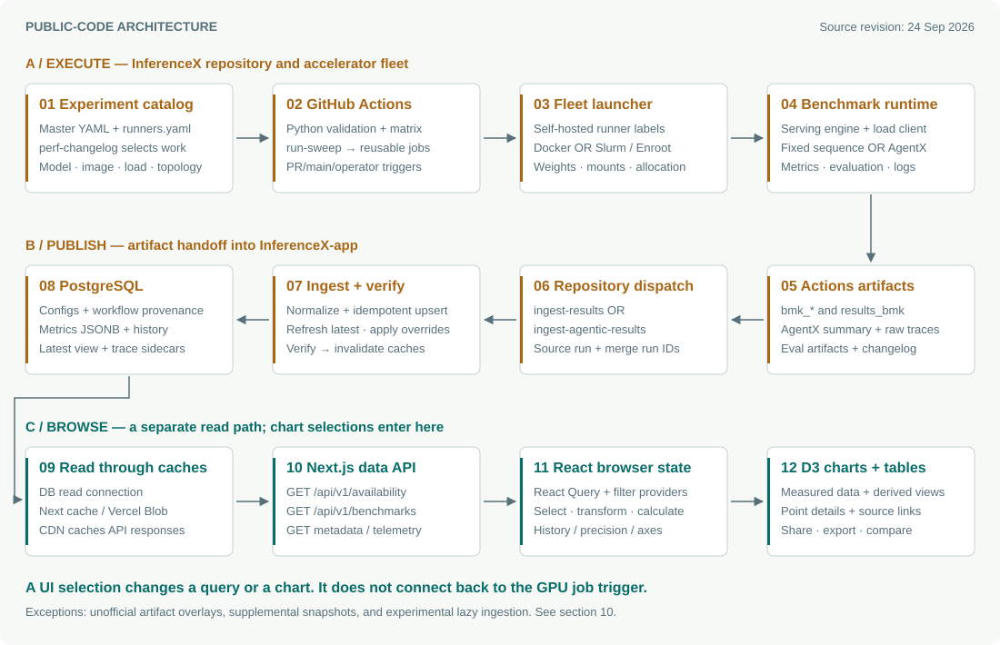
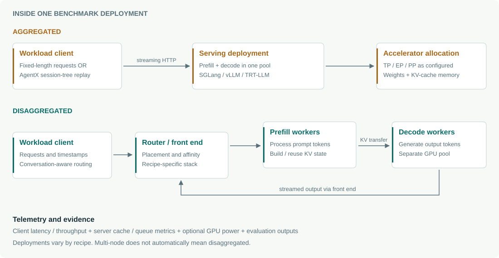
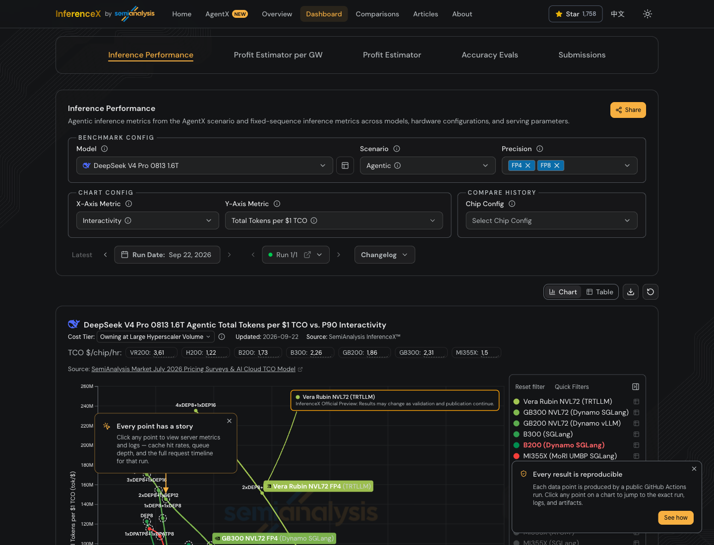
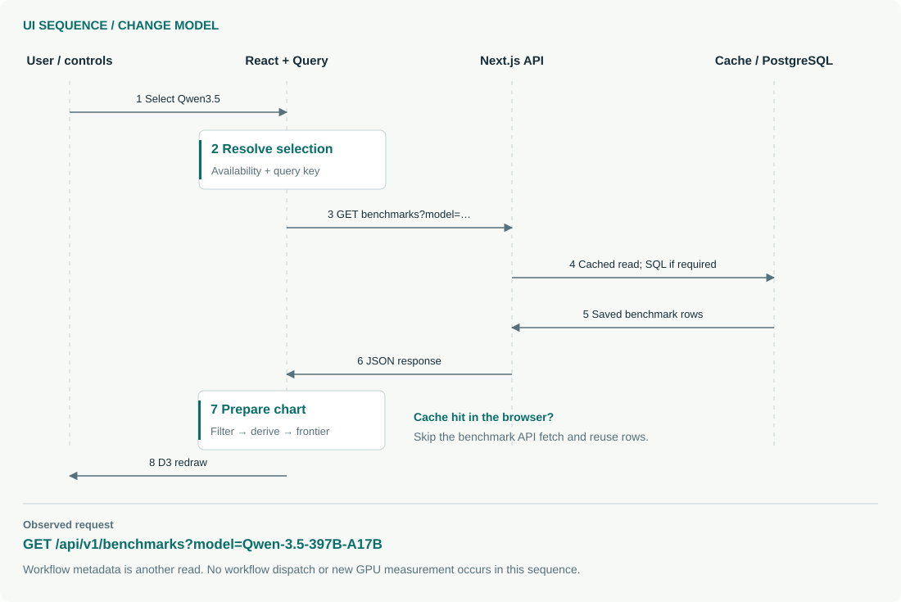

# How InferenceX works

Architecture, benchmark execution, and the exact meaning of a UI click.

**Research snapshot: 24 September 2026.** I inspected the live dashboard, exercised its model and scenario selectors, recorded the resulting network requests, and traced both public repositories. Benchmark repository: `5abd17e2ef546bd557608b370a8ff6123a170cbf`. Dashboard repository: `b710865c22e631d1cf0420f029afbd950ee73bb8`. Source links below are pinned to these revisions. The production deployment's exact commit was not independently identified.

## 1. The answer to your main question

**Selecting a model, scenario, GPU, precision, or chart metric in the public dashboard does not start a benchmark or rerun GitHub Actions.** It selects and visualizes results that already exist. A model/date change can fetch saved data; a metric or hardware toggle usually recalculates or filters data already in the browser.

New measurements follow a separate path: reviewed benchmark configuration → GitHub Actions → actual accelerator hardware → result artifacts → database ingestion → dashboard APIs. The cross-repository GitHub event normally starts **ingestion after a benchmark**, rather than starting a benchmark after a chart click. This separation is visible in the [browser query hook][S09], [benchmark API][S10], and [sweep workflow][S04].

InferenceX is a benchmarking and research platform. It runs serving engines such as SGLang, vLLM, and TensorRT-LLM under controlled workloads, measures them, and publishes comparisons. The public website is not an inference endpoint into which visitors submit prompts for those models.

There are two main codebases:

- **InferenceX:** experiment declarations, validation, matrix generation, hardware launchers, workload clients, accuracy evaluation, telemetry, and artifact collection.
- **InferenceX-app:** Next.js website, data APIs, PostgreSQL schema and ingestion, chart calculations, and a read-only MCP interface. Its workspaces include `packages/app`, `packages/db`, `packages/constants`, and `packages/mcp`. [Repository overview][S02]

## 2. Architecture sketch: how the components connect



The diagram reconstructs the primary published-results path from code. The numbered nodes are explained below; the exceptional paths are covered in section 10.

### A. Experiment definition and orchestration

**1 — Configuration is the experiment catalog.** `configs/nvidia-master.yaml` and `configs/amd-master.yaml` describe model, serving framework, image, precision, compatible runner, workload, and parameter search space. The search space can include concurrency, tensor/expert parallelism, speculative decoding, and separate prefill/decode workers. `configs/runners.yaml` maps logical hardware or cluster labels to concrete runners. `perf-changelog.yaml` selects which configuration keys should run and records the reason for the change. [Configuration schema][S03]

**2 — Python converts intent into executable jobs.** `infx.matrix.validation` validates the configuration with Pydantic. `infx.matrix.generate` expands supported combinations into individual points. `infx.matrix.plan` selects changelog additions, applies sweep/evaluation policy, and produces a validated JSON job matrix. Different buckets handle single-node, multi-node, AgentX, and evaluation jobs. This is a constrained search space, not necessarily the Cartesian product of every possible parameter. [Matrix planner][S05]

**3 — GitHub Actions coordinates a real hardware fleet.** The main `run-sweep.yml` listens for qualifying `perf-changelog.yaml` pushes to `main` and eligible pull-request events. PR labels control whether and how much GPU testing runs. The reusable benchmark workflows schedule on `self-hosted` runners and project matrix fields into inputs and environment variables. A concrete runner name selects a fleet launcher such as `runners/launch_h100-cr.sh`. Ordinary GitHub-hosted Ubuntu jobs handle coordination and ingestion; they are not the machines performing the accelerator benchmark. [Sweep workflow][S04], [single-node template][S06]

**4 — The launcher starts the serving stack and workload.** Fleet scripts prepare model paths, shared caches, mounts, network ports, containers, and scheduler allocations. Benchmark recipes own engine-specific CLI flags. Shared functions in `benchmarks/benchmark_lib.sh` handle server readiness, load generation, evaluations, monitoring, and output processing. The hardware runs the LLM; the benchmark client measures the serving endpoint. [Shared harness][S07]

### B. Publication and durable storage

**5 — Results become versioned evidence.** Per-job artifacts contain metrics, serving configuration, logs, evaluation outputs, and, for AgentX, request/trace data. Fixed-sequence results are collected into `results_bmk/agg_bmk.json`; evaluation aggregates use `eval_results_all/agg_eval_all.json`. AgentX pairs `bmk_agentic_<suffix>` summaries with `agentic_<suffix>` raw artifacts. The naming convention is an interface between the two repositories. [Collection workflow][S28], [artifact preparation][S29]

**6 — A GitHub repository event hands results to the app.** Qualifying main-branch sweeps dispatch `ingest-results` or `ingest-agentic-results` to `SemiAnalysisAI/InferenceX-app`. The payload includes `source-run-id` and `merge-run-id`: these may differ when an approved PR sweep is reused after merge. Reuse avoids paying for the same GPU measurements twice. The event is authenticated by a repository integration credential available to CI. [Dispatch implementation][S04]

**7 — ETL maps artifacts into a stable data model.** The receiving workflow downloads artifacts, runs migrations, normalizes names and metadata, upserts rows, applies reviewed overrides, verifies the database, and invalidates application caches. Unknown models/hardware or missing required data are recorded for investigation. The ordinary ingest workflow has a 30-minute timeout; the AgentX path allows 180 minutes because trace processing is heavier. These are job limits, not promises of actual latency. [Normal ingest][S08], [AgentX ingest][S23], [ETL entry point][S24]

**8 — PostgreSQL is the durable source for ordinary published charts.** The README identifies Neon PostgreSQL and a read replica for frontend reads; the connection layer also supports standard PostgreSQL. Writes use a separate write connection. Historical results remain stored; the dashboard does not download all historical GitHub artifacts each time it opens. [Database connection][S15]

### C. API and browser presentation

**9–10 — Next.js reads through caches and exposes data APIs.** The ordinary benchmark endpoint selects the requested model/date/run using shared database queries. It uses a Vercel Blob-backed cache for large responses; smaller queries use Next.js caching. Responses are also CDN-cacheable. Cache invalidation follows verified ingestion. This avoids repeated expensive database queries for common chart views. [Query cache][S13], [cache implementation][S14]

**11–12 — React selects and transforms; D3 draws.** TanStack React Query fetches and caches responses. `GlobalFilterProvider` owns model/scenario/precision and run intent; `InferenceProvider` owns chart-specific filters and display controls. `useChartData` filters rows, merges historical comparisons, normalizes metadata, computes chart values, and prepares D3 scatter plots and frontiers. The stack is Next.js 16 App Router, TypeScript, Tailwind CSS 4, shadcn/ui, React Query, and D3, with Vercel deployment. [Chart hook][S11], [transform layer][S12], [app overview][S02]

## 3. What runs inside the benchmark



**Aggregated serving:** the same serving deployment performs prefill and decode. Prefill processes the prompt and builds key/value attention-cache state; decode generates subsequent tokens. The deployment can still span several chips or hosts.

**Disaggregated serving:** a router/front end sends work to separate prefill and decode worker pools. KV state must move between them through the configured transfer stack. Recipes carry independent worker counts and parallelism for each role. Dynamo, NIXL, MoRI, and other components appear in particular configurations; they are not universal dependencies of every run. [Master configuration example][S30]

**Parallelism and concurrency are different controls.** TP divides model computation across chips; EP partitions experts in mixture-of-experts models; PP distributes layers across pipeline stages. Concurrency changes offered load. Increasing concurrency can improve total throughput while slowing each user's experience, which is why the dashboard shows performance curves rather than a single score.

### Fixed-sequence workload

Examples include 8,192 input tokens / 1,024 output tokens. Recipes start a serving process, wait until it is ready, then send controlled requests through the benchmark client and collect latency/throughput statistics. For example, the checked-in Qwen FP8/B200 recipe starts SGLang, disables its radix prefix cache for this workload, and requests `CONC × 10` prompts with maximum concurrency `CONC`. That is an example recipe, not a universal rule for every model. [Fixed-sequence recipe][S31]

### AgentX workload

AgentX uses AIPerf's `inferencex-agentx-mvp` scenario to replay the structure of long, multi-turn agent sessions: growing history, shared prefixes, pauses, child conversations, and joins. The prompt content is synthesized; the trace structure supplies lengths, timing, and relationships. **This is workload replay, not a coding agent launched in a visitor's browser.** The harness points AIPerf at a streaming OpenAI-compatible `/v1/chat/completions` endpoint. [AgentX explanation](https://inferencex.semianalysis.com/about), [harness implementation][S07]

Here, concurrency means live session trees, so child conversations can make instantaneous HTTP-request concurrency larger. The common harness sets seed 42 and records artifacts; scenario validity and error checks run afterward. The scenario has a 900-second minimum profiling duration; dataset preparation, warmup, and export add wall time. Session-aware routing matters because repeatedly moving a conversation between replicas can destroy prefix-cache reuse. [AgentX request setup][S07]

Performance replay and accuracy evaluation are separate. Evaluation paths include lm-eval, SWE-bench, and model-specific adapters; a recipe selects the applicable suite. A fast throughput result does not itself establish answer correctness. Some speculative-decoding throughput recipes use a configured synthetic acceptance distribution while evaluation retains actual verification; the Qwen B200 AgentX recipe explicitly documents this. Inspect the particular recipe and evaluation outputs before interpreting a result as natural, unconstrained generation. [AgentX recipe][S32], [evaluation procedures][S33]

### The measured quantities

- **Throughput:** completed tokens per second, with separate total/input/output and hardware-normalized variants.
- **TTFT:** time until the first token reaches the client.
- **ITL / TPOT:** token-generation timing after the first token, with aggregation definitions depending on the harness and metric.
- **Interactivity:** token rate from a user's perspective. AgentX's slow-tail display derives it from the reciprocal of the matching latency statistic. For example, `1 / p90(ITL in seconds)` is not the same as `p90(1 / ITL)`.
- **End-to-end latency:** time to complete the response.
- **Additional evidence:** errors, cache behavior, queue/server metrics, request timelines, and power telemetry when available.

The app explicitly bridges AgentX metric names into its chart contract and prefers full-response timing when available. This is one reason displaying raw artifact fields without the app's normalization can disagree with the dashboard. [Metric normalization][S12], [request statistics][S34]

## 4. Where Docker fits

**Yes, containers are central to running benchmark stacks. There is no single Docker container that supplies the entire production InferenceX platform.**

On a direct-Docker fleet, the launcher uses `docker run`, enables accelerator access, mounts the model cache and checkout, forwards experiment environment variables, and runs a benchmark script inside the configured image. The H100 Crusoe launcher is a concrete NVIDIA example. [Docker launcher][S16]

On Slurm fleets, the launcher can allocate resources with `salloc`/`srun`, import a Docker-registry image into an Enroot SquashFS image, and execute with container mounts. The H100 CoreWeave launcher shows this path. Some larger deployments use the `srt-slurm` integration and checked-in recipes. A Docker-format image therefore does not imply the host uses the Docker daemon to run it. [Slurm/Enroot launcher][S17], [submodules][S35]

The public UI is documented as deployed on Vercel. Its local setup uses Node 24, Bun, and a PostgreSQL connection; the inspected app checkout contains no Dockerfile or Compose file providing an all-in-one deployment. You could design your own containerized deployment, but that would be an additional packaging project, not the documented production topology. [App setup][S02]

## 5. What the UI looks like



The desktop page has a dark/light theme, a top navigation bar, dashboard tabs, a large configuration panel, and interactive charts underneath. The captured dark theme uses charcoal surfaces, thin borders, amber navigation/actions, and colored hardware curves.

The main controls are organized into **Benchmark Config** (model, scenario, precision), **Chart Config** (axis metrics and related choices), **Compare history**, and **Run Date / Run / Changelog**. Below them are Chart/Table views, chart download, zoom reset, a hardware legend, and controls such as Optimal Only. Tooltips expose configuration and provenance; supported AgentX points link to detailed telemetry.

Despite the name “Benchmark Config,” these controls describe the **data being viewed**. They do not submit a new executable experiment. Likewise, **Run** selects a recorded run, and **Submissions** browses submission history, volumes, and configurations. It is not a public “submit job” form. [Submissions implementation][S21]

## 6. UI flow: what happens after each selection



### Initial page load

1. Next.js supplies the page and client bundles. The dashboard mounts only the providers that this route needs.
2. The browser reads any shared URL state and loads availability information.
3. The filter provider resolves a supported model/scenario/precision combination and an effective date. A missing combination falls back to a supported one.
4. `useBenchmarks` issues a model/date/run-keyed request when that query is not already cached.
5. The API reads a cached response or queries PostgreSQL. The no-date path uses the `latest_benchmarks` materialized view; historical paths apply date/run selection.
6. The browser transforms the rows, computes the requested axes/frontier, and renders the chart. Extra GETs discover available traces/logs or retrieve details as needed.

The availability cascade and state ownership are documented alongside the code. [Filter state][S18], [query hook][S09], [database query][S25]

### Observed example: change the model

I changed **DeepSeek V4 Pro → Qwen3.5 397B** in the live UI. The browser changed the path to `/inference/qwen-3-5` and made these successful requests:

```text
GET /api/v1/benchmarks?model=Qwen-3.5-397B-A17B
GET /api/v1/workflow-info?date=2026-09-21
```

The results rendered without a benchmark dispatch. The source explains why: the model changes the React Query key, whose query function calls `fetchBenchmarks`, a GET wrapper. The corresponding server route exports a read handler. [API client][S36], [benchmark API][S10]

### Observed example: change Agentic → 8K / 1K

On that same Qwen page, I selected **8K / 1K**. The chart changed, the effective run date became September 18, and another workflow metadata GET appeared:

```text
GET /api/v1/workflow-info?date=2026-09-18
```

No additional `/api/v1/benchmarks` request appeared for that change in this session. The browser already held the model's rows and selected the fixed-sequence subset locally. This is observed behavior for this sequence of actions, not a guarantee that every scenario change is network-free.

### Other controls

| User action | Work performed under the hood | Starts GPU work? |
|---|---|---|
| Choose model | Resolve valid filters; use a different query key; fetch that model if needed | No |
| Choose scenario or precision | Filter available rows and choices; may update effective date and metadata | No |
| Hide/show hardware, change axes or percentile | Recompute chart selection, coordinates, and frontier; some metrics need extra stored-data reads | No |
| Select historical date/run | Fetch historical/as-of or run-scoped rows; merge according to snapshot rules | No |
| Add comparison dates | Parallel data queries for those dates, then merged chart overlays | No |
| Change cost or power assumptions | Recalculate derived economics/efficiency from existing measurements | No |
| Click an existing point | Pin metadata tooltip; links open producer workflow, logs, or stored telemetry | No |
| Open AgentX “View charts” | Fetch point-owned stored timelines, aggregates, and server metrics | No |
| Use Share or download | Serialize view state or export the displayed chart/data | No |
| Supply an unofficial run ID | Read and normalize existing GitHub artifacts for an overlay | No |

This mapping follows [chart data preparation][S11], [URL/filter state][S18], [unofficial-run API][S20], and [point-detail route][S37].

**Why a network trace can still show POSTs:** the inspected page also sent analytics events. An analytics POST does not mean a benchmark was submitted. No workflow-dispatch request appeared during the model/scenario interactions I tested.

## 7. Execution flow: how a new measurement reaches the UI

This is the flow to follow when you want genuinely new benchmark results.

1. **A contributor or maintainer changes an experiment.** Update an image, recipe, topology, or supported concurrency; append the appropriate `perf-changelog.yaml` entry.
2. **Validation establishes the job set.** The planner expands selected configuration keys and rejects invalid combinations before consuming GPU time.
3. **A qualifying workflow event starts the sweep.** Pull-request labels gate costly testing. A qualifying main-branch changelog push follows the publication path. Manual testing has separate workflow entry points; the main sweep is not simply a public UI “Run” button.
4. **Reusable workflows fan out.** They create single-node/multi-node/AgentX/eval jobs with the required image, model, topology, and load.
5. **Self-hosted runners acquire compatible resources.** Fleet scripts handle container setup, Slurm allocation where applicable, model storage, and recipe routing.
6. **Each job starts the server and waits for readiness.** The load generator then runs its controlled workload; monitors and evaluation helpers collect their outputs.
7. **Outputs are validated and uploaded.** Diagnostic logs can upload even after failure; their existence does not certify a successful benchmark.
8. **Collectors package results and provenance.** Artifact identity, workflow attempt, source SHA, recipe fingerprint, and changelog metadata preserve traceability.
9. **The producer dispatches ingestion.** The app's receiving workflow fetches the designated source artifacts. An authorized PR run can be reused instead of repeating execution after merge.
10. **ETL publishes durable records.** It normalizes, upserts, applies overrides, refreshes the latest-view data, and verifies consistency.
11. **Caches are invalidated.** Subsequent public reads can obtain the new results. Ingestion and cache refresh are distinct from the web application's code deployment.
12. **A fresh browser query displays them.** An already-open page does not automatically become a live subscription to the database.

These boundaries matter operationally: a green GPU job, uploaded artifact, successful ingest, and visible chart are four different milestones. [Producer workflow][S04], [reusable job][S06], [ingestion workflow][S08]

“Continuous” means repeated measurement as the ecosystem evolves. The current main sweep is changelog-driven; it does not declare a nightly cron. A separate `klaud-plan.yml` currently runs every six hours to consider automated recipe/image updates, subject to eligibility/capacity checks. This is an operator-side automation path with private capacity-service dependencies, not a public chart interaction. I verified its public workflow/code, not the private service implementation. [Automation workflow][S26]

## 8. Features and how they are provided

| Feature | Mechanism | What to understand |
|---|---|---|
| Model / hardware / framework / precision comparisons | Saved benchmark rows plus shared model/hardware registries | Availability is data-driven; not every combination exists |
| Throughput–latency curves and Optimal Only | D3 scatter plots and Pareto selection over measured operating points | A frontier shows non-dominated choices for the selected axes |
| Historical comparison and changelog | Date/run queries, workflow metadata, preserved provenance | “Latest” can combine different curve dates |
| AgentX long-context and cache behavior | AIPerf trace replay, request metrics, server telemetry | Session concurrency differs from simple request concurrency |
| Point-level timelines, logs, distributions | Stored trace sidecars, precomputed aggregates/series, bounded log readers | Opening or replaying a visualization reads recorded evidence |
| Accuracy Evals | Separate evaluation artifacts mapped into `eval_results` and samples | Accuracy is not inferred from throughput |
| TCO, tokens per dollar, and target-based calculator | Throughput combined with cost assumptions; frontier interpolation | Calculated/estimated values, not separately measured hardware results |
| Profit, fleet, and per-GW planning | Benchmark-derived performance plus pricing, utilization, power, and fleet assumptions | Results depend on the chosen economic assumptions |
| Power/energy analysis | Measured telemetry where valid; separate modeled system-power paths | GPU-board measurement and chassis/facility estimates have different boundaries |
| First-token and prefix-cache analysis | Existing latency/cache measurements grouped for focused comparisons | Missing telemetry should not be interpreted as zero |
| Reliability view | Aggregated benchmark-run success counts | This describes benchmark execution success, not a cloud SLA or hardware MTBF |
| Submission history | Stored run/configuration metadata, counts, searchable tables | A browse/audit surface |
| Share, export, theme, and Chinese UI | URL-state serialization, chart/table exporters, theme/localization components | Share links encode a view, not a request to recompute experiments |
| Programmatic access | Public `/api/v1/*`, OpenAPI reference, and a separate DB-backed read-only MCP server | These are data-consumption surfaces |
| Experimental OperatorX / CollectiveX | Separate kernel/collective sweeps and lazy artifact ingestion | Feature-gated, distinct data paths |

Sources: [route registry][S38], [chart transform][S12], [calculator design][S19], [power model boundary][S27], [schema][S39], [MCP server][S40], [OperatorX][S41], [CollectiveX][S22].

### Example: why changing a cost field is instant

For throughput `T` tokens/second/chip and hourly cost `C` dollars/chip/hour:

```text
tokens per dollar = (T × 3,600) / C
dollars per million tokens = C / (T × 3,600 / 1,000,000)
```

Changing `C` changes the displayed economics without running the model again. Total, input, and output token metrics have different denominators. Disaggregated configurations require care because some rates are normalized to role-specific chip pools. The calculator interpolates between observed points using a monotone frontier spline, and it can clamp to a measured endpoint outside a series' supported range. Those values are estimates, not new benchmark observations. [Calculation code][S42], [calculator behavior][S19]

## 9. Storage, freshness, and provenance

The main relational model separates reusable serving configuration from individual experiment observations:

- `configs`: model, hardware, framework, precision, speculative method, and topology.
- `workflow_runs`: GitHub run/attempt, commit, branch, timestamps, and producer URL.
- `benchmark_results`: configuration/run references, scenario, sequence lengths, concurrency, image, metrics JSONB, and later-added offload/recipe/power metadata.
- `availability`: a compact index of available combinations/dates for UI selectors.
- `eval_results` and sample tables: accuracy outcomes and drill-down evidence.
- `run_stats`: success counts used for reliability charts.
- `agentic_trace_replay`, dataset tables, and log tables: detailed evidence, including compressed request records and precomputed timelines/aggregates.

Metrics remain flexible JSONB while dimensions and relationships are relational. ETL uses natural-key conflict handling so repeating an ingest does not blindly duplicate rows. [Initial schema][S39], [AgentX schema][S43], [ETL][S24]

**Latest means latest eligible logical curve, not every point measured on one date.** A normal new sweep replaces the relevant curve snapshot; historical rows remain accessible. Explicit append-only runs can extend a same-image curve while preserving point provenance and recipe identity. AgentX's replacement scope differs from fixed-sequence scope. [Latest-curve SQL][S44], [query implementation][S25]

**Three caches affect what you see:** browser React Query memory, server query/Blob caches, and CDN responses. React Query currently uses infinite stale and garbage-collection times for ordinary queries, disables focus refetch, and keeps its cache for the page session. A reload starts a new client cache. The current cache code sets a default CDN `s-maxage=86400` and supports tag-based invalidation. Some prose in the architecture documentation still says one year; I use the checked-in implementation here. The live response identified Vercel but did not expose the origin `s-maxage` setting to the browser. [Query provider][S45], [cache code][S14]

Weekly database dumps are automated by the app repository and published as release assets; the workflow excludes user-feedback table data. These snapshots are an audit/recovery mechanism, separate from the live query path. [Backup workflow][S46]

## 10. Exceptions that should appear on a complete design

**Unofficial run previews bypass the normal publication step.** `/api/unofficial-run?runId=...` fetches existing GitHub run metadata/artifacts, normalizes them with shared ETL mappers, and returns overlay rows. The route deliberately avoids the normal cache because artifacts can arrive while a run is in progress. Those overlay rows are not inserted into the official benchmark tables. Loading them still does not start or rerun a workflow. [Unofficial-run API][S20]

**Supplemental snapshots can be added in the frontend.** `withSupplementalBenchmarks` merges bundled datasets with fetched results for selected views. The inspected code contains TPUv7, Jalapeño, and a historical Rubin snapshot; the latter can link to an external source article instead of a GitHub run. Therefore the website's broad “every point comes from Actions” description should not be treated as a universal implementation invariant. Inspect a point's source, preview status, date, and measurement type. [Supplemental data implementation][S47]

**A default curve can intentionally use an older snapshot.** The checked-in default-run preference selects a September 9 snapshot for one specific DeepSeek V4 Pro / VR configuration while other curves use their usual latest data. I observed the matching extra exact-date GET on initial load. Explicit date/run/history views opt out. This explains how the model-level “latest” date can differ from a point's producer date. [Default preference][S48]

**OperatorX and CollectiveX can write a durable cache on read.** Their feature-gated APIs discover already-completed manual sweep runs, fetch artifacts, and persist raw documents in separate/namespaced storage. Their shared readers then assemble the chart dataset. Opening such a view may cause backend ingestion, but not new kernel or GPU execution. They have different refresh/retention rules from the main benchmark database. [OperatorX design][S41], [CollectiveX design][S22]

**Not all API routes are raw passthroughs.** The main benchmark response mostly preserves stored rows, but the code validates parameters, supports filtered/compact views, and sanitizes selected metadata. Overview, calculator views, log search, and experimental readers perform additional work server-side. “All processing happens in the browser” is too broad. [Benchmark route][S10], [query/view cache][S13]

## 11. A practical design and implementation plan

If you want to reproduce or build on this approach, use these boundaries as the design plan. This is a proposed implementation order, not an additional claim about SemiAnalysis's private infrastructure.

1. **Define the result contract first.** Choose model/hardware identities, workload, topology, concurrency semantics, units, run/attempt/SHA provenance, recipe identity, and validity fields. Keep measured values distinct from assumptions and estimates.
2. **Implement one reproducible execution path.** Start with one model, framework, and hardware fleet. Pin the image and workload; provide a readiness check, load client, metrics output, and failure artifacts.
3. **Add configuration validation and matrix generation.** Keep experiment intent in configuration, physical fleet setup in launchers, and serving flags in recipes. Verify generated jobs before GPU execution.
4. **Connect asynchronous orchestration.** Use restricted GitHub workflow entry points and compatible self-hosted runners. Preserve logs, results, and exact recipe revisions. Add evaluation gates appropriate to the model and optimization.
5. **Build idempotent ingestion.** Normalize artifact records into PostgreSQL, preserve historical results, index availability, define latest-curve semantics, and verify before cache invalidation.
6. **Build the read UI.** Availability API → shared filter state → benchmark query → local transforms → charts/tables. Add provenance links, historical comparison, and exported data early.
7. **Add advanced analyses.** AgentX trace detail, telemetry, cost assumptions, interpolation, power models, and unofficial comparisons can follow once the basic contract is dependable.

If your intended product needs a **Run benchmark** button, that is an additional control system. A sensible design would be authenticated UI → backend validation/authorization → approved recipe/job record → workflow dispatch → queue/status tracking → result ingestion → completion view. It would need resource limits, allowed images/recipes, ownership, cancellation, and durable status. The browser should not hold GitHub dispatch credentials. This proposed extension is not the behavior I found in InferenceX's public comparison controls.

For local reuse, distinguish three projects: running the dashboard against a database; executing benchmarks on supported accelerator infrastructure; and operating the complete publication system. Cloning the website does not provision GPU fleets, model weights, registry access, scheduler setup, or CI secrets. The repository documents parts of that infrastructure, but I did not verify private fleet provisioning or scheduler internals.

## 12. Verification and reading order

**Verified directly:** two pinned public checkouts; live page appearance; model/scenario selector behavior; successful read requests; source-level workflow triggers, container launch paths, dispatch payloads, ingestion stages, database/query layers, and chart transforms. I did not trigger a GPU run, modify their repositories, or access private infrastructure.

For an efficient code tour, read in this order:

1. [Producer architecture][S01] and [app overview][S02] for the ownership split.
2. [Configuration contract][S03] → [matrix planner][S05] → [run-sweep.yml][S04].
3. [Reusable job template][S06] → [Docker launcher][S16] or [Slurm launcher][S17] → [benchmark library][S07].
4. [Ingest workflow][S08] → [artifact preparation][S29] → [ETL][S24] → [database queries][S25].
5. [API route][S10] → [browser query hook][S09] → [chart hook][S11] → [transform][S12].
6. [Unofficial previews][S20], [supplemental snapshots][S47], and [experimental ingestion][S22] for the exceptions.

The diagrams describe verified public-code relationships, with generic serving explanations where needed. Feature availability and deployment behavior can change after this research date; pinned source links preserve what was inspected.

<!-- SOURCE_DEFINITIONS -->

[S01]: https://github.com/SemiAnalysisAI/InferenceX/blob/5abd17e2ef546bd557608b370a8ff6123a170cbf/docs/architecture.md
[S02]: https://github.com/SemiAnalysisAI/InferenceX-app/blob/b710865c22e631d1cf0420f029afbd950ee73bb8/README.md
[S03]: https://github.com/SemiAnalysisAI/InferenceX/blob/5abd17e2ef546bd557608b370a8ff6123a170cbf/configs/CONFIGS.md
[S04]: https://github.com/SemiAnalysisAI/InferenceX/blob/5abd17e2ef546bd557608b370a8ff6123a170cbf/.github/workflows/run-sweep.yml
[S05]: https://github.com/SemiAnalysisAI/InferenceX/blob/5abd17e2ef546bd557608b370a8ff6123a170cbf/infx/matrix/plan.py
[S06]: https://github.com/SemiAnalysisAI/InferenceX/blob/5abd17e2ef546bd557608b370a8ff6123a170cbf/.github/workflows/benchmark-tmpl.yml
[S07]: https://github.com/SemiAnalysisAI/InferenceX/blob/5abd17e2ef546bd557608b370a8ff6123a170cbf/benchmarks/benchmark_lib.sh
[S08]: https://github.com/SemiAnalysisAI/InferenceX-app/blob/b710865c22e631d1cf0420f029afbd950ee73bb8/.github/workflows/ingest-results.yml
[S09]: https://github.com/SemiAnalysisAI/InferenceX-app/blob/b710865c22e631d1cf0420f029afbd950ee73bb8/packages/app/src/hooks/api/use-benchmarks.ts
[S10]: https://github.com/SemiAnalysisAI/InferenceX-app/blob/b710865c22e631d1cf0420f029afbd950ee73bb8/packages/app/src/app/api/v1/benchmarks/route.ts
[S11]: https://github.com/SemiAnalysisAI/InferenceX-app/blob/b710865c22e631d1cf0420f029afbd950ee73bb8/packages/app/src/components/inference/hooks/useChartData.ts
[S12]: https://github.com/SemiAnalysisAI/InferenceX-app/blob/b710865c22e631d1cf0420f029afbd950ee73bb8/packages/app/src/lib/benchmark-transform.ts
[S13]: https://github.com/SemiAnalysisAI/InferenceX-app/blob/b710865c22e631d1cf0420f029afbd950ee73bb8/packages/app/src/lib/benchmark-query-cache.server.ts
[S14]: https://github.com/SemiAnalysisAI/InferenceX-app/blob/b710865c22e631d1cf0420f029afbd950ee73bb8/packages/app/src/lib/api-cache.ts
[S15]: https://github.com/SemiAnalysisAI/InferenceX-app/blob/b710865c22e631d1cf0420f029afbd950ee73bb8/packages/db/src/connection.ts
[S16]: https://github.com/SemiAnalysisAI/InferenceX/blob/5abd17e2ef546bd557608b370a8ff6123a170cbf/runners/launch_h100-cr.sh
[S17]: https://github.com/SemiAnalysisAI/InferenceX/blob/5abd17e2ef546bd557608b370a8ff6123a170cbf/runners/launch_h100-cw.sh
[S18]: https://github.com/SemiAnalysisAI/InferenceX-app/blob/b710865c22e631d1cf0420f029afbd950ee73bb8/docs/state-ownership.md
[S19]: https://github.com/SemiAnalysisAI/InferenceX-app/blob/b710865c22e631d1cf0420f029afbd950ee73bb8/docs/tco-calculator.md
[S20]: https://github.com/SemiAnalysisAI/InferenceX-app/blob/b710865c22e631d1cf0420f029afbd950ee73bb8/packages/app/src/app/api/unofficial-run/route.ts
[S21]: https://github.com/SemiAnalysisAI/InferenceX-app/blob/b710865c22e631d1cf0420f029afbd950ee73bb8/packages/app/src/components/submissions/SubmissionsDisplay.tsx
[S22]: https://github.com/SemiAnalysisAI/InferenceX-app/blob/b710865c22e631d1cf0420f029afbd950ee73bb8/docs/collectivex.md
[S23]: https://github.com/SemiAnalysisAI/InferenceX-app/blob/b710865c22e631d1cf0420f029afbd950ee73bb8/.github/workflows/ingest-agentic-results.yml
[S24]: https://github.com/SemiAnalysisAI/InferenceX-app/blob/b710865c22e631d1cf0420f029afbd950ee73bb8/packages/db/src/ingest-ci-run.ts
[S25]: https://github.com/SemiAnalysisAI/InferenceX-app/blob/b710865c22e631d1cf0420f029afbd950ee73bb8/packages/db/src/queries/benchmarks.ts
[S26]: https://github.com/SemiAnalysisAI/InferenceX/blob/5abd17e2ef546bd557608b370a8ff6123a170cbf/.github/workflows/klaud-plan.yml
[S27]: https://github.com/SemiAnalysisAI/InferenceX-app/blob/b710865c22e631d1cf0420f029afbd950ee73bb8/docs/powerx-system-power.md
[S28]: https://github.com/SemiAnalysisAI/InferenceX/blob/5abd17e2ef546bd557608b370a8ff6123a170cbf/.github/workflows/collect-results.yml
[S29]: https://github.com/SemiAnalysisAI/InferenceX-app/blob/b710865c22e631d1cf0420f029afbd950ee73bb8/packages/db/src/prepare-ci-artifacts.ts
[S30]: https://github.com/SemiAnalysisAI/InferenceX/blob/5abd17e2ef546bd557608b370a8ff6123a170cbf/configs/nvidia-master.yaml
[S31]: https://github.com/SemiAnalysisAI/InferenceX/blob/5abd17e2ef546bd557608b370a8ff6123a170cbf/benchmarks/single_node/fixed_seq_len/qwen3.5_fp8_b200.sh
[S32]: https://github.com/SemiAnalysisAI/InferenceX/blob/5abd17e2ef546bd557608b370a8ff6123a170cbf/benchmarks/single_node/agentic/qwen3.5_fp8_b200_sglang_mtp.sh
[S33]: https://github.com/SemiAnalysisAI/InferenceX/blob/5abd17e2ef546bd557608b370a8ff6123a170cbf/docs/eval-agentx-procedures.md
[S34]: https://github.com/SemiAnalysisAI/InferenceX/blob/5abd17e2ef546bd557608b370a8ff6123a170cbf/infx/results/agentic/request_metrics.py
[S35]: https://github.com/SemiAnalysisAI/InferenceX/blob/5abd17e2ef546bd557608b370a8ff6123a170cbf/.gitmodules
[S36]: https://github.com/SemiAnalysisAI/InferenceX-app/blob/b710865c22e631d1cf0420f029afbd950ee73bb8/packages/app/src/lib/api.ts
[S37]: https://github.com/SemiAnalysisAI/InferenceX-app/blob/b710865c22e631d1cf0420f029afbd950ee73bb8/packages/app/src/app/(dashboard)/inference/agentic/[id]/page.tsx
[S38]: https://github.com/SemiAnalysisAI/InferenceX-app/blob/b710865c22e631d1cf0420f029afbd950ee73bb8/packages/app/src/lib/dashboard-routes.ts
[S39]: https://github.com/SemiAnalysisAI/InferenceX-app/blob/b710865c22e631d1cf0420f029afbd950ee73bb8/packages/db/migrations/001_initial_schema.sql
[S40]: https://github.com/SemiAnalysisAI/InferenceX-app/blob/b710865c22e631d1cf0420f029afbd950ee73bb8/packages/mcp/src/server.ts
[S41]: https://github.com/SemiAnalysisAI/InferenceX-app/blob/b710865c22e631d1cf0420f029afbd950ee73bb8/docs/operatorx.md
[S42]: https://github.com/SemiAnalysisAI/InferenceX-app/blob/b710865c22e631d1cf0420f029afbd950ee73bb8/packages/app/src/lib/chart-utils.ts
[S43]: https://github.com/SemiAnalysisAI/InferenceX-app/blob/b710865c22e631d1cf0420f029afbd950ee73bb8/packages/db/migrations/008_agentic.sql
[S44]: https://github.com/SemiAnalysisAI/InferenceX-app/blob/b710865c22e631d1cf0420f029afbd950ee73bb8/packages/db/migrations/014_agentic_curve_snapshots.sql
[S45]: https://github.com/SemiAnalysisAI/InferenceX-app/blob/b710865c22e631d1cf0420f029afbd950ee73bb8/packages/app/src/providers/query-provider.tsx
[S46]: https://github.com/SemiAnalysisAI/InferenceX-app/blob/b710865c22e631d1cf0420f029afbd950ee73bb8/.github/workflows/db-backup.yml
[S47]: https://github.com/SemiAnalysisAI/InferenceX-app/blob/b710865c22e631d1cf0420f029afbd950ee73bb8/packages/app/src/lib/supplemental-benchmarks.ts
[S48]: https://github.com/SemiAnalysisAI/InferenceX-app/blob/b710865c22e631d1cf0420f029afbd950ee73bb8/packages/app/src/components/inference/default-run-preference.ts
